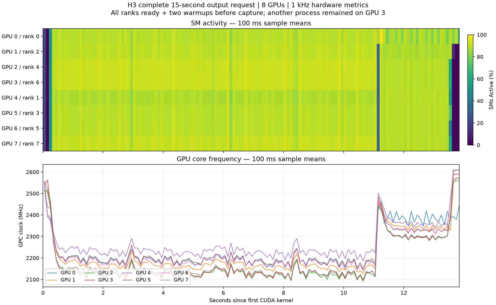
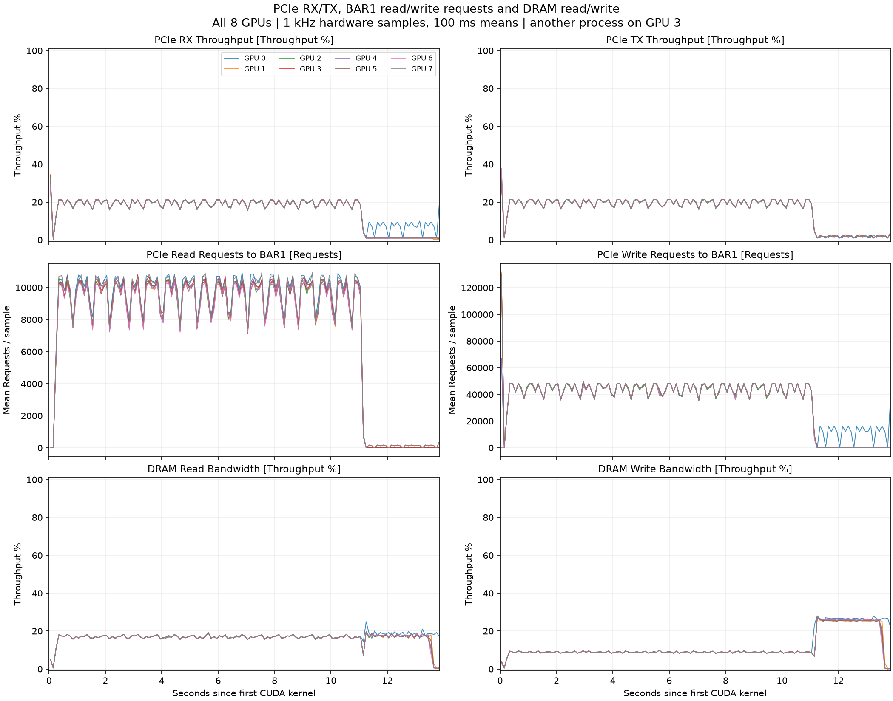

# H3 full 15-second request: complete GPU hardware metrics

[Download native Nsight trace](h3-cartoon-mxfp8-nvfp4-full15s-gpumetrics.nsys-rep) (93,095,501 bytes).
Open in Nsight Systems 2025.3.2 and expand **GPU Metrics → SMs Active** and **GPC Clock Frequency**.
All eight GPUs contain the complete **25-metric gb20x set** on the same timeline as CUDA kernels and NVTX stages: **200 channels and 3,226,025 raw metric rows**, nominally sampled at 1 kHz. Every channel spans the entire CUDA workload.

## Capture conditions

- The previous H3 gateway and all eight H3 worker GPU contexts were stopped before restart.
- All ranks 0–7 emitted ready messages, had live PIDs, and mapped to eight distinct GPUs before warmup.
- Two complete four-step requests ran outside collection: 22.321 s and 13.597 s.
- One complete 15-second-output T2VA request was then traced: **14.208 s HTTP latency**.
- Full output: 362 frames, 1280 × 704, 24 fps, 15.083333 seconds, with native audio.
- Full four-step coverage on all eight ranks, video/audio VAE and MP4 encoding/mux.
- 644,469 CUDA kernels; 200 fine-attention calls per rank, 1,600 in total.
- FastH3 four-step VSA, MXFP8 DiT, BF16 RDMA transport, NVFP4 full VAE.
- Hardware metrics: all GPUs, `gb20x` metric set, nominal **1,000 Hz** sampling.
- CUDA/NVTX/OS runtime and CUDA graph-node tracing; CPU and context-switch sampling disabled.
- Loading and both warmups are outside collection. Metrics include idle padding around the measured request.

**Concurrency:** another user's process remained on physical GPU 3, using about 5 GB of VRAM.
The user requested continuation after this limitation was disclosed. This is not an exclusive-GPU
benchmark. Hardware counters are device-wide and may include that process's activity.

## All hardware counters and PCIe read/write

- [All 25 metric plots (25-page PDF)](hardware-metrics-all.pdf), each with all eight GPUs
- [Complete raw samples (CSV.gz, 12.8 MB)](hardware-metrics-all-raw.csv.gz)
- [All counters in 100 ms bins (CSV.gz)](hardware-metrics-all-100ms.csv.gz)
- [All 200 channel summaries](hardware-metrics-all-summary.json)
- [Metric IDs, names and display conversions](hardware-metric-catalog.csv)

PCIe RX is traffic received by the GPU (`pcie__read_bytes`); TX is traffic transmitted
by the GPU (`pcie__write_bytes`), including protocol traffic. The captured RX/TX and
DRAM bandwidth counters are **percentages**, not bytes/s. BAR1 read/write counters
count CPU/peer requests to GPU memory per sampling interval. Their 100 ms plots show
mean requests per sample, not requests per second. The raw export preserves exact
integer values and timestamps. Raw zeros in inactive graphics/copy counters are retained.

| Metric ID | Captured metric |
|---|---|
| 0 | GPC Clock Frequency [MHz] |
| 1 | SYS Clock Frequency [MHz] |
| 2 | Sync Copy Engine Active [Throughput %] |
| 3 | Sync Copy Engine Active [Cycles Active] |
| 4 | Async Copy Engine Active 0 [Throughput %] |
| 5 | Async Copy Engine Active 0 [Cycles Active] |
| 6 | GR Active [Throughput %] |
| 7 | SMs Active [Throughput %] |
| 8 | SM Issue [Throughput %] |
| 9 | Tensor Active [Throughput %] |
| 10 | Vertex/Tess/Geometry Warps in Flight [Throughput %] |
| 11 | Vertex/Tess/Geometry Warps in Flight [Avg] |
| 12 | Vertex/Tess/Geometry Warps in Flight [Avg Warps per Cycle] |
| 13 | Pixel Warps in Flight [Throughput %] |
| 14 | Pixel Warps in Flight [Avg] |
| 15 | Pixel Warps in Flight [Avg Warps per Cycle] |
| 16 | Compute Warps in Flight [Throughput %] |
| 17 | Compute Warps in Flight [Avg] |
| 18 | Compute Warps in Flight [Avg Warps per Cycle] |
| 19 | DRAM Read Bandwidth [Throughput %] |
| 20 | DRAM Write Bandwidth [Throughput %] |
| 21 | PCIe RX Throughput [Throughput %] |
| 22 | PCIe TX Throughput [Throughput %] |
| 23 | PCIe Read Requests to BAR1 [Requests] |
| 24 | PCIe Write Requests to BAR1 [Requests] |

This covers the entire Nsight `gb20x` General Metrics set supported by this capture.
The raw CSV contains `raw_timestamp,timestamp_ns,type_id,metric_id,raw_value,physical_gpu,rank`.
The original five metric columns preserve the SQLite export values without unit conversion.
Warp `Avg` and `Avg Warps per Cycle` displays apply the `0.5` multiplier defined by
Nsight's metric configuration; clock display conversions are described below.

## SM activity and frequency summary

These are arithmetic sample means over the **13.843227 s** interval from the first
CUDA kernel start to the last CUDA kernel end. They include idle gaps in that interval.
Physical GPU IDs follow `nvidia-smi`, while ranks follow the model's reordered device mapping.

| Physical GPU | Rank | Mean SM active (%) | Mean GPC clock (MHz) | GPC clock p10–p90 (MHz) |
|---|---|---|---|---|
| 0 | 0 | 87.68 | 2233.9 | 1965.5–2549.3 |
| 1 | 2 | 86.75 | 2214.2 | 1952.6–2543.4 |
| 2 | 4 | 87.78 | 2177.8 | 1928.3–2528.6 |
| 3 | 6 | 87.78 | 2181.5 | 1931.7–2556.9 |
| 4 | 1 | 85.11 | 2267.9 | 2007.7–2584.5 |
| 5 | 3 | 86.28 | 2233.0 | 1973.7–2575.3 |
| 6 | 5 | 86.19 | 2226.8 | 1966.5–2561.0 |
| 7 | 7 | 87.50 | 2184.9 | 1936.6–2534.4 |

- [100 ms binned timeline CSV](gpu-metrics-100ms.csv)
- [Per-GPU sample counts and summary JSON](gpu-metrics-summary.json)
- [SHA-256 checksums](SHA256SUMS.txt)

The native trace retains the 1 kHz samples; the figure and CSV use 100 ms sample means.
`SMs Active` measures active SM cycles, not occupancy or SM issue rate.
GPC clock is the GPU core/graphics clock; SYS clock is also present in the trace.
See [NVIDIA's GPU Metrics documentation](https://docs.nvidia.com/nsight-systems/UserGuide/index.html#gpu-metrics).

For this Nsight 2025.3.2 SQLite export, clock values are signed 32-bit representations of Hz.
The derived MHz values use `(raw_value & 0xffffffff) / 1e6`, matching the `1e-6` display multiplier
in Nsight's `gb20x.config`; SM activity values are integer percentages.

## Collection limitations

Profiling adds overhead, so HTTP latency is not a measurement of unprofiled serving performance.
Nsight emitted event-completeness warnings for CUDA, NVTX and OS runtime, plus warnings for
processes with no CUDA/NVTX events. All eight ranks, all four steps, final media output, and
all 25 hardware metrics spanning the CUDA interval on every GPU were checked. This does not guarantee
that every individual event was collected. There were no severity-3 collection diagnostics.

The older trace without hardware metrics remains in
[the previous capture directory](../h3-cartoon-full15s-nsys-20260917/).

After collection, the normal eight-rank backend, gateway and public page were restored and verified HTTP 200; the 18-clip playlist was unchanged.
