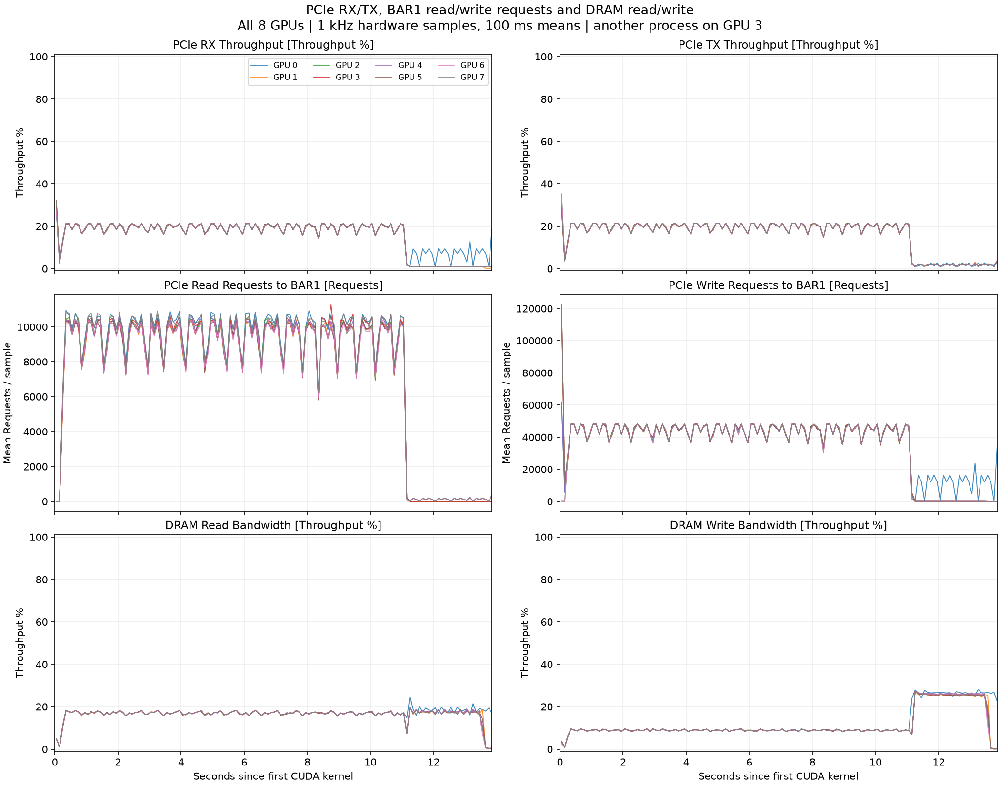

# H3 early V tile-pack: latest full-request Nsight trace

[Download the native Nsight Systems trace](h3-early-vpack-full15s-gpumetrics.nsys-rep) (94,134,801 bytes).
Open with Nsight Systems 2025.3.2. This is the **optimization enabled** full-model capture from 2026-09-17, following the earlier [baseline capture](../h3-cartoon-full15s-gpumetrics-20260917/).

The trace embeds the complete **25-metric gb20x set on all eight GPUs**: 200 channels, 3,235,275 raw metric rows, nominal 1 kHz sampling. Every channel spans the complete 13.846161-second CUDA workload. Expand GPU Metrics for SMs Active, SM Issue, GPC/SYS Clock Frequency, PCIe RX/TX, BAR1 read/write requests, DRAM read/write, Tensor activity, copy engines and warps.

The complete four-step, 15-second T2VA request includes all eight ranks, video/audio VAE and final MP4 encoding/mux. Output is 362 frames, 1280 × 704, with native audio. All eight workers were explicitly ready before warmup; two warmups and six alternating A/B requests preceded the captures. GPU loading and warmups are outside this trace.

## Scheduling result and exactness

The original BF16 V tile-pack kernel is prepared in a reusable CUDA graph and launched directly from C++ after successful synchronous RDMA. The original MXFP8 DiT, NVFP4 VAE and BF16 transport math remain unchanged.

| Full-model median, 1,600 samples per arm | Baseline | Early V pack |
|---|---:|---:|
| V closing barrier end → V tile-pack start | 177.1845 μs | 19.584 μs |
| V closing barrier end → CAKE attention start | 1587.945 μs | 1428.995 μs |
| V tile-pack end → CAKE attention start | 1103.461 μs | 1101.858 μs |

The targeted interval falls 88.95%; CAKE also starts about 159 μs earlier. The remaining interval includes other GPU work.

All 1,600 intermediate V-pack byte comparisons passed. All nine warmed off/on output MP4s match the qualified baseline byte-for-byte; the first cold-start output matches the qualified original cold-start output. See [comparison.json](comparison.json) and [full-model-bytechecks.json](full-model-bytechecks.json).

Three unrecorded same-process A/B pairs had median HTTP times of **13.687592 s baseline** and **13.709816 s optimized**. No end-to-end speedup was established. The profiled optimized request took 14.152 s; profiling adds overhead. This optimization remains in an isolated model copy.

## Hardware plots and validation

- [All 25 metrics, eight GPUs, 25-page PDF](hardware-metrics-all.pdf)
- [All 200 channel summaries](hardware-metrics-all-summary.json)
- [Metric catalog and display conversions](hardware-metric-catalog.csv)
- [Full-request stage validation](trace-stage-validation.json)
- [Nsight collection diagnostics](diagnostics.json)
- [SHA-256 checksums](SHA256SUMS.txt)

The native trace retains 1 kHz samples; figures use 100 ms sample means. PCIe RX/TX and DRAM throughput counters are percentages; BAR1 read/write counters are requests per sample. GPC clock is core/graphics frequency. SMs Active is active SM cycles, not occupancy.

## Collection limits and service state

One preexisting foreign process remained on physical GPU 3; counters are device-wide and may include its activity. Clocks were not locked. Nsight reported severity-2 event-completeness warnings, including a CUDA-start warning outside the eight worker PIDs, and no severity-3 diagnostics. All four steps on all eight ranks, final audio/video stages and all 200 hardware channels were verified; this does not guarantee every unrelated event was recorded.

After verification, the original service was restored. On the user's subsequent explicit request, the H3 gateway, backend and all eight worker GPU contexts were stopped; unrelated GPU jobs were preserved.
