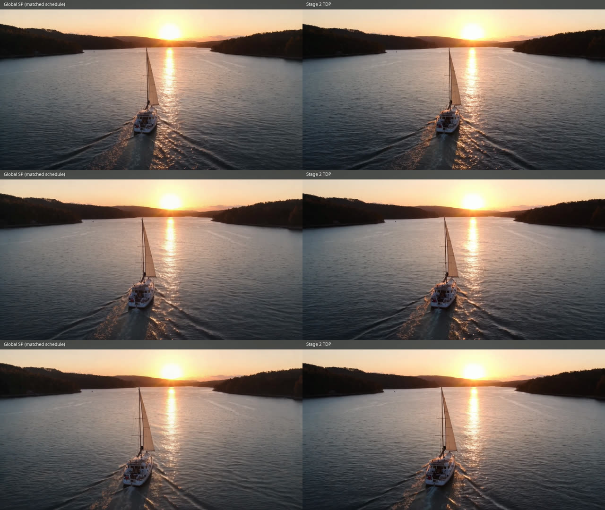

# LTX-2.5 4K Stage-2 tiled data parallelism on four B300 GPUs

This artifact compares two matched-schedule vLLM-Omni
`LTX2DistilledTwoStagePipeline` runs:

1. **Global SP:** four-way Ulysses sequence parallelism in both stages.
2. **Stage-2 TDP:** the same global SP Stage 1, followed by a 2x2 grid of
   overlapping spatial tiles distributed across four GPUs in Stage 2.

Open the [browser comparison](index.html), or play the
[side-by-side MP4](ltx25_global_sp_vs_stage2_tdp_sbs.mp4) directly.



## Fixed comparison contract

| | |
|---|---|
| Hardware | 4 x NVIDIA B300 SXM6 AC, 275,040 MiB each |
| Model | Local materialization of `Lightricks/LTX-2.5-Diffusers` |
| Pipeline | `LTX2DistilledTwoStagePipeline` |
| Prompt | “A cinematic aerial shot following a sailboat through a fjord at sunrise.” |
| Seed | 42 |
| Output | 3840x2160, 121 frames, 24 FPS, 5.0417 seconds |
| Stage 1 | 8 denoise updates, global Ulysses SP4 |
| Stage 2 | Matched sigma schedule `[0.625, 0.4, 0.0]` |
| TDP geometry | 2x2 spatial tiles, 5 latent-token overlap (160 output pixels) |
| Attention | BF16 `CUDNN_ATTN`, eager execution, no diffusion cache |

The global-SP path internally aligns height to 2176 and is cropped to the
requested 2160 pixels for metrics and presentation. The TDP output is emitted
at 3840x2160. The published MP4 is a GitHub-friendly 1920x540 H.264/yuv420p
preview of the 3840x1080 side-by-side master; each source video was generated
at 4K.

## Results

| Mode | Request latency | Reported worker peak reserved memory |
|---|---:|---:|
| Global SP | **36.6778 s** | **232,806 MiB** |
| Stage-2 TDP | 39.3526 s | 233,902 MiB |

The measured request speedup is **0.932x**, so TDP is 7.3% slower in this
single-seed B300 run. It also does not reduce the reported peak: the 1,096 MiB
difference is +0.47%. Model residency, full-resolution latents, VAE decode,
tile assembly, and all-reduce dominate this end-to-end configuration.

Quality is measured over all 121 decoded frames:

| Region | SSIM | PSNR |
|---|---:|---:|
| Full frame | 0.920476 | 31.783358 dB |
| Horizontal overlap band | 0.920530 | 33.386542 dB |
| Vertical overlap band | 0.921495 | 28.926828 dB |

The overlap-band SSIM tracks the full-frame score, and visual inspection of
frames 0, 60, and 120 found no obvious tile boundary. TDP uses approximate
local Stage-2 attention, so these scores are diagnostics rather than a
bit-parity claim.

For the follow-up official-prompt study with ten seeds at 1080p, DCI 2K, and
QHD 2K through a resident user-facing server, see the
[60-video resolution appendix](../ltx25_raw_b300_pipeline_parity/#ltx25-tdp-resolution-study).

## Reproduce

The included driver runs both modes, validates media metadata, computes
full-frame and overlap-band SSIM/PSNR, and creates the side-by-side video:

```bash
python benchmark.py \
  --devices 0,1,2,3 \
  --model /path/to/LTX-2.5-Diffusers \
  --output-dir /path/to/output
```

The run used vLLM-Omni base revision
`9df34bba154e1886620640ef1a8654fc3a310345` plus the experimental LTX-2.5
Stage-2 TDP implementation. The benchmark requires that TDP-enabled runtime;
the driver alone does not add model support.

## Files

| File | Description |
|---|---|
| `index.html` | Responsive GitHub Pages comparison |
| `ltx25_global_sp_vs_stage2_tdp_sbs.mp4` | GitHub-compatible side-by-side video |
| `preview.jpg` | Frames 0, 60, and 120 |
| `results.json` | Exact configuration, profiler summaries, and metrics |
| `benchmark.py` | A/B generation and analysis driver |
| `checksums.sha256` | SHA-256 checksums for published artifacts |
