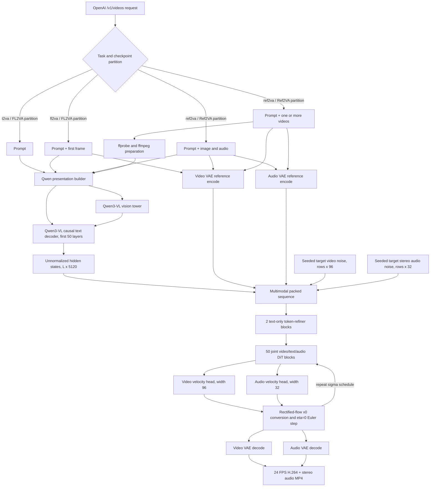
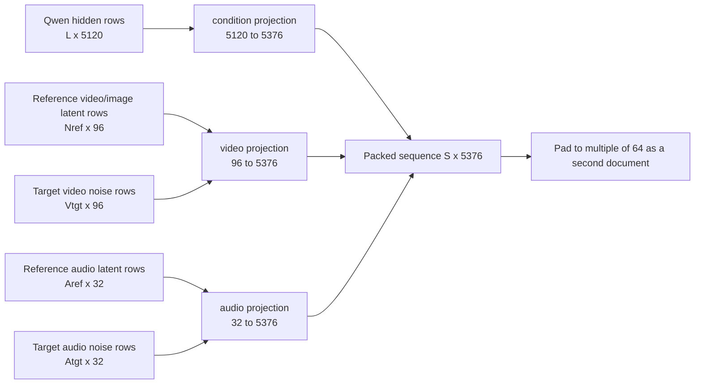
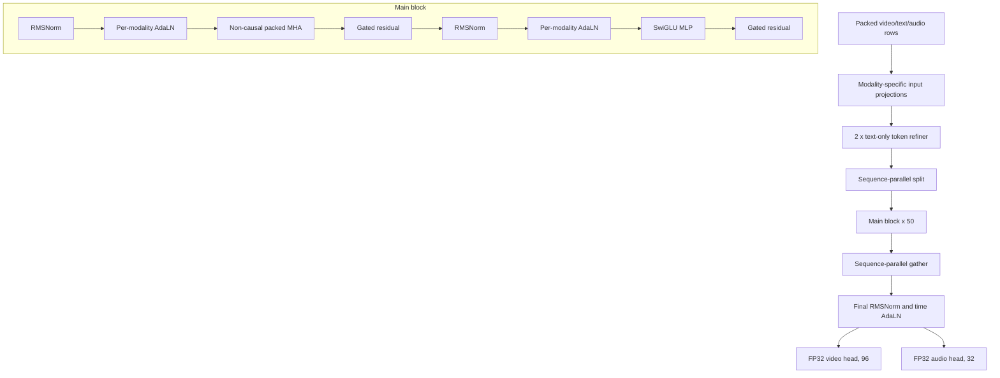
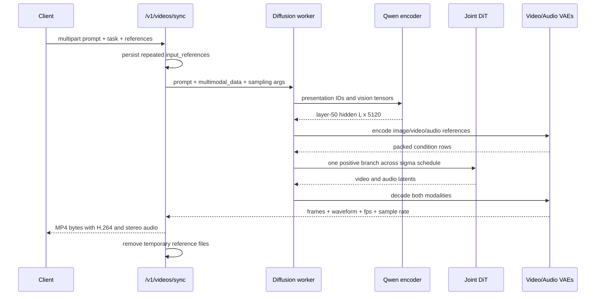

# MiniMax-H3 architecture deep dive

> Scope: vLLM-Omni [PR #5691](https://github.com/vllm-project/vllm-omni/pull/5691) at `d6e4c96ce746ef12e9731101fa4cd5ec5df1ff16`, and vLLM Recipes [PR #725](https://github.com/vllm-project/recipes/pull/725) at `b63958c5212d57c2eac223bde1d073a8f1439f3d`.
>
> Date checked: 2026-08-02 UTC. The Hugging Face repository is gated, and no public original MiniMax-H3 architecture diagram was indexed at review time. All diagrams below are therefore **source-derived reconstructions**, not vendor diagrams.

## 1. Executive summary

MiniMax-H3 is a dense, approximately 64B-parameter, **joint video-and-audio rectified-flow diffusion system**. It is not a video generator followed by a separate dubbing model. At every denoising step, one non-causal transformer sees a single packed sequence containing text, visual references, audio references, target video latents, and target stereo-audio latents, and predicts video and audio velocities together.

The most accurate mental model is:

1. A truncated Qwen3-VL-32B-style encoder converts the prompt and visual references into an unnormalized layer-50 hidden sequence of width 5120.
2. Video and audio VAEs encode references and define the target latent spaces.
3. Text, reference media, target video, and target audio are projected to width 5376 and packed into one sequence.
4. Two text-only token-refiner blocks run first.
5. Fifty joint multimodal DiT blocks perform full, non-causal attention across all packed rows.
6. Separate video and audio heads predict rectified-flow velocity; a deterministic eta=0 Euler update changes only target rows while reference rows remain anchored.
7. Separate video and audio VAEs decode the final latents, and the serving layer muxes 24 FPS H.264 video with 32 kHz stereo audio into MP4.

The integration is unusually broad: PR #5691 adds the model, a TP-aware Qwen3-VL encoder, packed variable-length FlashAttention, Blackwell FA4/Ring support, multi-video upload lifetime handling, VAE parallelism, tests, and model documentation in one 7.3k-line change.

The code architecture is coherent and the local contract tests pass, but the PR is not merge-ready yet:

- PR #5691 is still Draft, has no approving review, has an empty/incomplete PR description, and its DCO check is `ACTION_REQUIRED` because the main implementation commit lacks a `Signed-off-by` trailer.
- Full Buildkite and gated-checkpoint E2E evidence is not represented in the current required checks.
- Recipes PR #725 is mechanically healthy, but its generated command uses `MiniMaxAI/MiniMax-H3` for every task while the implementation and upstream recipe require selecting the local `FL2VA/` or `Ref2VA/` checkpoint partition. This needs an actual gated-checkpoint launch confirmation or a recipe fix before merge.
- The recipe phrase “52-block joint DiT” is imprecise: the implementation has **50 joint multimodal DiT blocks plus 2 text-only token-refiner blocks**.

## 2. End-to-end architecture



The diagrams in this report are reconstructed from the implementation, especially the [pipeline](https://github.com/vllm-project/vllm-omni/blob/d6e4c96ce746ef12e9731101fa4cd5ec5df1ff16/vllm_omni/diffusion/models/minimax_h3/pipeline_minimax_h3.py), [DiT](https://github.com/vllm-project/vllm-omni/blob/d6e4c96ce746ef12e9731101fa4cd5ec5df1ff16/vllm_omni/diffusion/models/minimax_h3/minimax_h3_transformer.py), and [encoder](https://github.com/vllm-project/vllm-omni/blob/d6e4c96ce746ef12e9731101fa4cd5ec5df1ff16/vllm_omni/diffusion/models/minimax_h3/encoder.py).

## 3. Component inventory and parameter interpretation

| Component | Approximate size | Role | Runtime precision/placement |
|---|---:|---|---|
| Joint DiT | 66.3 GB, about 33.1B params | Joint video/audio denoising | Mostly BF16; patch projections, timestep MLP, RoPE frequencies, and final heads remain FP32 |
| Qwen3-VL encoder through layer 50 | 51.5 GB, about 25.8B params | Multimodal presentation encoding | BF16; optionally tensor-parallel across the first N DiT ranks |
| Video VAE | about 10 GB, about 5B params | Image/video reference encode and target video decode | Weights FP32; encode uses the checkpoint's FP16-latent path; decode under FP16 autocast |
| Audio VAE | about 0.6 GB, about 0.3B params | Reference audio encode and 32 kHz stereo decode | FP32 with a deterministic reference-encode context |
| Total pipeline | about 128.4 GB BF16/FP32 storage, approximately 64B params | End-to-end generation | Dense, but components execute in phases rather than one monolithic forward |

“64B active parameters” needs interpretation. There is no MoE routing, so the weights are dense. However, Qwen, DiT, and the VAEs do not all participate in the same matrix-multiplication graph at the same instant: prompt encoding, denoising, and decode are sequential phases. The parameter count describes the whole pipeline, not a 64B single-block forward.

### Why the DiT alone is about 33.1B

From the source defaults (`H=5376`, `56` heads, head dimension `128`, FFN `14336`, 50 main blocks):

| Per main block | Approximate parameters |
|---|---:|
| QKV + output attention projections | 154.14M |
| SwiGLU MLP | 231.21M |
| Three-modality AdaLN projection | 260.21M |
| Total per block | 645.59M |
| 50 main blocks | 32.28B |
| Two text-refiner blocks | 0.77B |
| Embedders, time MLP, norms, and final heads | about 0.08B |
| Total | about 33.12B |

An important and non-obvious fact is that the per-block AdaLN projection is larger than either attention or the MLP. It maps a 2688-wide time embedding to `3 modalities x 6 vectors x 5376`, producing independent shift, scale, and gate values for attention and MLP for video, text, and audio.

## 4. Checkpoint structure and task partitions

The release is treated as two independent local pipelines:

| Checkpoint partition | Supported task | Required conditions |
|---|---|---|
| `FL2VA` | `t2va` | prompt only |
| `FL2VA` | `fl2va` | prompt + exactly one first-frame image |
| `Ref2VA` | `ref2va` | exactly one image + exactly one standalone audio reference, or one or more video file paths |

The pipeline synchronously reads `<model_path>/model_index.json`, then loads `transformer/`, `tokenizer/`, `processor/`, `text_encoder/`, `video_vae/`, and `audio_vae/` from that same selected directory. `_minimax_h3.partition` and `_minimax_h3.tasks` in that `model_index.json` decide which task names are legal.

Consequences:

- One process does not dynamically switch FL2VA and Ref2VA weights.
- Changing from T2VA/FL2VA to Ref2VA requires restarting against the other partition.
- The current vLLM implementation exposes only first-frame FL2VA even though the generic packer understands `(first)`, `(last)`, and `(first,last)` keyframe signatures.
- The model-level input limits described in the recipe (up to 9 images, 3 videos, 3 audio clips) are broader than the serving code implemented in PR #5691.

## 5. Qwen3-VL conditioning encoder

This is not a stock `transformers` model call. The PR reimplements the relevant Qwen3-VL path using vLLM-style tensor-parallel primitives routed through a dedicated encoder process group.

### 5.1 Vision path

- 3D convolutional patch embedding accepts flattened image or sampled-video patches.
- Learned positional embeddings are interpolated for variable resolution.
- Vision blocks use vision RoPE and per-segment SDPA.
- A patch merger produces language-width visual tokens.
- DeepStack features from multiple vision layers are injected into early language decoder layers.

For reference videos, two representations are intentionally used:

1. **Qwen semantic view:** the prepared video is sampled at 2 FPS. Temporal pairs are merged and represented as timestamped blocks such as `<0.2 seconds>` followed by video tokens.
2. **DiT conditioning view:** the full 24 FPS prepared video is encoded by the video VAE and inserted as reference latent rows.

This split lets Qwen reason about a compact semantic summary while the DiT receives dense motion/appearance anchors.

### 5.2 Language path

- Causal GQA decoder, hidden size 5120.
- 64 query heads and 8 KV heads.
- Q/K RMSNorm, multimodal RoPE, SwiGLU MLP.
- Only layers 0 through 49 are retained.
- No LM head and no final normalization are loaded.
- The output is the unnormalized layer-50 hidden state `[L, 5120]`.

Images and videos are inserted into placeholder positions in the token stream. Standalone audio content never enters Qwen; it receives only a textual label such as `<Audio 1>:` while the actual waveform is handled by the audio VAE and packed directly into the DiT sequence.

### 5.3 Encoder tensor parallelism

`--text-encoder-tp-size N` shards embeddings, QKV, merged gate/up, and row-parallel projections over the first N DiT ranks. N must divide both 64 query heads and 8 KV heads. Row-parallel collectives reproduce the full `[L,5120]` hidden state on every encoder rank; the pipeline then broadcasts it to all DiT ranks.

The benefit is memory balance, not lower DiT latency. The recipe reports main-rank peak memory falling from roughly 133 GB to 103 GB with encoder TP4, with no measurable throughput loss. BF16 collective order can introduce small numerical differences for N>1.

## 6. Presentation formats by task

| Task | Qwen presentation |
|---|---|
| T2VA | Prompt verbatim, no chat template and no special visual block |
| FL2VA | `<Picture 1>:` + image vision block + prompt |
| image+audio Ref2VA | `<Picture 1>:` + image vision block + `<Audio 1>:` + prompt |
| multi-video Ref2VA | Optional `<Audio j>:` label for each source video with audio, then `<Video k>:` + timestamped sampled-video blocks, then prompt |

Presentation IDs and modality tags are built in one accumulator so their row alignment cannot drift. Visual token positions receive DiT modality tag 0; textual labels and prompt tokens receive tag 1.

## 7. The packed multimodal sequence

The central design choice is to turn different modality tensors into rows of one attention sequence.



Canonical Ref2VA layout:

```text
[ text L
| ref block 1 (image OR audio OR video-audio)
| ref block 2 ...
| target audio: audio_t * 2 rows
| target video: latent_t * (latent_h/2) * (latent_w/2) rows
| padding to multiple of 64 ]
```

The first document is the used multimodal sequence. Alignment padding becomes a second document through `cu_seqlens=[0, used, seq_len]`, so FlashAttention never lets valid rows attend to padding.

### Row widths before projection

- Video VAE latent has 24 channels. A `(1,2,2)` patch produces `24 x 1 x 2 x 2 = 96` values per row.
- Audio VAE latent has width 32. Stereo is represented channel-major as `audio_t x 2` rows, each width 32.
- Qwen rows have width 5120.
- All three project to the DiT hidden width 5376.

### Position and modality encoding

- Every packed row gets a 3D `(time,height,width)` position.
- Text advances on the temporal coordinate.
- Video uses temporal positions with a repeating `(1,4,4,4,4)` frame-per-latent-token rhythm and a `5/3` rescale.
- Audio uses temporal positions at 40 Hz; the two channels are pinned to opposite width-grid edges.
- Each row gets a modality tag: video `0`, text `1`, audio `2`, padding `-1`.
- 3D RoPE rotates 96 of each 128-dimensional head, allocating 32 rotated dimensions per time/height/width axis.

### Concrete sequence-size examples

For the validated FL2VA workload, 209 frames at 1248x768:

- Video VAE grid: `(T,H,W)=(62,48,78)`.
- Target video rows: `62 x 24 x 39 = 58,032`.
- Target audio: 348 latent time points x 2 channels = 696 rows.
- First-frame condition: `1 x 24 x 39 = 936` rows.
- Media rows before text/padding: **59,664**.

For a 362-frame, 1344x768 two-video Ref2VA request, assuming both references occupy the same adapted 16:9 latent canvas:

- Target video rows: 107,856.
- Target audio rows: 1,206.
- Two full reference-video streams: about 215,712 visual rows.
- Two full reference-audio streams: up to about 2,412 audio rows.
- Media rows before Qwen text/padding: roughly **327,186**.

This is why multi-video Ref2VA is drastically slower. Full attention grows approximately quadratically with packed sequence length, while every additional reference video increases both the Qwen visual sequence and the DiT latent sequence.

## 8. Joint DiT internals

### 8.1 Topology



### 8.2 Attention

- 56 query heads and 56 KV heads: this DiT uses MHA, not GQA.
- Head dimension 128, attention inner dimension 7168.
- Q/K per-head RMSNorm.
- 3D partial RoPE.
- Non-causal packed full attention.
- Checkpoint QKV rows arrive grouped per head as `[q,k,v]` and are reordered to the runtime's `[all Q, all K, all V]` layout during weight loading.

The packed attention call is a narrow `torch.compiler.disable` eager island. Projection, normalization, RoPE, and surrounding block computation remain available to regional `torch.compile`, while CuTe FA4 and scalar packed metadata are kept opaque to Dynamo.

### 8.3 Token refiner

The two refiner blocks run only on projected Qwen rows. They are ordinary pre-norm attention+MLP blocks without AdaLN or RoPE. They run before sequence sharding and explicitly skip Ulysses; treating these replicated rows as already sharded would corrupt packed `cu_seqlens` semantics.

### 8.4 Mixed precision

The implementation deliberately preserves FP32 for numerically sensitive boundaries:

- video and audio input projections;
- timestep input/output projections;
- RoPE inverse frequencies;
- final video and audio projections.

The 50 block stack and text condition path are BF16. This mixed contract is the current obstacle to generic FP8 quantization, as noted in the PR review.

## 9. Denoising and scheduler

H3 is CFG-distilled. There is only one positive presentation and one transformer forward per sigma point; `cfg_parallel_size` must equal 1.

Video and audio have separate shifted sigma schedules:

```text
base sigma = linspace(1, 0, num_steps)
shifted sigma = shift * sigma / (1 + (shift - 1) * sigma)
default video shift = 12
default audio shift = 3
```

At each step:

1. `t_video = 1 - sigma_video`; `t_audio = 1 - sigma_audio`.
2. Text/padding inherit video time; target video uses video time; target audio uses audio time.
3. Visual conditions use at least `t=0.999`; audio references use `t=1.0`.
4. Unique `(time, modality)` combinations index per-block AdaLN parameters.
5. The DiT returns video and audio rectified-flow velocity.
6. `x0 = xt + sigma * velocity`.
7. Deterministic eta=0 Euler interpolation moves only target rows to the next sigma.
8. Reference visual/audio rows are reset to their anchors after every step.

There is no negative-prompt branch, no doubled CFG batch, and no stochastic ancestral noise injection in the update.

## 10. VAE and media contracts

### Video VAE

- Native remote-code model loaded from the gated checkpoint with `trust_remote_code`.
- 24 latent channels and spatial compression of 16 before the DiT's additional 2x2 patchification.
- Video weights remain FP32.
- Reference encode is seeded with 42 and normalized/patchified on CPU FP32 to match the reference implementation.
- Decode runs under FP16 autocast.
- Only the checkpoint's native tile-parallel mode is supported.
- `vae_patch_parallel_size` must be 1 or the full DiT group size.

### Audio VAE

- 32-dimensional latent at 40 Hz.
- Two channels, decoded at 32 kHz.
- Mono input is duplicated; larger channel counts are truncated to stereo.
- Reference encode disables TF32, cuDNN, flash SDPA, and memory-efficient SDPA, using math SDPA for deterministic parity.

### Reference-video preprocessing

- `ffprobe` reads dimensions, FPS, frame count, and audio presence.
- Every source video is rescaled to a multiple-of-32 canvas with a 768-pixel short edge and about 1 MP maximum area.
- It is transcoded to 24 FPS H.264/YUV420P for visual conditioning.
- The source soundtrack is extracted separately, converted to stereo, and passed to the audio VAE.
- Decoding prefers Decord and falls back to PyAV.
- Multipart uploads are persisted only for request lifetime and cleaned on both success and failure.

## 11. Serving path



The synchronous endpoint returns raw MP4 bytes. The asynchronous endpoint stores the job and returns base64 video data on retrieval. The generic video serving layer detects H3's `video`, `audio`, `fps`, and `audio_sample_rate` fields and muxes the tracks.

Current serving limitations:

- one prompt/request per diffusion batch;
- exactly one image for FL2VA;
- image Ref2VA requires exactly one image and one audio;
- video Ref2VA accepts file-path videos and embedded soundtracks, but rejects a separate audio condition;
- no explicit implementation enforcement of the vendor's 4–15 second, file-count, file-size, or 64 MB total request limits;
- multipart multi-video persistence writes all uploads before model validation, so production deployment should enforce reverse-proxy/body limits.

## 12. Parallelism and memory model

| Parallel mode | What is sharded | H3-specific status |
|---|---|---|
| Ulysses SP | sequence/head exchange inside attention | Best validated 4-GPU path is U4; DiT weights remain replicated |
| Ring | sequence blocks via P2P | FA4 wrapper added; hybrid U2 x Ring2 has a known accuracy mismatch, so pure Ulysses is recommended |
| DiT TP | attention heads and FFN matrices | Supported when 56 heads and FFN 14336 divide TP and local heads divide Ulysses |
| HSDP | the 50 main DiT blocks | Hooks are present; resident input/time/final modules are excluded |
| Text-encoder TP | Qwen embeddings, QKV, MLP, row projections | Dedicated group over first N DiT ranks; N divides 64 and 8 |
| VAE patch parallel | native VAE tiles | size 1 or full DiT group; mode `tile` only |
| CFG parallel | positive/negative branch | Forbidden because the checkpoint is CFG-distilled |

### Why pure Ulysses needs large-memory GPUs

Ulysses distributes attention work but not model weights. Every rank still holds the roughly 66.3 GB DiT. The video/audio VAEs are also constructed on every rank, and rank 0 holds the Qwen encoder unless encoder TP is enabled. This explains:

- about 133 GB main-rank peak in the reported 4xB300 no-offload configuration;
- about 103 GB with Qwen encoder TP4;
- an expected OOM on 8x64 GB with pure Ulysses despite the large aggregate memory.

On smaller-HBM hardware, the architectural answer is DiT TP/HSDP and/or offload, not simply a larger Ulysses degree. Distributed layerwise offload is explicitly deferred to follow-up work.

## 13. Performance analysis

The reported validated setup is 4xB300, Ulysses 4, Ring 1, VAE tile parallel 4, regional compile, CuTe FlashAttention-4, no CPU/layerwise offload.

| Workload | Reported result | Interpretation |
|---|---:|---|
| FL2VA, 209 frames, 1248x768 | 86.964 s mean HTTP E2E | Approximately 0.10x real time for an 8.7 s clip; denoise dominates |
| Two-video Ref2VA, 362 frames, 1344x768 | 784.394 s accounted model stages | About 13 minutes for 15.1 s output; long packed attention dominates |

For FL2VA, the reported stage breakdown is approximately:

- Qwen text/vision encode: 0.41 s combined;
- DiT denoise: 79.1 s, about 88% of E2E;
- video+audio VAE decode: 2.40 s with VAE PP4;
- remaining time: initialization around stages, transfers, postprocess, and MP4 encoding.

VAE tile parallelism reduces decode from 8.24 s to 2.40 s, roughly 3.4x. That is a good local speedup but cannot dominate total latency because DiT remains the main cost.

For two-video Ref2VA, FA4 accounts for about 76% of diffusion device time, GPU utilization is reported around 92.8–94.3%, and CPU-idle union about 3.15%. This is strong evidence that the slow path is fundamentally attention-bound rather than stalled on preprocessing or Python.

### Accuracy evidence

Matched reference comparisons reported in the recipe:

- T2VA/FL2VA: SSIM 0.9873–0.9896, PSNR 39–42 dB, pixel cosine above 0.9996, audio log-mel cosine 0.977–0.996.
- Two-video Ref2VA: raw-pixel SSIM 0.628, CLIP cosine 0.9816, audio log-mel cosine 0.9869. The lower pixel SSIM is attributed to H.264 bitrate differences rather than semantic divergence.
- Qwen encoder TP1 is bit-exact in the reported test. TP4 preserves semantic/numerical quality but BF16 collective order changes exact pixels (reported PSNR 31.11, SSIM 0.9566 versus TP1).

These are good initial signals, but the current PR does not include the raw artifacts/logs or an automated numerical-golden test, so reviewers must treat them as externally reported validation rather than CI-enforced guarantees.

## 14. Cache-DiT and quantization

The model exposes Cache-DiT `Pattern_3` and correctly marks `has_separate_cfg=False`. Reported denoise latency improves 121.01 s to 84.47 s (30.2%), but SSIM is only 0.831, so this is a lossy opt-in rather than the default accuracy path.

FP8 is not supported yet. The reason is deeper than adding a CLI flag:

- several projections and RoPE state are required to stay FP32;
- checkpoint QKV and MLP layouts use custom loaders;
- the large modality-specific AdaLN layers need a defined quantization contract;
- reference parity is sensitive to BF16/FP32 boundaries.

Day-0 BF16 support is therefore a reasonable scope choice, but the PR description and recipe should say this explicitly.

## 15. What PR #5691 changes outside the model directory

The integration modifies shared infrastructure in four meaningful ways:

1. **Packed FlashAttention metadata:** callers can pass exact `cu_seqlens` and max lengths, bypassing repeated boolean-mask unpadding and gather/scatter.
2. **Blackwell FA4:** `FLASH_ATTN` prefers `flash_attn.cute` on Blackwell, with an opt-in `flash-attn-4[cu13]==4.0.0b18` extra.
3. **Ring FA4:** Ring attention gets an FA4 kernel adapter returning log-sum-exp state for block merging.
4. **Video API:** repeated `input_references` multipart fields are persisted as temporary video files and cleaned after synchronous or asynchronous generation.

These shared changes deserve separate attention from model correctness because they can affect other diffusion models and serving routes.

## 16. Test and CI assessment

### Local run performed for this report

```bash
PYTHONPATH=$PWD /home/zjy/code/lsy/vllm-omni/.venv/bin/python -m pytest -q \
  tests/diffusion/models/minimax_h3/test_minimax_h3_contract.py \
  tests/diffusion/models/minimax_h3/test_minimax_h3_packing.py \
  tests/diffusion/models/minimax_h3/test_minimax_h3_parallel.py
```

Result: **27 passed** in 1.92 s.

The reused environment has vLLM 0.24.0 while the branch is vLLM-Omni 0.26.0rc2-derived, so this validates CPU contracts rather than release ABI compatibility.

The full `tests/entrypoints/openai_api/test_video_server.py` collection was attempted but blocked before test execution because this local environment lacks `pytest-mock`. No API assertion failed.

### What the tests cover well

- registry and postprocess contracts;
- fixed FPS and frame/latent shape mapping;
- sigma schedule values;
- packed row/update-mask separation;
- video/audio pack-unpack round trips;
- offload dispatch behavior;
- reference-video adaptation and mixed-resolution metadata;
- text-refiner Ulysses bypass;
- TP divisibility checks;
- packed FA metadata and FA4 Ring wrapper selection;
- multi-video upload lifetime and cleanup.

### What remains weak

- The only repository E2E is opt-in, requires an authorized FL2VA path and 8 GPUs, uses 2 denoise steps at 256x448, and checks only output shape/sample rate/FPS.
- No Ref2VA E2E exists in the committed tests.
- No full 50-step numerical parity test or golden media hash/metric is in CI.
- No current CI evidence demonstrates B300/GB200 FA4 execution, Ulysses 4, VAE PP4, or encoder TP4 on this exact head.
- The current PR check rollup shows wheel builds, pre-commit, release, and docs, but not the full vLLM-Omni Buildkite matrix.

## 17. Recipes PR #725 assessment

### What is good

- Hardware support is now explicitly limited to verified GB200/B300 and marks AMD accelerators unsupported.
- All three task pills now show `/v1/videos/sync`.
- DCO passes.
- The recipe clearly documents CFG=1, VAE tile-only behavior, FP8 absence, warmup exclusion, memory peaks, and the 8x64 GB pure-Ulysses OOM mechanism.
- The measured 4-GPU launch flags match the implementation's strongest validated path.

### Important discrepancy: partition selection

The recipe's generated launch command is:

```bash
vllm serve MiniMaxAI/MiniMax-H3 --omni ...
```

for T2VA, FL2VA, and Ref2VA. But the implementation:

- directly opens `Path(od_config.model) / "model_index.json"`;
- expects all six components under that selected path;
- reads the selected partition and allowed tasks from that file;
- provides no `--partition`, `--subfolder`, or task-driven checkpoint swap.

The vLLM-Omni model recipe instead downloads the gated repository and launches either:

```bash
vllm serve "${MODEL_ROOT}/FL2VA" --omni ...
vllm serve "${MODEL_ROOT}/Ref2VA" --omni ...
```

Because the gated Hugging Face tree could not be inspected in this review, the safest verdict is: **the root-ID recipe command is unproven and structurally inconsistent with the loader contract**. It should be tested exactly as rendered. If it fails—as the code strongly suggests—the recipe UI needs partition-specific model paths or an implementation-side subfolder selector.

### Wording corrections

- Replace “52-block joint video/audio DiT” with “50 joint multimodal DiT blocks plus 2 text-only token-refiner blocks.”
- Make clear that 64B is the whole dense pipeline, not simultaneous parameters in one forward.
- Separate model/product input limits from what vLLM-Omni currently exposes.
- Avoid presenting 1440p as validated vLLM evidence when the shown benchmarks are 768-short-edge workloads.

## 18. Merge-readiness verdict

### PR #5691: not ready yet

Blocking or pre-ready items:

1. Add DCO sign-off to the implementation commit history.
2. Fill the PR description with architecture, exact environment, task matrix, commands, accuracy/performance tables, and artifact links.
3. Run or link full Buildkite.
4. Add/attach actual gated-checkpoint evidence for FL2VA and both Ref2VA modes on the final head.
5. Confirm the root-HF-ID versus partition-directory launch contract.
6. Mark the PR ready only after these are complete; it is still Draft and cannot receive the normal code-owner review flow.

Strongly recommended before or immediately after day 0:

- Ref2VA E2E coverage;
- request file/count/duration limits;
- move/reuse generic text-encoder TP infrastructure rather than keeping a model-specific implementation forever;
- isolate shared FA4/API infrastructure into follow-ups if review surface becomes too large;
- quantify Ring accuracy before documenting hybrid topologies;
- add a supported low-HBM plan using DiT TP/HSDP/distributed layerwise offload.

### Recipes PR #725: close, but depends on #5691 and partition launch confirmation

The recipe's schema/checks are healthy. It should not merge ahead of the model PR, and the generated root-model command must be proven or corrected first.

## 19. Bottom line

MiniMax-H3's core architectural idea is elegant: use a large multimodal encoder to build a semantically rich presentation, then let a single-stream DiT perform full attention over text, visual reference, audio reference, target video, and target audio rows. Modality-specific AdaLN and separate time schedules preserve modality identity without splitting the denoiser into separate networks. This naturally supports generation, continuation, reference composition, lip sync, and editing-like tasks in one checkpoint family.

The cost follows directly from the design. A 33B dense DiT with full attention over roughly 60k rows for FL2VA—and potentially well above 300k rows for multi-video Ref2VA—is HBM- and attention-intensive. FA4, Ulysses, encoder TP, VAE tile parallelism, regional compile, and future HSDP/offload are not optional polish; they are what make the architecture serveable.

The implementation is technically substantial and internally consistent enough to justify continued review. The remaining work is primarily release engineering and evidence packaging: DCO, full CI, final-head GPU artifacts, exact partition launch behavior, and honest separation between vendor capabilities and the narrower day-0 vLLM serving contract.

## 20. Source map

- [MiniMax-H3 pipeline](https://github.com/vllm-project/vllm-omni/blob/d6e4c96ce746ef12e9731101fa4cd5ec5df1ff16/vllm_omni/diffusion/models/minimax_h3/pipeline_minimax_h3.py)
- [Joint DiT](https://github.com/vllm-project/vllm-omni/blob/d6e4c96ce746ef12e9731101fa4cd5ec5df1ff16/vllm_omni/diffusion/models/minimax_h3/minimax_h3_transformer.py)
- [Qwen3-VL encoder](https://github.com/vllm-project/vllm-omni/blob/d6e4c96ce746ef12e9731101fa4cd5ec5df1ff16/vllm_omni/diffusion/models/minimax_h3/encoder.py)
- [Packed sequence](https://github.com/vllm-project/vllm-omni/blob/d6e4c96ce746ef12e9731101fa4cd5ec5df1ff16/vllm_omni/diffusion/models/minimax_h3/packed_sequence.py)
- [Denoise loop](https://github.com/vllm-project/vllm-omni/blob/d6e4c96ce746ef12e9731101fa4cd5ec5df1ff16/vllm_omni/diffusion/models/minimax_h3/denoise_loop.py)
- [Video/audio VAE adapters](https://github.com/vllm-project/vllm-omni/blob/d6e4c96ce746ef12e9731101fa4cd5ec5df1ff16/vllm_omni/diffusion/models/minimax_h3/vae.py)
- [Reference-video preparation](https://github.com/vllm-project/vllm-omni/blob/d6e4c96ce746ef12e9731101fa4cd5ec5df1ff16/vllm_omni/diffusion/models/minimax_h3/reference_video.py)
- [vLLM-Omni PR #5691](https://github.com/vllm-project/vllm-omni/pull/5691)
- [vLLM Recipes PR #725](https://github.com/vllm-project/recipes/pull/725)
- [Gated MiniMax-H3 checkpoint](https://huggingface.co/MiniMaxAI/MiniMax-H3)
