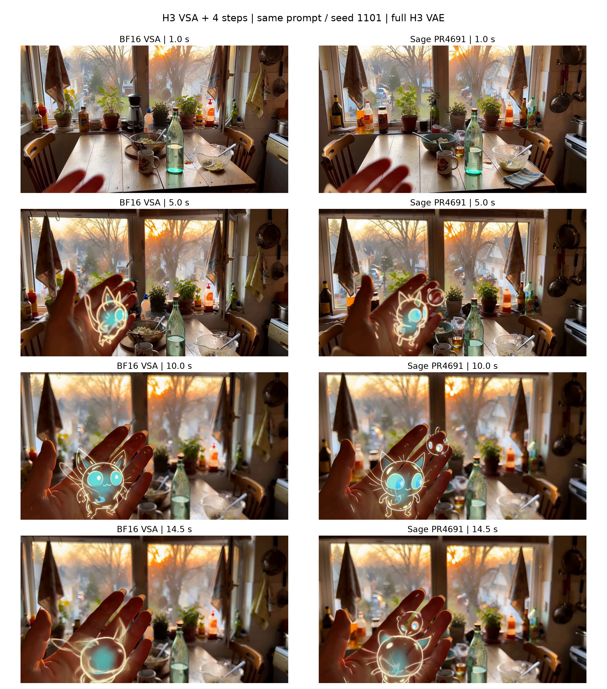
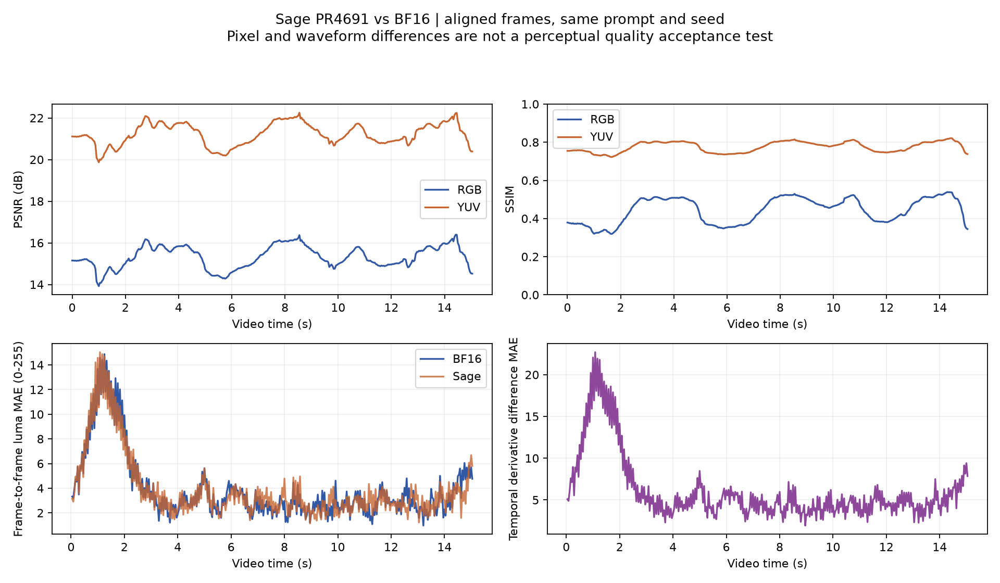

# H3 VSA + 4-step：BF16 vs Sage PR #4691

固定同一 prompt、seed 1101、8 卡和稀疏配置。Sage 有耗时收益，但此次 DiT 降幅未达到预期 15%；输出有可见变化。

| 测量 | BF16 秒 | Sage 秒 | 耗时下降 |
| --- | --- | --- | --- |
| 正常端到端（无 profiler） | 27.190 | 25.905 | 4.73% |
| DiT（分阶段计时，无 Nsight） | 20.528 | 19.116 | 6.88% |

每组先预热一次，再测三次。正常请求与分阶段计时分别运行；Nsight 另行采集，不能用 trace 用时代替正常延迟。

## 视频、原始 Nsight 与数据

- 完整视频：[BF16](BF16.mp4)、[Sage PR4691](Sage-PR4691.mp4)。
- 原生 trace：[BF16](BF16-warmed.nsys-rep)、[Sage PR4691](Sage-PR4691-warmed.nsys-rep)。
- [原始数据和日志 ZIP](raw-data.zip)、[汇总 CSV](summary/latency-summary.csv)、[来源和校验](manifest.json)。

## 阶段耗时与占比

| 阶段 | BF16 秒 | Sage 秒 | BF16 占比 | Sage 占比 | 变化 pp |
| --- | --- | --- | --- | --- | --- |
| Encoder | 0.081 | 0.081 | 0.30% | 0.31% | +0.02 |
| DiT | 20.528 | 19.116 | 75.46% | 73.72% | -1.74 |
| Decode total | 6.512 | 6.646 | 23.94% | 25.63% | +1.69 |
| Outside encoder/DiT/decode | 0.082 | 0.086 | 0.30% | 0.33% | +0.03 |

分母为分阶段计时运行的完整请求 E2E；这些顶层项组成完整请求。视频/音频 VAE 是 Decode 子项，另见 [解码明细](summary/decode-components.csv)，不要重复相加。

## Nsight 中第 3 步的耗时分布

| GPU 7，第 3 步 | BF16 秒 | Sage 秒 | BF16 占比 | Sage 占比 | 变化 pp |
| --- | --- | --- | --- | --- | --- |
| linear_gemm | 2.670 | 2.670 | 53.30% | 57.76% | +4.46 |
| vsa | 1.320 | 0.799 | 26.35% | 17.28% | -9.07 |
| rdma_barrier | 0.006 | 0.004 | 0.13% | 0.09% | -0.04 |
| rdma_other | 0.000 | 0.000 | 0.00% | 0.00% | +0.00 |
| pointwise | 0.076 | 0.076 | 1.51% | 1.63% | +0.12 |
| attention_other | 0.000 | 0.000 | 0.00% | 0.00% | +0.00 |
| communication_other | 0.002 | 0.001 | 0.03% | 0.03% | +0.00 |
| layout_copy | 0.127 | 0.208 | 2.54% | 4.50% | +1.96 |
| memory_ops | 0.009 | 0.009 | 0.17% | 0.18% | +0.01 |
| other | 0.144 | 0.145 | 2.87% | 3.13% | +0.26 |
| concurrent_mixed | 0.000 | 0.000 | 0.00% | 0.00% | +0.00 |
| idle | 0.656 | 0.657 | 13.10% | 14.21% | +1.12 |
| sage_quantization | 0.000 | 0.054 | 0.00% | 1.17% | +1.17 |

这是物理 GPU 7 的不重叠时间区间划分；跨类别并发记为 concurrent_mixed，空闲记为 idle，总和为该步时长。没有跨 GPU 求和。vsa 表示可识别的精细 block-sparse/index kernel；量化和布局另列。GEMM 按 kernel 名分类，不声称每个 GEMM 都属于线性层。RDMA barrier 是驻留/等待时间，不等于可全部消除的通信开销。

这一 GPU 的精细 VSA kernel 耗时下降 39.48%，但每步新增量化 0.054 秒、布局开销增加 0.081 秒；GEMM 仍约 2.670 秒。这解释了 kernel 收益没有等比例转化为整个 DiT 的收益。

[全部八卡占比 CSV](summary/nsys-step03-phase-changes-all-gpus.csv) · [精细 VSA kernel 次数/均值/最大值](summary/nsys-fine-vsa-kernel-per-gpu.csv)

## 运行中 GPC 频率

| 物理 GPU | BF16 GPC max MHz | BF16 mean MHz | Sage GPC max MHz | Sage mean MHz |
| --- | --- | --- | --- | --- |
| 0 | 2376.04 | 2330.66 | 2377.27 | 2371.82 |
| 1 | 2376.75 | 2359.24 | 2377.67 | 2368.76 |
| 2 | 2377.09 | 2363.64 | 2377.55 | 2372.17 |
| 3 | 2370.08 | 2267.47 | 2377.19 | 2368.07 |
| 4 | 2529.61 | 2328.25 | 2553.35 | 2442.66 |
| 5 | 2532.68 | 2384.03 | 2542.10 | 2479.27 |
| 6 | 2577.15 | 2364.23 | 2610.63 | 2482.15 |
| 7 | 1950.07 | 1948.48 | 1950.06 | 1948.38 |

GPU Metrics 目标 1000 Hz。此表仅选择时间戳落在对应 GPU 精细 VSA kernel 区间内的采样点；mean 为采样点算术均值。完整采集窗口和 SYS 数据见 [频率汇总](summary/frequency-summary-all.csv)。NVML 目标每卡 10 Hz，保留完整原始时间戳。

本实验没有锁定频率，部分 GPU 在 Sage 下频率更高，因此这些结果属于节点默认动态频率下的实测。GPU 7 两组的 GPC 均值接近（1948.48 / 1948.38 MHz），可结合上面的该卡耗时分解评估变化。

## 输出差异与质量

固定同一 prompt、seed 1101，比较 362 个对齐帧及同长度音频：

| 指标 | Sage 相对 BF16 |
| --- | ---: |
| RGB 全局 PSNR | 15.289 dB |
| RGB 逐帧 SSIM 均值 | 0.443940 |
| YUV 全局 PSNR | 21.187 dB |
| YUV 逐帧 SSIM 均值 | 0.775831 |
| 音频 PCM SNR | 2.623 dB |
| 音频波形相同 | 否 |

场景主题保留，但构图、手的位置及发光角色细节有可见差异。这是同一生成样本的输出保真度比较，不是跨 prompt 的总体质量评估。像素指标会受位置和运动变化影响，不能单独解释为感知质量分数。未指定质量接受阈值，因此没有宣称 accuracy 通过。原始质量 JSON 中的 `status=passed` 仅表示媒体对齐检查及指标计算成功。

每组内部三次正常输出字节一致，且该组分阶段计时的三个正式输出、Nsight 采集时的正式输出均与其一致。视频与 trace 的对应校验见 [SHA-256 记录](video-trace-identities.json)。预热视频不作为正式比较样本。

[逐帧 CSV](quality/per-frame-metrics.csv) · [完整质量 JSON](quality/comparison.json)

## 实验配置

| 项目 | A：BF16 | B：Sage PR4691 |
| --- | --- | --- |
| FastH3 / VSA | 4 次 DiT forward，top-k 162，tile 64 | 相同 |
| DiT 线性层 | BF16，关闭全部后续 FP8 线性层 | 相同 |
| QKV 通信 | BF16 | 相同 |
| 精细 attention | 原始 SM120 BF16 CuTeDSL kernel | INT8 QK / FP8 PV，BF16 输出 |
| Skip-softmax 近似 | 关闭 | 关闭 |
| Video VAE | 完整 H3 VAE，关闭 TAEH3 | 相同 |
| RDMA、直接落位、布局和 O bundle | 保留既有精确实现 | 相同 |
| GPU 顺序 | 0,4,1,5,2,6,3,7 | 相同 |
| 频率/功率设置 | 节点默认动态频率，没有修改 | 相同 |

模型请求为 1280×720、15 秒；有效视频为 1280×704、362 帧、24 FPS。实验使用隔离源码与缓存，原始工作区未回退或改写。

Sage 固定 [PR4691](https://github.com/flashinfer-ai/flashinfer/pull/4691) 的 `e0526bbe9180b0b65b513faa32ab255e078d8bcb`。其 23 项官方测试通过。实际 H3 形状随机输入微测中，BF16 调用 21.897 ms，Sage 预量化 kernel 路径 13.219 ms，包含布局与量化为 15.677 ms；有效 token 输出相对 L2 为 0.039396。随机输入微测不能替代上面的完整视频比较。

## PR4951 能否直接用于这里

当前发布版本不能直接使用。它的 SM120、D128、block64 和量化格式匹配，但六个导出 kernel 缺少 H3 所需的“可变 block 长度 + 逐行不同 block 数量 + 任意 top-k 索引”组合，具体缺失 tuple 为 `(1,1,0,0,0)`。不能通过伪称连续索引、统一数量或忽略 padding 来绕过。

[PR4951](https://github.com/flashinfer-ai/flashinfer/pull/4951) 已合并；它报告的约 1.11× 是相对旧 Sage kernel 的特定 shape 测试，不是此次 H3 的 DiT 收益。详见 [适配检查](pr4951-assessment.md) 和 [原始清单校验 JSON](pr4951-compatibility.json)。

## 如何查看 Nsight 与 ZIP

1. 用 Nsight Systems 打开 `.nsys-rep`，展开 CUDA GPU 与 NVTX 时间线。
2. 定位 `minimax_h3.denoise.step_03`，查看八卡同一 DiT 步；VSA 内部有 fine attention 和 Sage 量化/布局标记。
3. 解码请求使用第二次调用的 NVTX 标记。GPU Metrics 下可查看 GPC/SYS Clock Frequency。
4. 通过 PCI 地址或映射 CSV 识别物理卡；CUPTI deviceId 与 GPU Metrics instanceId 是不同编号体系。

`raw-data.zip` 保留：

- `frequency/<mode>/nsys-gpc-raw.csv`、`nsys-sys-raw.csv`：未转换的数据库采样值；包括原始有符号整数。
- `frequency/<mode>/TARGET_INFO_*.csv`、映射和导出清单：设备身份、单位标签和可复现查询。
- `nvml-frequency.csv`：10 Hz 目标轮询原始读数，SM/graphics/memory 单位 MHz，含功耗、温度和时间戳。
- `runs/`：各测量的配置、请求、日志、阶段数据和验证记录。
- `analysis/`：完整请求、第 3 步的分析 JSON/Markdown 及原生 nsys stats。
- `sources/`：采样、分析和实验脚本及提交/哈希记录。

两个 `.nsys-rep` 独立提供；完整 SQLite 可从它们重新导出。原始 CSV 不做单位修正，派生频率表显式采用 `(value & 0xffffffff) / 1e6` 得到 MHz，并记录筛选窗口。最大值和均值分别计算，不把空闲快照当成运行频率。
