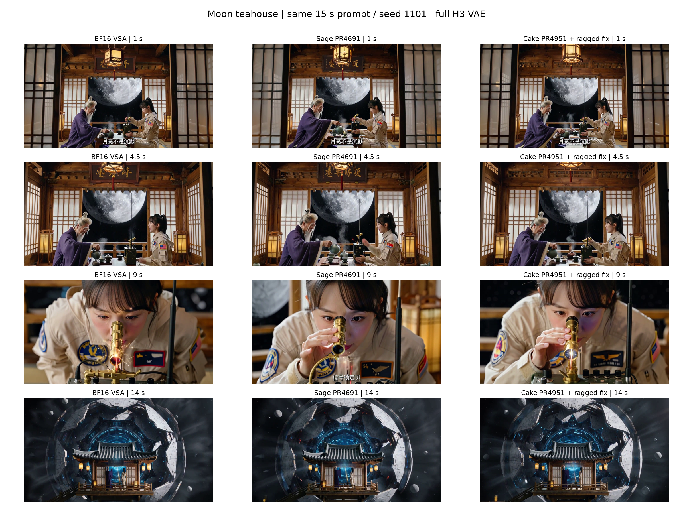

# 月下茶屋 15 秒：BF16 / Sage / Cake 三组实测

[打开三路同步播放页面](https://lishunyang12.github.io/vllm-omni-rankings/scripts/minimax_h3_sage_teahouse_three_way/)

| 方法 | 端到端均值 / 秒 | DiT 均值 / 秒 | 端到端三个样本 / 秒 |
| --- | --- | --- | --- |
| BF16 VSA | 27.494 | 20.685 | [27.645, 27.471, 27.365] |
| PR4691 Sage | 25.902 | 19.155 | [25.987, 25.807, 25.913] |
| PR4951 Cake + ragged fix | 25.706 | 18.990 | [25.793, 25.554, 25.772] |

同一 prompt、seed 1101、8 卡、VSA top-k 162 和 4 steps。BF16 线性层、BF16 QKV 通信、完整 H3 VAE；关闭后续 FP8 线性层、TAEH3 与 skip-softmax。正常请求无 profiler；DiT 来自独立的分阶段计时。每组先预热一次，再测三次；Nsight 另行采集。

| 参照 → 候选 | 测量 | 耗时下降 |
| --- | --- | --- |
| BF16 VSA → PR4691 Sage | normal_e2e | 5.79% |
| BF16 VSA → PR4691 Sage | dit_untraced | 7.40% |
| BF16 VSA → PR4951 Cake + ragged fix | normal_e2e | 6.50% |
| BF16 VSA → PR4951 Cake + ragged fix | dit_untraced | 8.20% |
| PR4691 Sage → PR4951 Cake + ragged fix | normal_e2e | 0.76% |
| PR4691 Sage → PR4951 Cake + ragged fix | dit_untraced | 0.86% |

本次两个候选均未达到预期的 15% DiT 性能提升。三组按顺序运行、使用默认动态频率；三次重复不足以确认小幅差异的统计显著性。

## 视频、Nsight 和原始数据

- BF16 VSA：[完整视频](bf16.mp4) · [原生 Nsight](bf16-warmed.nsys-rep)
- PR4691 Sage：[完整视频](pr4691.mp4) · [原生 Nsight](pr4691-warmed.nsys-rep)
- PR4951 Cake + ragged fix：[完整视频](pr4951.mp4) · [原生 Nsight](pr4951-warmed.nsys-rep)
- [原始数据 ZIP](raw-data.zip) · [汇总目录](summary/) · [文件清单](manifest.json) · [SHA256](SHA256SUMS.txt)

## 阶段耗时与占比

| 阶段 | BF16 VSA 秒 / 占比 | PR4691 Sage 秒 / 占比 | PR4951 Cake + ragged fix 秒 / 占比 |
| --- | --- | --- | --- |
| Encoder | 0.122 / 0.44% | 0.123 / 0.47% | 0.123 / 0.48% |
| DiT | 20.685 / 75.49% | 19.155 / 73.79% | 18.990 / 73.49% |
| Decode | 6.504 / 23.74% | 6.592 / 25.39% | 6.640 / 25.70% |
| Other request time | 0.089 / 0.33% | 0.088 / 0.34% | 0.086 / 0.33% |

解码子项不要与 Decode 重复相加。八卡第 3 步的非重叠时间划分与变化见 [CSV](summary/nsys-step03-phase-changes.csv)，页面可切换两两参照。

## Nsight 精细 attention kernel

| 物理 GPU | BF16 VSA ms / step | PR4691 Sage ms / step | PR4951 Cake + ragged fix ms / step | Sage → Cake 耗时下降 |
| --- | --- | --- | --- | --- |
| 0 | 1181.45 | 701.57 | 660.59 | 5.84% |
| 1 | 1164.13 | 702.65 | 660.16 | 6.05% |
| 2 | 1160.92 | 701.25 | 659.40 | 5.97% |
| 3 | 1217.03 | 702.62 | 670.11 | 4.63% |
| 4 | 1182.34 | 684.84 | 659.06 | 3.76% |
| 5 | 1155.98 | 671.57 | 647.56 | 3.57% |
| 6 | 1163.59 | 671.51 | 647.17 | 3.62% |
| 7 | 1405.90 | 853.54 | 801.64 | 6.08% |

每卡 200 次精细 attention kernel 时长之和除以 4 步；量化与布局另行统计。这里是受 profiling 影响的 kernel 时间，不能直接等同于正常请求延迟。[次数和原始汇总](summary/nsys-fine-kernels.csv) · [两两变化](summary/nsys-fine-kernel-comparisons.csv)。

## GPC max / mean（MHz）

| 物理 GPU | BF16 VSA | PR4691 Sage | PR4951 Cake + ragged fix |
| --- | --- | --- | --- |
| 0 | 2376.48 / 2320.55 | 2377.30 / 2371.43 | 2377.45 / 2366.34 |
| 1 | 2376.94 / 2354.61 | 2376.86 / 2368.28 | 2377.37 / 2368.14 |
| 2 | 2377.18 / 2360.62 | 2377.48 / 2372.10 | 2377.57 / 2370.35 |
| 3 | 2370.42 / 2255.89 | 2376.95 / 2368.12 | 2377.05 / 2333.49 |
| 4 | 2525.05 / 2320.32 | 2541.47 / 2432.66 | 2542.83 / 2376.37 |
| 5 | 2531.45 / 2373.02 | 2537.80 / 2479.62 | 2557.11 / 2417.92 |
| 6 | 2579.85 / 2358.33 | 2571.78 / 2480.57 | 2593.25 / 2420.00 |
| 7 | 1950.09 / 1948.22 | 1949.98 / 1948.23 | 1950.07 / 1948.07 |

GPU Metrics 目标1000Hz，只统计对应GPU精细attention kernel内的采样点。mean为采样点算术均值。默认动态频率，未锁频。NVML目标每卡10Hz；原始CSV保留原值和时间戳，派生频率显式转换单位。CUPTI设备ID和Metrics实例ID分别通过PCI映射为物理卡。

## 输出差异

在 1、4.5、9、14 秒的实际抽帧中，三路都保留了木茶屋、浅色飞行服、接收器和蓝色机械月球的主体内容。人物手势、脸部位置、灯笼与背景构图、字幕出现时机存在可见差异；9 秒的人物特写尤其明显，Sage 与 Cake 之间也有变化，不能称为视觉无损。四个时间点未见整帧黑屏或大面积花屏，但抽帧不能证明全部运动质量。三路也有共同的 prompt 遵循偏差：4.5 秒仍为室内人物镜头，9 秒仍是人物特写，未严格执行指定切镜时间；茶师均出现长胡须，与原文“两名女性”的描述不完全一致。这些是观察到的输出特征，不能仅归因于新增量化。

| 参照 ↔ 候选 | RGB PSNR / dB | RGB SSIM | 音频SNR / dB |
| --- | --- | --- | --- |
| BF16 VSA ↔ PR4691 Sage | 14.615 | 0.468600 | 9.849 |
| BF16 VSA ↔ PR4951 Cake + ragged fix | 15.094 | 0.472333 | 11.132 |
| PR4691 Sage ↔ PR4951 Cake + ragged fix | 14.658 | 0.458846 | 9.519 |

像素差异也受构图和运动影响，不是感知质量分数。此处仅单prompt、单seed，没有宣称通用accuracy通过。原始质量JSON的status=passed仅表示媒体对齐和指标计算成功。正式输出是否与各自Nsight输出相同见[逐视频SHA256记录](summary/video-identities.json)。

## PR4951 本地修复与量化

固定PR4951提交`30751b2ef15776ea00256e9ba979364a1ecf39a3`，补齐`(1,0,0,0,0)`和`(1,1,0,0,0)`：字段顺序为HAS_BLOCK_NUMS/BLOCK_SIZES_MODE/FULL_K64_TILES/UNIFORM_NONEMPTY/CONTIGUOUS_BLOCK_INDICES。任意索引路径来自已导出的module2，有效token数计算来自module3，原有score mask按实际block长度启用。这是本地CUDA源码适配，没有重新运行Cake编译器；[来源与哈希](cake-adaptation.json)。

调用方按张量绑定、设备与stream保留独立512字节TMA workspace，避免临时分配回收后native缓存错误复用及异步重映射。每个worker生命周期内保留这些slot，此实验wrapper未作为长期服务的有界缓存实现。

两个Sage方案使用相同动态量化：Q INT8每32token/head；K沿序列方向去通道均值后INT8每64token/head；V FP8 E4M3每[B,H,D]通道scale；scale为FP32。QK为INT32累加，softmax状态与输出累加为FP32，P在PV乘法中转FP8，最终输出BF16。QKV通信与投影都是BF16。

13项上游测试、6项稀疏边界测试、2项默认/非默认stream workspace测试通过。[当前完整H3形状微测](h3-three-way-qualification.json)另作验证；随机输入微测不能代替完整视频质量或模型延迟。

## ZIP 结构

- `frequency/<mode>/`：原始GPC/SYS、设备信息、映射、导出查询及校验；原始有符号整数不改写。
- `nvml-frequency.csv`：完整目标10Hz轮询频率、功耗等。
- `runs/`：九次运行的配置、请求、日志与验证记录。
- `analysis/`：完整请求、第3步分析与原生nsys stats。
- `sources/`：实验、分析脚本、最小adapter补丁、Cake源码变体和提交/哈希。

三个`.nsys-rep`独立提供，SQLite可重新导出。ZIP不含模型权重和运行缓存。
