# From FastH3 Throughput to H3 Turbo Streaming

## Abstract

We describe the conversion of an eight-GPU H3 audiovisual generation system from a long-clip throughput benchmark into an interactive streaming avatar. The model path changes from FastH3 T2VA with VSA to MiniMax-H3 Ref2VA with the LightX2V four-step Turbo adapter. The application combines a persistent clean image reference, an accepted audiovisual latent tail, and a new segment instruction. At 960×544 and 24 fps, each continuation publishes 119 new frames (4.958 s). In a fixed 102-continuation production observation, publication latency is 3.972 s at the median and 4.205 s at P95; a later 456-continuation checkpoint records two deadline misses and 1.833 s of relay waiting. A retrospective three-arm continuity experiment, with 60 segments per arm, yields median boundary RGB errors of 7.824 without prefix protection and 3.785 with video-prefix protection. Longer trials nevertheless exhibit appearance drift. The report separates exact serving optimizations from approximate arithmetic, production observations from historical Nsight captures, and boundary invariants from perceptual consistency. The evidence supports bounded real-time production under the evaluated conditions; it does not establish indefinite visual coherence or a viewer-end response-time guarantee.

## 1. Introduction

The project first demonstrated that a roughly 15-second audiovisual clip could be generated in less than its playback duration. It then changed the workload into an interactive avatar: a continuing character must answer newly arriving messages, preserve motion and scene state, maintain intelligible speech, and deliver a continuous Twitch stream. These are different optimization objectives.

The current production path generates a **124-frame window at 24 fps**, retaining five overlapping frames and publishing **119 new frames, or 4.958333 seconds**, after the opening. It uses native H3 joint audio/video generation, a four-step Ref2VA Turbo adapter, dense Sage attention, resident MXFP8 main projections, an NVFP4 video decoder, and an FP32 audio decoder. The answer planner is a separate local Qwen3-4B model. No per-answer TTS or external voice-reference waveform is required in the selected prompt-only voice mode.

### 1.1 Evaluation objectives

| Question | Required measurement | Current conclusion |
|---|---|---|
| Can generation keep up with playback? | Producer work divided by newly published media duration; include retries and tail latency | Adequate throughput in bounded observations; later deadline misses occurred |
| How quickly does a viewer get a response? | Arrival → selection → generation → first response sample transmitted → viewer presentation | Local components are instrumented; full viewer-end onset distribution is not established |
| Can the avatar remain coherent indefinitely? | Long-run identity, lighting, objects, speech, motion and failure recovery | Not established; a real brightness-drift stop was reproduced |

A stream can have a generation ratio below one and still respond slowly because it has queued future footage. It can also be fast and visually wrong. These are independent acceptance dimensions.

## 2. Workload and model selection

### 2.1 From FastH3 to reference-conditioned H3 Turbo

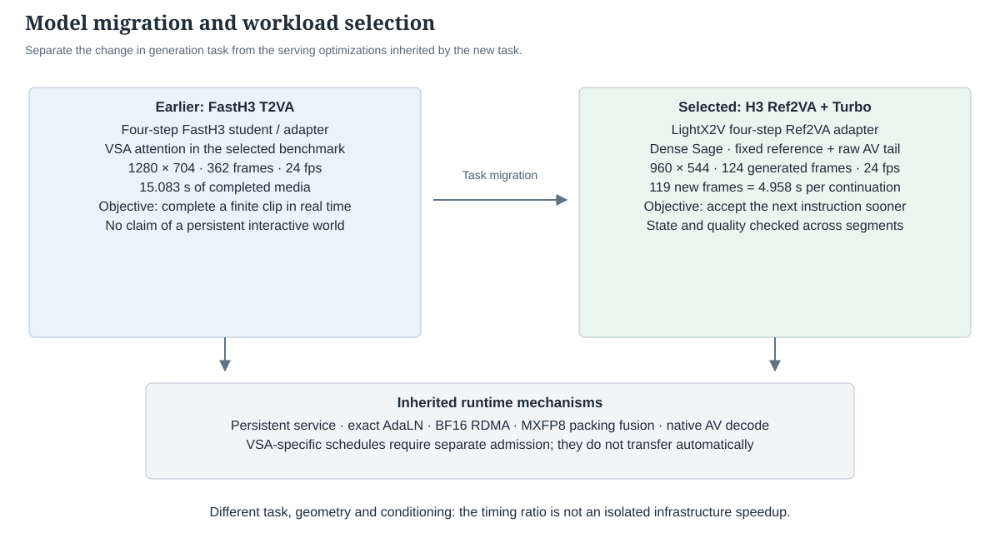

The model migration therefore precedes the duration decision in the system's design. The application adopts H3's **Ref2VA task path**, where visual and optional audio references participate in generation, and combines it with the **Ref2VA Turbo four-step adapter**. The serving controller then applies that generator to bounded windows and supplies the preceding state explicitly. Turbo provides the selected few-step generator; the application and continuation implementation provide the streaming protocol. Shortening the old request alone does not reproduce this system.

| Dimension | Earlier throughput demonstration | Current interactive avatar |
|---|---|---|
| Main task | FastH3 T2VA / VSA long clip | H3 Ref2VA Turbo rolling continuation |
| Video geometry | 1280×704, 362 frames, 24 fps | 960×544, 124 source frames; 119 new continuation frames |
| Media duration | 15.0833 s for the 362-frame output | Opening 5.1667 s; each continuation 4.9583 s |
| Few-step model | FastH3 student/adapter path | H3 Ref2VA base + LightX2V Turbo four-step adapter |
| Attention | VSA sparsity plus Sage in the selected fast path | Dense Sage; all eligible KV blocks retained |
| Conditioning | Authored long-clip prompt | Fixed character reference, new line/action prompt and previous raw AV tail |
| Scheduler | Complete a standalone request | One logical continuous session with bounded future footage |
| Deadline | Finish a long MP4 within its playback duration | Publish the next accepted continuation before its playback slot |
| Output consumer | Benchmark/player | Persistent relay, public chat, continuous encoder, Twitch player |
| Quality objective | Accepted finite sample | Face, voice, lighting, props and actions across many requests |

It would be misleading to divide a historical 13.3 s long-clip result by a current 4.0 s short-clip result and call that a 3.3× infrastructure speedup. Resolution, duration, conditioning, task partition, attention policy and timing boundaries all changed.

The practical gain is a smaller **commitment horizon**. Once a diffusion request has started, the system does not rewrite its middle with a newly received comment. A shorter window permits a new request sooner. That benefit must be paid for with enough throughput margin to cover repeated conditioning, decoding and publication.

For continuation window length `F`, overlap `O=5`, and `fps=24`:

```text
new_media_seconds D = (F - O) / fps
producer_ratio     = total producer work / total new media
mean headroom      = D - mean producer time
viewer latency     = admission + planning/scheduling + generation/checks
                     + ready-to-play backlog + within-clip response onset
                     + Twitch delivery/player buffering
```

Planning and generation can overlap, so their complete durations should not automatically be added as serial work. A turn's dispatch time is constrained by both input readiness and generator availability. Increasing the buffer hides occasional overruns; it does not fix average production slower than playback.

The adapter file is `minimax_h3_ref2v_turbo_4step_v0.1_bf16.safetensors`. Setup records identify `MiniMaxAI/MiniMax-H3` at revision `73372e6cf53e414edd3ab03e357717fb0602e758` and `lightx2v/Minimax-h3-Turbo` at `3ec17a324ced54151364f24f8b5fb6bf7e26414f`. The native loader verifies and merges this adapter into the Ref2VA projections. Accordingly, **H3 Ref2VA Turbo** is the model name used for the current avatar in this report. Legacy filenames containing “FastH3 optimized” describe inherited infrastructure, not the active adapter identity. Source and configuration provenance are recorded in [the method manifest](evidence/continuity-design.json).

### 2.2 Design requirements and selection rationale

The requirement column paraphrases explicit development requests. The engineering rationale is an interpretation of those requests together with the experiments; it is not a claim to know an unstated motivation.

| Requirement or observation | Decision made for the demo | Evidence and cost |
|---|---|---|
| The earlier FastH3 path already produced a 15-second clip in about 13 seconds | Preserve that as a throughput reference; adapt the serving system for interaction | Warm complete-MP4 measurements reached 13.549 s, then separately qualified 13.304 s and 13.261 s configurations; these are different campaigns |
| Viewers should be able to influence what happens next | Move from long completed clips to roughly five-second rolling Ref2VA windows | Shorter commitment horizon; fixed preparation, reference and output costs recur more frequently |
| The character's face and scene matter more than a headline resolution | Select 960×544 for the live baseline while testing larger shapes separately | BF16-first 1088×608 took 5.611 s per 4.958 s continuation; the then-requested 4.5 s target was not achieved |
| Protecting the first diffusion step visibly helped quality | Introduce original BF16 first-step projections and attention | Longer quality retention in one soak; 4.492 s versus 3.888 s median in a paired configuration family; drift was delayed, not eliminated |
| Real-time headroom remained tight; explicitly try Sage/MXFP8 in step one | Temporarily use all four low-precision steps in production | Live idle median 4.575 → 3.857 s in the historical operational comparison; this is a lossy tradeoff, not an infrastructure-only gain |
| “Keep weights resident instead of moving them” | Test original BF16 residency and on-demand MXFP8 weight packing; revert after measurement | Large weight copies disappeared, but complete request median increased 5.611 → 5.704 s |
| “Can we remove MXFP8 entirely?” | Test resident original BF16 projections separately from attention precision | 960×544 all-BF16 projections still took 5.060 s median; 1088×608 took 6.568 s with mixed attention or 7.343 s with BF16 attention |
| Do not interrupt a turn by looking back at the book | Keep one answer identity and viewer attention across its multiple generated segments | Whole-answer scheduling and prompt corrections; a video boundary is not a conversational ending |
| Voice references seemed to add complexity and unnatural speech | Test and select prompt-only native H3 voice after review | Removes the TTS/reference-input dependency; a three-clip trial took 4.049–4.161 s including sample preparation; voice stability remains a separate quality question |
| Avoid constant BGM; keep environmental and action sound | Preserve native generated ambient PCM; use accompaniment only for explicit singing | Ordinary reading/dialogue has no added music bed; singing uses H3-authored accompaniment instructions |
| Make the response faster without degrading the picture | Reduce lookahead from two clips to one, bypass the LLM for supported direct gestures, cache unchanged inputs, remove duplicate validation decode | Lower queue delay and exact work reduction; less reserve to absorb retries |
| Try approximately two-second generation | Implement and test 56/73-frame experimental shapes; retain 124 live | 56-frame mixed-workload mean exceeds its 2.125 s playback duration; speech fragmentation and unintended subtitles also appeared |
| Keep the camera and movement continuous | Carry raw AV latent state; preserve the accepted prefix; retry from the same accepted parent | Avoids periodic reference-image cuts; does not eliminate accumulated model error |
| Add mirror, cloth, water, clothing and window interactions | Reuse a stateful planner, but keep unqualified recipes in a private research profile | An eat → wipe → read sample exists; window control and mirror reflection still fail visual acceptance |

The resulting operating point is a deliberate compromise: preserve exact engineering optimizations, use explicitly accepted approximate model kernels where necessary, reduce queueing, and reject visibly deteriorating output. It is not an all-lossless model or a fully solved persistent world.

## 3. System architecture


The demonstration presents an established character and scene through a public broadcast interface. The screenshot is included unmodified, with its original player and chat UI; it does not establish that every visible chat request was executed successfully. [Original screenshot and hash](evidence/live-screenshot.json)

### 3.1 Request-to-viewer path

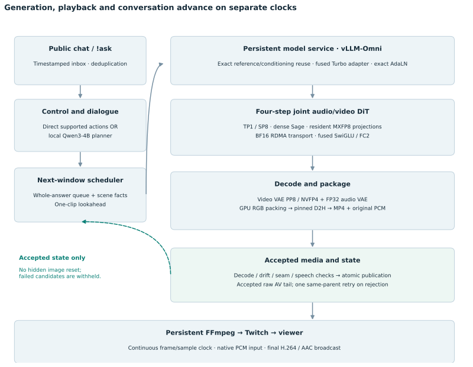

### 3.2 Components and responsibilities

| Layer | Current implementation | Why it is present |
|---|---|---|
| Character and environment | Zhiwei lotus-study persona; authored scene facts; reference image and timed prompts | Stable identity, grounded object descriptions and repeatable behavior |
| Input transport | `avatar_chat_inbox.py` | Receive public messages without blocking GPU generation |
| Language planning | `avatar_text_worker.py`, `avatar_text.py`, `avatar_zhiwei_dialogue.py`; local Qwen3-4B-Instruct-2507 | Convert dialogue into a reply and supported action; avoid a heavyweight remote planning dependency |
| Direct action compiler | `avatar_zhiwei_actions.py` and public action routing | Familiar commands such as nod/wave/read can bypass a model call |
| Durable work queue | `avatar_agent_replies.py`, SQLite WAL | Deduplication, claim/generate/air timestamps, bounded queue and multi-segment replies |
| Production scene state | `avatar_behavior.py` scene ledger | Intended scene and generated/playback receipts; not automatic visual recognition |
| Extended interaction research | `avatar_world/*`, separate `interaction_lab` profile | Object occupancy, action prerequisites, cancellation and wardrobe/scenery versions; not all publicly deployed |
| Short-window producer | `generate_short_avatar.py` | Select the next turn/idle action, call H3, publish atomically and follow relay progress |
| Continuous camera controller | `avatar_continuous.py` | Save accepted latent tails, validate prefix identity, screen seams, restore same parent for one retry |
| Model API | vLLM-Omni local diffusion endpoint | Keep expensive weights and communicators resident across requests |
| H3 semantic encoder | Qwen3-VL-derived H3 conditioning encoder, TP8 | Model conditioning; distinct from the 4B conversational planner |
| H3 generator | Ref2VA partition plus fused four-step Turbo adapter | Jointly generate speech, face/body motion and scene evolution |
| Tensor kernels | PyTorch/Triton, FlashInfer/CAKE, CUTLASS SM120 block-scaled GEMMs | Attention, projection, fusion and communication execution |
| DiT communication | FlashInfer PCIe/RDMA Ulysses, TP1/SP8, BF16 transport | Split the token sequence across eight GPUs while preserving communication precision |
| Video reconstruction | Native tiled video VAE, PP8; NVFP4 decoder linear projections | Reconstruct all frames with parallel tile scheduling |
| Audio reconstruction | Native audio VAE, FP32; float PCM sidecars | Keep original generated waveform available through validation and relay |
| Packaging | GPU RGB byte conversion; pinned host transfer; chunked CPU/PyAV output | Overlap output handling with upstream reconstruction |
| Broadcast | `twitch_fresh_queue.py`, persistent FFmpeg, RTMP/HLS | Continuous audiovisual clock and fresh clips; no prerecorded loop |
| Observability | `avatar_metrics.py`, Prometheus, Grafana, receipt/log analysis | Current-session generation, queue, playback, failures and hardware status |
| GPU diagnostics | Nsight Systems CUDA/NVTX/selected hardware captures | Locate compute, transfers, synchronization and host-submission gaps |
| Reproducibility | Runtime lock, source manifest, selected environment, media/checkpoint hashes | Bind performance observations to an actual execution path |

### 3.3 Locked production choices

| Setting | Selected value | Interpretation |
|---|---|---|
| Hardware | Eight GB202 GPUs, SM120; roughly 71.1 GiB exposed device memory each in the retained trace | PCIe/RDMA system, not an NVLink B200/H200 result |
| DiT / encoder / video VAE | TP1/SP8 / TP8 / PP8 | Different components use different parallel decomposition |
| Canvas and video rate | 960×544 at 24 fps | Selected live budget, not a resolution enhancement claim |
| Diffusion evaluations | Four | Distilled Ref2VA adapter; not original dense H3's long schedule |
| Video/audio scheduler shifts | 12 / 3.0 | Two noise schedules inside joint AV generation |
| Window / overlap | 124 / 5 frames | 119 new frames after opening |
| RoPE position mode | Window-relative | Keeps the local temporal coordinate bounded while the media clock continues |
| Main projections | GPU-resident MXFP8; four low-precision steps | A8W8 block scaling; original BF16 preservation remains available for experiments |
| Attention | Dense Sage in every step | Low-precision attention, but no FastH3 VSA pruning in the current Ref2VA path |
| Wire precision | BF16 | E4M3 QKV transport is disabled |
| Video / audio VAE | NVFP4 / FP32 | Video-only decoder approximation; audio decoder not quantized to NVFP4 |
| Clean reference blocks | Two copies of the same reference | Retains the tested conditioning arrangement; cache avoids redundant encoding rather than removing a block |
| Visual-tail guide timestep τ | 0.8 | Applies to the generated visual guide; distinct from the clean image references |
| Target-prefix preservation | Video prefix enabled | Exact accepted video prefix plus raw AV continuation state |
| External audio reference | None in prompt-only mode | Voice is described in the prompt; H3 generates the audio |
| Future footage | One-clip lookahead | Lower ready-to-play delay, less retry reserve |
| Broadcast format | H.264, 960×544, 24 fps; AAC stereo 48 kHz | Source audio is 32 kHz PCM and resampled for transport |
| Relay target bitrate | Video 5000 kb/s, audio 192 kb/s | Encoding target, not guaranteed instantaneous measured bitrate |

The configuration field `quality="lossless"` refers to the runtime's approximate-cache policy. It does **not** turn MXFP8, Sage, NVFP4 or four-step distillation into lossless computation. Likewise, `--cache-backend none` does not mean AdaLN and exact input caches are absent: they are separate mechanisms.

The backend environment reports Python 3.12.13, PyTorch 2.13.0+cu132, Triton 3.7.1, vLLM 0.28.0, vLLM-Omni 0.28.0rc2.dev62+gad1bb0f97, FlashInfer 0.6.16.post3, Transformers 5.14.1, Diffusers 0.40.0 and PyAV 18.1.0. These are installed distribution versions; local native and FlashInfer overlays are also active. The selected backend source-manifest SHA256 is `a53e5edb008f3b0b2ffe39feafd6706121e7a8ac0b86f3bd1837c4e40b2c6873`, which is more specific than a package version. [Version metadata](evidence/software-versions.json)

[Selected configuration and measurements](evidence/measurements.json) · [Actual accumulated backend projection counters](evidence/backend-dispatch-snapshot.json)

### 3.4 Live program and interaction policy

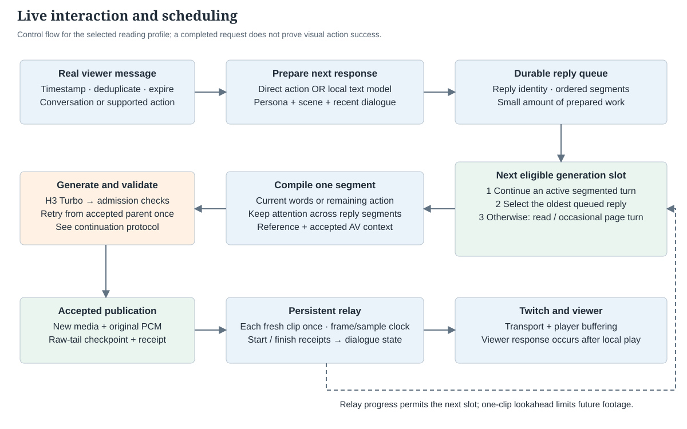

The selected program is a continuous reading session in a classical study. Zhiwei reads *Liaozhai Zhiyi* beside a lotus pond; the book, incense, bamboo slips, sweets and tea provide a stable setting for conversation. The default behavior is quiet reading with natural breathing and blinking. Page turning is enabled through a low-frequency schedule, approximately once per ten five-second windows when no queued interaction takes precedence. Eating, drinking and repeated head turns are not automatic idle routines.

The show bible defines possible discussion units and original story prompts, but it is a director's plan rather than an autonomous deployed program scheduler. Viewer dialogue, supported gestures and explicitly queued host contributions use the same generation queue. The application does not fabricate audience messages to keep the character talking.

**TABLECAPTION: Live scheduling decisions and their visible consequences.** These are control decisions, not claims that every requested movement is visually correct.

| Decision point | Selected behavior | Continuity or latency implication |
|---|---|---|
| No prepared interaction | Generate quiet reading; select a page turn when eligible | The stream remains active without an obligatory spoken monologue |
| A multi-segment answer is already in progress | Claim its next segment before a new queued answer | Preserve reply identity and consecutive delivery; later messages may wait |
| A fresh supported gesture is recognized | Compile the action directly | Avoid an unnecessary text-model call or a separate spoken acknowledgment |
| A new conversational question needs a reply | Use local Qwen3-4B with persona, scene facts and recent conversation | Text planning can overlap the current video request |
| The reply spans several windows | Segment by speakable content and retain viewer attention | A five-second boundary does not end the turn or send her back to the book |
| The complete spoken turn ends and no next reply is ready | Select a silent return-to-reading movement | Return happens after the answer, rather than between its clauses |
| An action candidate or continuation fails screening | Apply the accepted-parent retry policy in Section 4.6 | Withhold rejected output; insufficient buffer can become an explicit wait |
| The allowed future-media slot is occupied | Wait for relay progress before generating another clip | Bound prepared footage instead of accumulating a long response backlog |

### 3.5 From an audience message to visible behavior

The listener timestamps a real message and places it in the durable inbox with deduplication and expiry. The text worker selects an eligible message, obtains intended scene state, and prepares a supported action or a natural reply. Its conversation context includes up to two completed turns from the same viewer within ten minutes and recent host lines for repetition control. A follow-up from a viewer whose preceding turn is still being generated or aired waits for that turn; this avoids planning against an answer the viewer has not yet received.

The worker allows only a small amount of prepared reply work: an already queued response blocks another planning pass, as does an outstanding physical action. Once queued, the producer selects an active continuation first, otherwise the oldest queued reply, otherwise idle reading. The prompt compiler combines the selected reply span or action phase with the established persona, scene facts and accepted audiovisual context. It does not interrupt or rewrite a diffusion request that is already executing.

For an illustrative question such as “What are you reading?”, the logical sequence is message arrival → reply preparation → next available generation slot → a directed spoken segment → validation → publication → relay playback. A supported “nod once” request can bypass conversational generation and go directly to the action compiler. These are protocol examples, not additional measured response-time experiments.

The current public controls include conversation and a limited set of gestures, with selected additional direct actions described in the scene-action catalog. Extended book handling, pouring, window operation, mirror interaction, wardrobe changes and background transitions have separate research status. The general director interface can express those goals, but a compilable instruction or predicted scene change is not visual qualification. In particular, the existing scene ledger records intended and generated/playback state; it does not reliably recognize all objects in every output frame.

### 3.6 Publication, playback and observability

The controller admits a segment only after the continuation checks in Section 4. An accepted media file, native PCM sidecar and receipt become available to the relay, while the accepted latent suffix becomes the next model context. The relay emits fresh accepted clips in sequence using accumulated frame and sample positions. Video is encoded through the persistent H.264 path; original PCM is resampled and encoded once to broadcast AAC. FFmpeg transports the continuous stream to Twitch. Ordinary reading and dialogue have no added background-music bed; explicitly requested singing can use generated accompaniment.

Generation and playback advance independently. With one-clip lookahead, the producer waits when the next allowed slot is already occupied. Relay start/finish events update the dialogue receipts so that “generated,” “being shown,” and “finished” remain distinct. A labelled waiting interval is counted if accepted media arrives too late. This design reduces stale prepared footage but leaves less reserve for retries.

Prometheus and Grafana expose generation latency, validation/publication overhead, playback budget, queue depth, reply milestones, relay waiting, transport output and GPU activity. The useful latency chain is **arrival → text ready → selected → media ready → local playback → first meaningful response within the clip → viewer presentation**. The current instrumentation covers local milestones; screenshot values and local relay timestamps do not measure Twitch player buffering or perceptual response onset. Method-source hashes are included in the [live-logic manifest](evidence/live-logic.json).

### 3.7 Harness architecture and evidence contracts

The harness translates conversation into a bounded audiovisual workload and records what happened at each boundary. It does not replace the video model's physical reasoning. The implemented public path uses a durable chat inbox, reply queue, segment scheduler, continuity controller and playback receipts. A separate research path adds explicit object state, multi-action planning and review-gated state transitions. These paths share the rendering stack but must not be described as one fully deployed autonomous world simulator.


**TABLECAPTION: Harness components, responsibilities and deployment scope.** Source hashes and the actual local routing probe are retained in the [harness manifest](evidence/harness-system.json).

| Component | Responsibility | State or output | Scope |
|---|---|---|---|
| Chat inbox and text worker | Deduplicate real messages, bound waiting work and retain viewer context | Message identity, arrival time, expiry, same-viewer dialogue | Public control path |
| Public dialogue policy | Produce a relevant complete answer; obtain only relevant scene facts | Natural utterance text, language, attention and delivery mode | Public control path; not a fixed total-answer character limit |
| Reply queue and segment scheduler | Preserve turn identity and consecutive answer delivery | Queued, selected, generated, relay-started and relay-finished records | Public control path |
| Action registry and research planner | Extract affirmative requests, map only available capabilities, refuse unsupported substitutions | Validated decision with at most three action identifiers | Separate research path |
| Pure action compiler | Arrange dependencies, object contact, one action cycle and persistent exit state | A sequence of before/after states and timed prompt beats | Separate research path; desired effects remain predictions |
| World ledger and grounding | Record state revisions, provenance, pending work and viewer-specific dialogue | SQLite transactions and a digest of the planning context | Separate research path |
| Renderer and continuity controller | Attach clean references and the accepted raw AV suffix; screen candidates | Video, original PCM, hashes, raw-tail checkpoint and timing | Shared generation machinery; private override requires a non-broadcast run |
| Review and playback adapter | Compare an explicit observation with the expected state; commit only after confirmed playback | Verified/played receipts or rejection/uncertainty | Research contract; no general automatic visual verifier has been established |

The research state includes book location, hand ownership, mouth state, gaze, tea availability, coarse cup fill, candy history and the near window leaf. Outfit, room and exterior variants require exact prepared references. The ledger deliberately does not infer an exact candy count, tea temperature, invisible scene geometry or a viewer's current screen. Window reachability and hinge type must be supplied and verified; a private geometry hypothesis is not public action qualification.

Planning uses a state snapshot and context digest. Admission checks the digest again, preventing an answer planned against an old scene from silently entering a changed world. Effect records retain the source action and viewer relation. Replaying the same playback receipt is idempotent. Cancellation preserves already completed effects and recovers held objects at a segment boundary; it does not reverse time or rewrite an in-flight diffusion request. An uncertain playback result requires reconciliation before further dependent work.

**TABLECAPTION: Research receipt lifecycle and the claim each stage permits.** The private GPU probe follows predicted states to collect footage; it does not automatically invoke the observed-world commit path.

| Receipt stage | What is known | Permitted statement | State advancement |
|---|---|---|---|
| Prepared | A validated phase and expected exit state exist | The action is planned | None |
| Generated | A candidate media artifact exists | The candidate was generated | None |
| Verified | Explicit review passes and its observed state matches the phase contract | The candidate meets the supplied review | None until playback |
| Played | The verified segment has a confirmed local playback receipt | The reviewed local effect can enter memory | Transactional state, provenance and memory update |
| Rejected / uncertain | Review failed or playback outcome is unresolved | Completion is not established | Rollback or reconciliation required |

### 3.8 Prompt construction and action execution

There are two distinct prompt interfaces. The language planner receives character policy, selected facts, recent dialogue and the viewer's message. The audiovisual renderer receives the current phase, exact speech where applicable, clean visual conditioning and the accepted motion/audio context. The language-model answer is not itself a complete video prompt.

The public dialogue policy allows an answer to expand when the question needs it. Speech is then divided into speakable windows, preserving turn identity and viewer attention across boundaries. The older research writer remains more restrictive: its current contract allows at most two lines, with twenty Chinese characters or twelve English words per line. That research constraint must not be presented as the public conversation policy or as a desired universal limit.

For object interaction, the compiler first establishes the necessary hand state. In the current private tea/food recipes, a held book is placed on the table once; a subsequent bite, sip or pour follows in one generation window. Rest keeps the book on the table, and picking it up is an explicit later instruction. This avoids repeatedly inserting a fresh pickup phase or forcing the reference image's reading pose at every boundary. The prompt names the existing object, contact sequence, single operation, release point and persistent exit state. Only actually present props are included.

**TABLECAPTION: Renderer prompt fields and their intended function.** Exact transmitted examples appear in Appendix B.1.

| Field | Example function | Evidence boundary |
|---|---|---|
| Scene and identity | Same adult character, side camera, book, lotus study and present props | A conditioning instruction, not identity verification |
| Entrance state | Book on the table, empty hand, current window angle | Must correspond to the accepted incoming scene |
| Timed beats | Continue overlap; reach and grip; sip; set down and release | Timing directives are approximate model control |
| Exit state | Same cup back on the table; no second reach | Predicted until the generated motion is reviewed |
| Voice and soundscape | Exact words if speaking; otherwise quiet room tone and action sounds | No per-answer external voice waveform in this profile |
| Reference suffix | Picture 2 repeats Picture 1 | Two blocks of one image, not two independent views |

A request from the held-book state typically plans one approximately five-second placement window followed by one approximately five-second action window. If the book is already on the table, the placement phase is omitted. These are planned media durations, not chat-response latency measurements: queue occupancy, current generation, local playback and Twitch buffering remain additional clocks.

Finite private samples show recognizable eating, sipping and pouring cycles with subsequent hold phases. Window work remains experimental: a state-specific reference can preserve a closure in one sample, yet other shutters may move without the intended contact; a more explicit spatial prompt also produced an uncommanded reopening. These outcomes belong in limitations and diagnostic evidence. A positive coarse motion example does not establish arbitrary action control, precise prop conservation or a long-run success rate.

## 4. Reference and continuation method

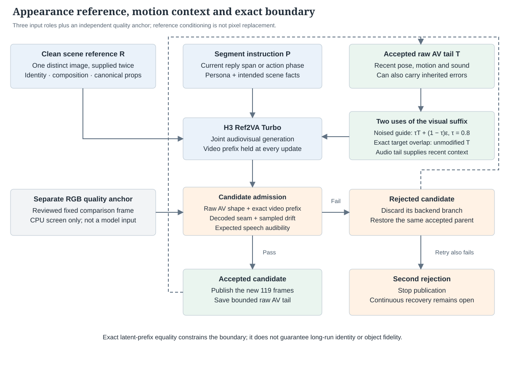

### 4.1 Separate appearance, recent motion, and intended behavior

Let R denote the clean visual reference, Tₖ₋₁ the accepted audiovisual tail preceding segment k, and Pₖ the instruction compiled from the conversation and scene state. The logical generation contract is:

> **(1)** (Vₖ, Aₖ) = Gθ(Pₖ, R, Tₖ₋₁; εₖ).

Here θ denotes the selected H3 Ref2VA Turbo weights, εₖ the request noise, and Vₖ/Aₖ the candidate video/audio latents. This equation describes information flow; it is not a replacement for the implementation's packed reference blocks, separate AV schedules, and masks.

**TABLECAPTION: Inputs and their distinct responsibilities in the September 22 configuration.**

| Input or record | Construction | Intended responsibility | What it does not establish |
|---|---|---|---|
| Clean scene reference R | One authored image, supplied twice as ordered image-reference blocks | Face, hair, clothing, room composition, lighting and canonical props | Exact output pixels or successful object manipulation |
| Accepted visual tail | Raw generated latent suffix from the previous accepted segment | Recent pose, gaze, hand contact and visible scene state | A drift-free representation; inherited errors can also propagate |
| Accepted audio tail | Raw generated stereo latent suffix aligned with the overlap | Recent acoustic context and temporal continuation | Stable speaker identity or intelligibility by itself |
| Segment instruction Pₖ | Persona, known scene facts, current reply span and action phase | What should happen next, including behavior across boundaries | Proof that the requested action actually occurred |
| Quality anchor | Separately reviewed 960×544 RGB frame | A fixed baseline for CPU drift measurements | Model conditioning; it is not inserted into the generation request |

This separation resolves a practical conflict. The clean reference specifies **which person and scene should persist**; the accepted tail specifies **their most recent generated configuration**. Requiring the character to return to the reference pose after every segment would defeat motion continuity. Conversely, retaining only the generated tail would make the appearance reference progressively dependent on prior generated errors.

### 4.2 How the scene reference is actually used

The evaluated live profile uses `reference-interior-side-liaozhai-tea-v1.png`, an authored 1672×941 image. It depicts the selected interior side-view composition and provides the reference for the character, book, lotus-window setting and table arrangement. The Ref2VA input preparation downsizes references according to the output-area “match” policy and aligns dimensions to a 32-pixel grid; it does not upscale small inputs under this policy.


The request contains **two copies of this same image**, named by order as Picture 1 and Picture 2. The prompt explicitly identifies Picture 2 as a repeat of Picture 1 and asks for stable appearance while continuing the incoming motion and pose. These are two conditioning blocks containing one distinct view; they are not a front/side/back identity dataset. The H3 semantic encoder receives the images and their condition labels, while the visual encoder produces the reference latents used by the joint generator.

Both blocks remain present on successive requests. Reuse of their encoded values preserves the same conditioning contract; it does not turn a reference into a forced first frame. The reference image is also distinct from `tea-quality-anchor.png`, the manually reviewed frame used only by the publication screen. Their separate hashes and dimensions are included in [the method manifest](evidence/continuity-design.json).

Current voice generation is prompt-only: no external audio-reference file is attached. The preceding generated audio tail is still present during continuation. Thus “no voice reference” means no external reference waveform, not absence of all audio conditioning.

### 4.3 Stable attributes and mutable scene state

The persistent reference is useful when the camera, room and outfit should remain stable. It can conflict with an intended permanent change: a reference showing an open window or an earlier outfit continues to condition subsequent generation after a request to change that state. The prompt and scene ledger can express the intended change, but they do not remove contradictory visual evidence automatically.

In the current public profile, the selected scene reference remains fixed. Automatic replacement with an action-specific image or a visually verified updated world state is not an established capability. A future scene-change protocol would need to coordinate the reference revision, intended state and accepted tail, then validate the transition. Merely recording “window closed” in the ledger does not demonstrate that the pixels show a closed window.


The second image is an **experimental asset**, prepared after the report's fixed performance cohorts. It is shown here to make the reference inputs inspectable, not to add an action-success result to the evaluation. Its edit asks for only the near shutter to close, with the far leaf and visible pond opening preserved. Subsequent generated motion must still be reviewed for hand contact, unintended movement of other leaves, state retention and scene continuity. The [reference-image manifest](evidence/reference-images.json) records both source filenames, dimensions, byte hashes and the complete image-edit prompt. Both PNGs are embedded directly in this HTML at their original resolution.

### 4.4 Opening and continuation geometry

The opening has no preceding motion tail. It is generated from the selected reference and opening instruction, checked, and adopted as the first accepted state. Each subsequent request receives the persistent reference again, a new instruction, and the preceding accepted AV suffix.

**TABLECAPTION: Temporal geometry of the selected continuation protocol.** Latent temporal units are distinct from decoded video frames.

| Quantity | Value or rule | Interpretation |
|---|---|---|
| Output rate | 24 video frames/s | Playback time base |
| Generated window F | 124 frames | Full output geometry before continuation cropping |
| Overlap O | 5 frames | Context interval shared with the preceding segment |
| Newly published content | F − O = 119 frames | 4.958333 s after the opening |
| Opening content | 124 frames | 5.166667 s; no overlap removal |
| Saved video tail | 7 temporal latent slices | Bounded checkpoint storage; not all slices are used by five-frame continuation |
| Used video guide | Last 2 temporal latent slices | Native geometry corresponding to the selected five-frame overlap |
| Saved audio tail | 37 latent ticks per stereo channel | Bounded audio checkpoint storage |
| Audio overlap | 8 or 9 ticks at 40 Hz | Derived from absolute frame boundaries, rather than repeatedly rounding a nominal five seconds |
| Position policy | Window-relative target offset | Bounded local temporal coordinates with a separately advancing media clock |

For a previous window ending at frame e, the next window starts at e − 5. The audio overlap is computed as `round(e × 5/3) − round((e − 5) × 5/3)`. This accounts for the ratio between the 40 Hz audio latent clock and the 24 Hz video clock. After generation and decode, the repeated video/audio interval is removed before publication. The relay does not transmit the retained context as new footage.

The checkpoint stores raw generated AV state, not the previously encoded MP4. This avoids a codec round trip in the model's recurrence. It does not prevent generative errors from entering the next request through the latent tail.

### 4.5 A conditioned guide and an exact prefix serve different purposes

The preceding visual suffix is appended as a latent-guide reference block. Its conditioning uses `video_guide_timestep = 0.8`. In the implementation's rectified-flow convention, the selected guide is formed from clean latent values and dependent noise with the corresponding timestep label:

> **(2)** Gₖ = τTᵛₖ₋₁ + (1 − τ)εᵍₖ, τ = 0.8.

This adjustment changes the guide presented to the model; it does not modify the stored accepted tail or weaken the clean scene-image blocks. The value and its timestep label must change together. Controlled tail-replay experiments motivated reducing direct dependence on inherited fine detail: a degraded tail could carry abnormal texture into the next segment. The selected τ represents a continuity/appearance tradeoff, not a generic reference-image strength or a calibrated guarantee against drift.

Separately, `target_prefix = video` places the **unmodified accepted video suffix into the target overlap**. The sampler marks these target positions as clean and restores their values before the loop and after every denoising update. The controller then checks exact equality between the candidate's first two video latent slices and the accepted parent's last two slices.

The distinction matters: the guide supplies conditioning, whereas the protected target prefix constrains the inherited boundary. The current path enforces exact video-prefix equality. It carries audio context but does not enable the stronger `av` target-prefix mode used in a separate ablation. Temporal VAE decoding can depend on neighboring latent values, so exact latent equality alone does not imply identical decoded boundary pixels; a separate decoded-frame seam screen is required.

### 4.6 Acceptance, rollback, and publication

**Algorithm 1. One accepted-state continuation step.**

```text
Input: fixed reference R, accepted tail T, accepted last RGB frame,
       logical segment index k, scene state and pending reply/action
1. Compile the next instruction without ending the current action or answer.
2. Condition H3 Ref2VA Turbo on R, T and the new instruction.
3. Generate one window with the protected video prefix.
4. Validate AV geometry, exact video-prefix equality, decoded boundary,
   sampled appearance drift and expected speech audibility.
5. If accepted: save the raw AV checkpoint, publish new media, then advance
   the accepted generation state and corresponding application receipt.
6. If rejected: abandon the backend branch that already consumed the candidate.
   Restore the same accepted parent in a new branch and retry once with new noise.
7. If the retry also fails: stop publication; do not adopt the rejected tail.
```

The branch change is an implementation response to the backend's non-transactional tail update: by the time application screening runs, the backend has already advanced its own state. Restoring the accepted parent prevents that rejected candidate from becoming the starting point for the following segment. The logical media position and accepted AV parent remain unchanged during retry.

The selected controller has **no periodic clean-reference reset, crossfade, interpolation, or synthetic cutaway**. An earlier four-segment reset strategy reduced chain length but produced visible posture resets approximately every 20 seconds, contrary to the fixed-camera requirement. The current policy therefore preserves one logical chain and can stop when neither candidate passes. A failed-chain recovery that is both continuous and visually reliable remains unresolved.

### 4.7 Continuity at the application and playback levels

Physical continuity and conversational continuity require different records. A multi-segment answer retains its reply identity and continuation intent across video boundaries. Directed action phases carry entry and exit descriptions so that the next prompt does not automatically return both hands to the initial reading pose. The scene ledger tracks intended transitions and generated/playback receipts, with visual confirmation explicitly unverified.

The relay advances on accumulated frame and audio-sample counts. Model generation, accepted scene state and footage already shown to viewers are therefore separate clocks. This distinction prevents a future planned action from being described as already visible. It also explains why the existence of a valid reference image, a successful model request or a committed scene record cannot alone certify character consistency.

## 5. Infrastructure optimization

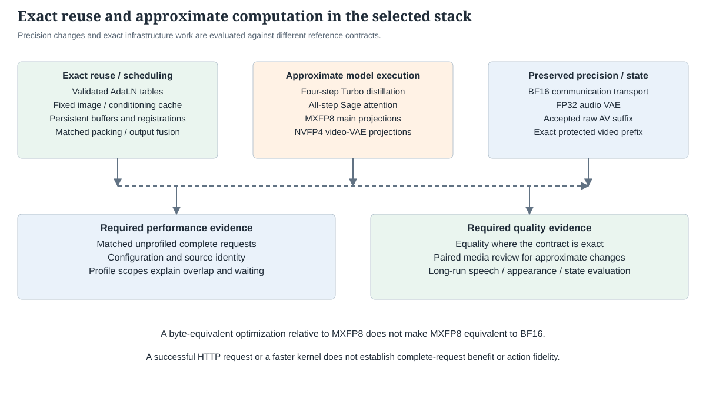

### 5.1 Exact AdaLN caching

H3's modulation tables depend on model weights, the exact timestep schedule and modality/time mapping, rather than the evolving video hidden state. Repeatedly evaluating the large per-block modulation projections is unnecessary when those dependencies are fixed. The native path loads validated precomputed tables and removes the online modulation projections. This is useful for original H3 as well as distilled schedules; the cache contents are still model- and schedule-specific.

The current Ref2VA admission checks require a loaded exact AdaLN cache and cached final modulation. A valid cache must match the fused adapter, task partition, video/audio schedules, dtype and indexing contract. A FastH3 table cannot be assumed valid for Ref2VA just because both use four evaluations. Changing scheduler guidance inputs without regenerating or validating the cache would violate that contract.

This is an exact reuse optimization, distinct from approximate reuse of a denoising block across different steps. The latter is not part of the selected live baseline. The current local optimized kernel admission is SM120/TP1/SP8-specific; that implementation restriction should not be confused with the broader semantic applicability of AdaLN caching.

### 5.2 Adapter fusion and persistent model state

The Ref2VA Turbo factors are merged into native projection weights before steady-state generation. The loader validates the full target set, adapter rank/scale, native per-head QKV layout, and gate/value ordering of FC1. Quantization is applied to the fused original weights, not to an unadapted base and not by reconstructing a supposed BF16 reference from quantized values.

The current integration validates 208 fused native parameters, including the two context-refiner blocks. Its main-stack MXFP8 path covers 200 projection modules across 50 blocks: packed QKV, attention output, gate/up and down projections. Main-step dispatch counters verify each real projection and the fused FC2 calls. Counters accumulated over many requests demonstrate execution; they are not a fresh per-request latency experiment.

Weights, communication registration and reusable buffers stay alive between clips. Model load time is outside the warm serving numbers. The historical VDN loading phase took about 1,181 seconds on shared storage, illustrating why repeatedly starting a model is unsuitable for interactive serving. This is not a claim that the current warm request includes that delay.

### 5.3 MXFP8: distinguish weights from activations

In the selected path, fused BF16 weights are quantized to MXFP8 **at initialization** and the packed payload/scales remain on the GPU. Input activations are quantized during each projection. “Online quantization” is ambiguous unless these two operations are distinguished.

MXFP8 here uses E4M3 payload values with block-shared E8M0 scales over 32 elements. The GEMM path is approximate relative to the original BF16 model. Eliminating repeated weight packing while retaining the same packed values is an exact scheduling/storage improvement relative to that MXFP8 baseline.

The BF16-first experiment preserved original BF16 projections in pinned host memory with double-buffer GPU prefetch. Turning step one back to MXFP8 removes that step's BF16 projection work and staging from its execution path. The original-weight facility can remain initialized for other requests; its existence alone does not prove large H2D transfers occur in the current all-MXFP8 request.

### 5.4 Fused SwiGLU and activation packing

The historical fusion combines the SwiGLU producer with the MXFP8 activation packing consumed by FC2. It eliminates intermediate memory traffic and launches while preserving the installed activation implementation's rounding sequence. The accepted implementation explicitly preserves BF16 rounding after SiLU and after multiplication; replacing it with an algebraically similar sigmoid expression did not preserve quantized payload bytes.

A real-shape microbenchmark reduced producer time from 1.4015 to 0.7981 ms, and producer plus the same FC2 GEMM from 5.9671 to 5.3568 ms. The complete model improvement was about 130 ms in that campaign, not the sum of arbitrary microbenchmark speedups. An alternate lookup-table implementation passed numerical checks but did not improve performance further.

The current Ref2VA path retains this FC2 fusion. It does not enable VSA-only QK/V split schedules: the admission code explicitly rejects those flags for dense Ref2VA. A historical FastH3 optimization inventory is therefore not a list of switches that can all be turned on for the avatar.

### 5.5 Attention, communication and producer placement

Sage reduces attention arithmetic precision. It is a quality tradeoff. The FlashInfer/CAKE kernel name includes “block_sparse,” but the current Ref2VA adapter keeps the complete dense KV set. A sparse-sounding kernel symbol is not evidence of pruning.

BF16 Ulysses exchange is retained. Persistent registered RDMA buffers avoid repeated registration/teardown; the historical matched comparison improved 17.9214 → 17.5780 s mean, while increasing retained memory. Q/K and output producer-direct paths reduce layout/materialization work around communication. QK norm/RoPE fusion preserves the intended normalization and positional transformation while reducing intermediate work.

Earlier FastH3 VSA experiments also overlapped gate/coarse work and pipelined four output chunks. Some of these depend on VSA layout and gate semantics and are **not** current dense Ref2VA features. The report records their historical value without silently transferring their speedup to the new task.

### 5.6 Weight residency and the critical path

A reasonable hypothesis was that keeping original BF16 weights on the GPU should eliminate a large transfer penalty. The experiment did eliminate the transfers. It did not reduce the complete request.

| 1088×608, BF16-first four-step comparison | MXFP8 resident + BF16 prefetch | BF16 resident + online MXFP8 packing |
|---|---:|---:|
| Unprofiled HTTP→MP4 median, nine requests | 5.610958 s | 5.704375 s |
| Unprofiled maximum | 5.736889 s | 5.814680 s |
| Large original-weight H2D copies per rank | 200 | 0 |
| Original-weight bytes per rank/request | 38,535,168,000 | 0 |
| Sampled step-one CPU NVTX median across ranks | 1544.952 ms | 1464.517 ms |
| Sampled step-two CPU NVTX median | 913.879 ms | 952.357 ms |
| Sampled step-three CPU NVTX median | 910.386 ms | 950.036 ms |
| Sampled step-four CPU NVTX median | 911.156 ms | 951.626 ms |
| Sampled complete DiT CPU NVTX median | 4312.628 ms | 4349.858 ms |

All 13 compared MP4 hashes matched in the original residency experiment. The new candidate reduced step-one time by roughly 80 ms, while the next three steps gained about 119 ms of work from on-demand weight packing. Complete request median regressed by 93.4 ms, about 1.7%.

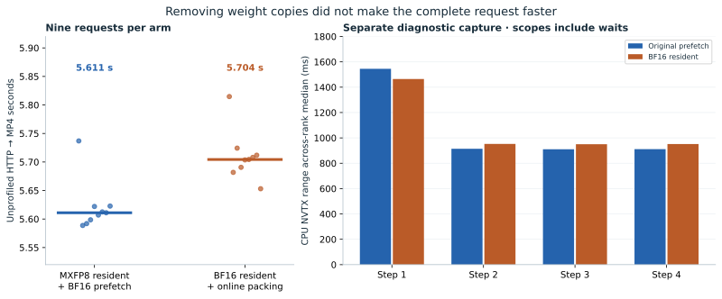

The original copies totaled roughly 1.42–1.44 GPU seconds **per device**, but prefetch already overlapped much of their execution with other work. Eight-device aggregate memcpy time is not a serial critical path. The resident candidate still had input transfers; for example, rank/device zero retained a roughly 11.54 MB large input transfer. “No weight staging” is accurate; “no H2D at all” is not.

The follow-up all-BF16 tests also failed the live deadline:

| Follow-up | Median HTTP→MP4 | Formal requests beyond 4.958 s |
|---|---:|---:|
| 1088, original prefetch baseline rerun | 5.5833 s | 9/9 |
| 1088, BF16 resident + later online MXFP8 | 5.6996 s | 9/9 |
| 1088, all BF16 projections, mixed attention | 6.5682 s | 9/9 |
| 1088, all BF16 projections and attention | 7.3434 s | 9/9 |
| 960, all BF16 projections, mixed attention | 5.0597 s | 9/9 |
| 960, BF16 resident + later online MXFP8 | 4.4268 s | 0/9 |

These controls justify retaining resident MXFP8 in the demo. They do not prove that every future kernel or memory placement will favor the same choice. [Recomputed Nsight results](evidence/nsys-reanalysis.json) · [Unprofiled samples](evidence/measurements.json)

### 5.7 Video reconstruction and output scheduling

The selected native video decoder uses NVFP4 linear projections. That precision choice is approximate; it must be separated from the exact scheduling work around it.

| Mechanism | What it removes or overlaps | Evidence and present interpretation |
|---|---|---|
| PP8 tiled VAE | Distributes reconstruction across devices | Retained; actual geometry and call-count audits matter |
| Pair/mixed/batch4 scheduling | Groups compatible temporal/tile work without changing the accepted ordering contract | Retained where current shapes are admitted; bigger batches were not automatically faster |
| Video/audio decode overlap | Independent decoders can execute after joint denoising | Retained; separate CUDA streams do not remove all CPU launch serialization |
| Early/asynchronous tile gather | Transfer completed tiles while later tiles decode | Retained; early-gather-only benefit was small and not stable in every test |
| Cached normalization constants | Avoid repeated construction/transfer of identical constants | Byte-equivalent qualified paths; retained |
| GPU blend/RGB packing | Fuse spatial blending and compact byte output; reduce FP32 intermediate traffic | Historical full-model MP4s matched; retained |
| Pinned double-buffer output | D2H and CPU video encoding run as a bounded pipeline | Retained; event/lifetime/backpressure handling remains required |
| Early AAC | Encode native audio while the video decoder is still running | Historical matched 15-second campaign: 13.551 → 13.304 s median with cached constants |
| Shared decode for checks | One complete AV decode also supplies quality samples and endpoint frames | Matched short-clip campaign: 5.044 → 4.774 s median, unchanged request and MP4 hashes |

The historical GPU RGB postprocess benchmark improved 2.84225 → 0.19347 ms per representative frame block. The full 15-second request comparison improved only 13.334 → 13.261 s median. The component gain is real, but upstream overlap and other work constrain end-to-end benefit.

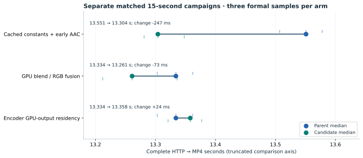

In the Config-A hardware trace, AAC ran at approximately 12,948.7–13,123.1 ms from the trace request origin while video-VAE GPU work continued until about 15,417.8 ms. That establishes overlap. It does not establish that all AAC CPU time is additional serial savings. Output-submit ranges had no `cudaStreamSynchronize` calls in the audited trace.

Changing video-VAE precision cannot repair a bad upstream video latent. In a later quality diagnosis, degraded generated latents remained visibly degraded under FP16 reconstruction. NVFP4 introduced measurable differences, but it was not the sole cause of long-run degradation. The audio VAE stayed FP32; attributing extra spoken words to the video decoder would be inconsistent with the pipeline.

### 5.8 Exact reuse of reference and semantic conditioning

The avatar repeatedly uses the same clean picture and often the same idle instruction. Encoding those identical inputs every five seconds is avoidable. At the same time, newly authored dialogue must remain fresh.

The exact reference cache uses content/configuration identity, ordered RGB inputs, prompt/tag identity and component identity; distributed ranks agree on a hit. Returned tensors are isolated from mutation. It preserves the two reference blocks and their positional role, rather than deleting a block to save time. The reference-image latent cache can still hit for a new spoken line even when semantic text conditioning must be recomputed.

#### 5.8.1 Four retained profiles, one instrumented request per condition

These are **rank-zero CPU NVTX durations**, in seconds, from the BF16-first cache experiment. They are not a fresh trace of the current all-Sage production mode.

| Range | One reference, cache off | Two references, off | Two references, hit | Two references, new speech |
|---|---:|---:|---:|---:|
| Request preparation | 0.562 | 0.876 | 0.117 | 0.476 |
| ↳ semantic encoder | 0.258 | 0.368 | 0.003 | 0.373 |
| Four-step DiT | 3.639 | 3.803 | 3.658 | 3.946 |
| ↳ first step | 1.589 | 1.593 | 1.455 | 1.726 |
| Decode range | 0.506 | 0.507 | 0.509 | 0.509 |
| ↳ video VAE | 0.461 | 0.466 | 0.468 | 0.469 |
| ↳ audio VAE | 0.026 | 0.024 | 0.024 | 0.024 |

Nested rows must not be added twice. Differences in DiT timing across these single captures are not automatically a causal benefit of the input cache. Across-rank medians in the new SQLite reanalysis differ from the rank-zero values here because other ranks include different waiting intervals.

The cache validation compared video latents, audio latents and complete MP4 hashes. Four reading pairs matched exactly; a subsequent OFF/ON/OFF experiment for reading, speaking and page turning also matched in all nine generated clips. This establishes tested-input equivalence, not a formal proof over all possible inputs.

The historical unprofiled 60-clip cache run had 57 formal samples: median 4.554 s, mean 4.671 s, P95 5.336 s, eight deadline misses. Relative to a preceding two-reference run's 5.289 s median, the operational reduction was about 0.735 s. Because these were different runs, that complete difference is not a controlled single-factor speedup. The same candidate showed an unrequested drinking action and was not accepted merely because it was faster.

## 6. Native audio generation and fidelity

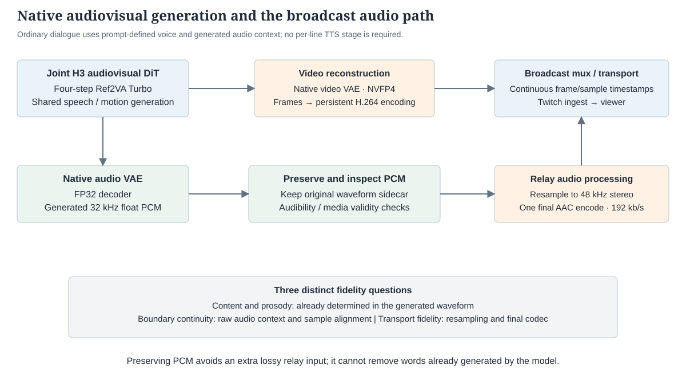

### 6.1 What the audio investigation ruled out

Extra speech appeared in original FP32 PCM before broadcast AAC. Seven recorded failures were replayed with the same prompt, seed, reference and preceding accepted raw AV tail; baseline PCM matched the live PCM bit for bit. Replacing quantized projections and Sage with original BF16 did not remove the three larger reproduced errors.

| Paired audio diagnosis | Median HTTP generation | Main extra-speech failures |
|---|---:|---|
| BF16 first step, then MXFP8; BF16 first attention, then Sage | 4.677 s | Four identified cases remained |
| All BF16 projections, mixed attention | 6.529 s | Three larger cases remained |
| Mixed projections, all BF16 attention | 4.872 s | Three larger cases remained |
| All BF16 projections and attention | 6.541 s | Three larger cases remained |

This justified investigating conditioning and prompt leakage instead of removing every performance optimization as an audio fix. It did not rule out all effects of distillation or precision on voice quality.

### 6.2 Why per-line TTS references were not kept as a requirement

Matched reference waveforms helped selected failure cases, and removing one leaked instruction helped a causal replay. A wider 50-spoken-clip regression found no comparable extra utterance under that experiment's combined reference/prompt policy. But a later online mixed run required 176.539 s of producer work for 158.875 s of media, a ratio of 1.111. Prefetch reduced direct waiting while synthesis could still contend for GPU execution.

The operator then requested trying voice description alone and preferred the observed result. In the selected prompt-only mode, there is no reference synthesis, manifest lookup or external audio block on the per-answer path. The native joint model still generates speech and lip motion together. This simplifies scheduling and avoids reference-content leakage, while transferring responsibility for stable timbre and delivery back to model conditioning.

The initial three-clip prompt-only sample had no recognized extra spoken material, but ASR, pitch and energy proxies did not establish stable speaker identity or perfect pronunciation. This is an accepted demo direction with known limits, not a proof of voice consistency over hours.

### 6.3 What is currently done to preserve the waveform

- Keep the audio VAE in FP32 and preserve the generated float PCM sidecar.
- Feed original PCM to the relay instead of decoding and re-encoding the backend AAC as the source.
- Use one final broadcast AAC encode at 192 kb/s after resampling for the 48 kHz relay clock.
- Keep video and audio on an accumulated sample/frame clock; do not add an assumed five seconds at every boundary.
- Preserve native ambient/action sound in quiet segments; these are generated sounds, not microphone recordings.
- Maintain the same answer and voice instructions across speech segments, with phrase-aware text budgets and no forced conversational ending at every five-second boundary.
- Treat singing as a distinct delivery mode with melodic instructions and native accompaniment only when requested.

The backend can still emit an AAC-bearing MP4 for request compatibility and preview. The relay's fidelity improvement is that it consumes verified original PCM, not that no AAC file exists anywhere in the system. Audibility checks detect missing/near-silent speech; they do not prove intelligibility, correct lyrics, singing quality or lip sync.

## 7. Experimental evaluation

### 7.1 Profiling protocol and interpretation

This report **re-analyzes eight preserved SQLite trace exports on CPU**. It did not interrupt the restarted broadcast to claim a new same-configuration CUDA capture. The current production timing table comes from current receipts; the detailed internal GPU/CPU mechanisms below come from explicitly identified historical captures.

| Capture family | Captures | Configuration distinction | Main question answered |
|---|---:|---|---|
| 15-second Config A | 1 | First BF16 step, later MXFP8/Sage; VSA; 1280×704 | Where the long-clip pipeline spent time; decoder/output overlap |
| 1088 projection residency | 2 | BF16-first, old staging versus resident BF16 plus online packing | Did removing weight H2D shorten the critical path? |
| 1088 all-BF16 projection diagnostic | 1 | Resident BF16 projections | What compute cost replaces the eliminated quantized path? |
| Five-second reference-cache comparison | 4 | One/two reference blocks, hit/miss; BF16-first | Which preparation work can be reused for idle and fresh dialogue? |

The included analyzer extracts CPU NVTX range distributions, per-device kernel spans, merged kernel interval coverage, top kernel work and copy bytes/counts. Each SQLite export has a file hash. It uses only read-only SQLite connections and can be rerun while the service stays live. [Analyzer](analyze_traces.py) · [JSON](evidence/nsys-reanalysis.json) · [CSV](evidence/nsys-reanalysis.csv)

Important interpretation rules:

1. **Do not sum the eight GPUs' simultaneous work as request latency.** Kernel sums and memcpy sums are useful workload measurements, not a serial wall clock.
2. **Do not add parent and child NVTX ranges.** DiT contains its four steps; decode contains video/audio/output work that can overlap.
3. **A long NCCL or RDMA barrier can be a wait for a late rank.** It is not necessarily slow wire transmission. The historical video-VAE entry showed other ranks waiting roughly 59 ms while rank zero submitted audio decode.
4. **A GPU timeline gap is not proof that the NIC is idle.** RDMA progress can occur outside CUDA kernel intervals.
5. **Kernel-interval union is not SM utilization.** A communication kernel may occupy a timeline while waiting rather than performing tensor work.
6. **Profiled request duration is not the unprofiled benchmark.** Profiler startup, event recording and instrumentation can alter scheduling.
7. **Short microbenchmarks do not certify end-to-end benefit.** The V-pack host-gap example is a concrete negative result.
8. **Check capture completeness and configuration.** A VSA trace cannot be relabeled as current dense Ref2VA just because some kernel names match.

A prior cache capture also left profiler injection variables in subprocess environments; a later ffprobe failed with a missing profiler session despite valid audio. That failure was resolved with an unprofiled backend and preserved as a failed experiment, not discarded as a slow sample.

#### 7.1.1 Reading the current bottleneck responsibly

Current receipts place about 97% of mean producer time inside the backend request. Historical five-second traces identify DiT as the dominant range, with preparation significant on new text/reference conditions and video reconstruction the next material stage. Audio VAE is about 24 ms in the cited cache capture. This supports prioritizing current dense DiT and conditioning work over an audio-decoder precision rollback for speed.

It does **not** provide an exact current all-step-fast DiT/attention/GEMM/communication percentage. A fresh current-configuration profile is the next measurement needed before promising a further kernel-level gain. The report avoids repurposing a BF16-first 1088 profile as the current 960 all-fast breakdown.

### 7.2 Production latency and response budget

#### 7.2.1 Fixed production snapshot

The new session began on 2026-09-22 at 11:57:03 UTC according to Twitch. The statistics below freeze the first 102 accepted continuations at 12:05:24 UTC, exclude the opening, and include any retries. No retries occurred in that snapshot. Percentiles use linear interpolation; the small sample is not a production SLO study.

| Workload | Samples | Publication P50 | P95 | Maximum | Over playback budget |
|---|---:|---:|---:|---:|---:|
| All continuation actions | 102 | 3.972 s | 4.205 s | 4.807 s | 0 |
| Quiet rest | 46 | 3.667 s | 4.267 s | 4.807 s | 0 |
| Speaking | 50 | 3.977 s | 4.204 s | 4.290 s | 0 |
| Page turn | 5 | 3.703 s | 4.066 s | 4.067 s | 0 |
| Wave | 1 | 4.007 s | Not a distribution | 4.007 s | 0 |

Mean producer time was 3.901 s, giving a producer ratio of approximately **0.787** and mean headroom of **1.057 s** per continuation. Maximum observed headroom was not the acceptance criterion; the slowest request had only about 0.152 s spare.

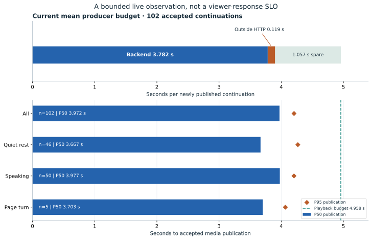

#### 7.2.2 A measured boundary breakdown, not an invented GPU waterfall

| Measured boundary | Mean | P50 | P95 | Meaning |
|---|---:|---:|---:|---|
| HTTP request | 3.782 s | 3.852 s | 4.083 s | Backend request, including its preparation, model, reconstruction and response work |
| Everything outside HTTP inside producer step | 0.119 s | 0.120 s | 0.126 s | App preparation, complete decode/checks, checkpoint/receipt/publication work |
| Total producer publication | 3.901 s | 3.972 s | 4.205 s | Accepted continuation ready for the relay |

Means of these complementary boundaries add by construction. Their independently computed medians and percentiles do not necessarily add. The backend's aggregate field named `denoise_step_latency_ms` is not a substitute for a measured DiT-only trace.

Eliminating all 0.119 s of outside-HTTP work would be an impossible zero-cost-check idealization and would save only about 3% of current mean producer time. The main compute opportunities remain inside the backend. Conversely, reducing future footage can improve perceived response more than a small kernel improvement without changing model throughput at all.

#### 7.2.3 Viewer response is a different clock


The local ledger records message arrival, text/reply readiness, selection, generated media and local relay start. A historical 30-clip one-lookahead sample measured a 1.242 s median from ready media to local playback. That excludes the text call, time waiting for a generation slot, earlier queued turns, within-clip first syllable and Twitch/player buffering.

Direct actions bypass the text model when routing is unambiguous. New dialogue uses the local 4B planner. Nine private action-planning inputs took 0.265–0.744 s in one small test, but that does not imply the avatar visibly acts within a second. A request arriving just after a window has started still waits for the next available generation decision.

There is no measured universal viewer-end response number in this report. A proper test must correlate one actual viewer message with the first meaningful visual/audio response in captured playback. A generic idle blink is not a response to the question.

#### 7.2.4 Extended observation during report assembly

At 12:34:41 UTC, the same session contained 456 accepted continuations: overall publication mean 3.841 s, median 3.672 s, P95 4.115 s, maximum 5.895 s. Speaking alone remained at 3.976 s median and 4.193 s P95 over 163 clips. The lower overall median primarily reflects the larger quiet-reading share; it is not a newly deployed optimization.

Two accepted quiet clips exceeded the 4.958 s deadline, at 5.895 and 5.622 s. The relay reported two waiting intervals totaling 1.833 s, with 455 clips and 2,256.25 seconds of generated media transmitted. Its sampled AV clock difference was 8.333 ms. Those are clock/queue observations, not a perceptual lip-sync assessment. No cause for the two backend spikes is assigned without a matching trace. The live service remained active at this checkpoint. [Extended observation](evidence/extended-live-observation.json)

#### 7.2.5 Operational dashboard snapshot

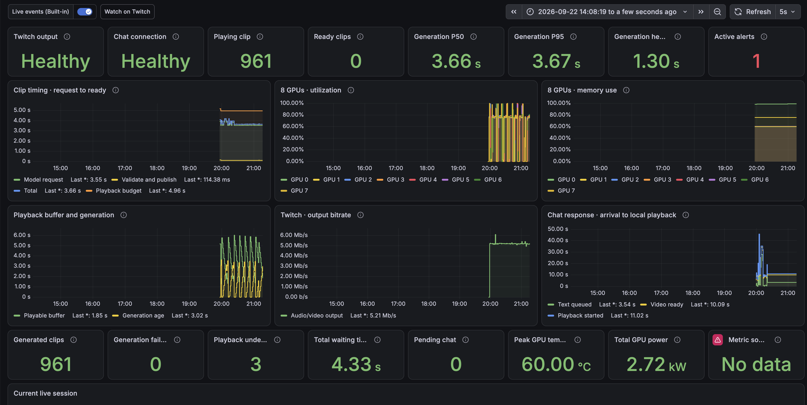

The supplied dashboard image displays generation P50/P95 values of 3.66/3.67 s, 961 generated clips, three playback waiting events and 4.33 s of accumulated waiting. Its latest chat-response legend shows 3.54 s to text queued, 10.09 s to video ready and 11.02 s to local playback. These are transcribed display values with different metric scopes; they are not recomputed cohort statistics, and the screenshot does not establish their complete sampling definitions. It also displays one active alert and a no-data metric tile. The figure therefore illustrates observability and remaining interruptions, rather than certifying an error-free run. [Original screenshot and hash](evidence/grafana-screenshot.json)


### 7.3 Generation-window selection

The project implemented shorter shapes rather than assuming duration could be changed with one API parameter. It adapted temporal geometry, raw-tail metadata, AV clocks, decoder dispatch audits, prompt timing and speech capacity in an isolated backend.

| Candidate | New media | Formal mixed-workload clips | Ready median | Mean | P95 | Deadline misses |
|---|---:|---:|---:|---:|---:|---:|
| 56-frame window | 2.125 s | 17 | 2.289 s | 2.204 s | 2.486 s | 10/17 |
| 73-frame window | 2.833 s | 14 | 2.425 s | 2.553 s | 2.856 s | 4/14 |
| 124-frame window | 4.958 s | 13 | 3.706 s | 3.837 s | 4.129 s | 0/13 |

The 56-frame reading median was only 1.925 s, but new dialogue took about 2.28–2.48 s. A demo spends real time speaking, so selecting only idle performance would conceal an unsustainable workload. The 73-frame mean had margin, but all four speech windows were slightly slower than their playback budget. Neither short candidate completed the longer playback and quality qualification needed for production.

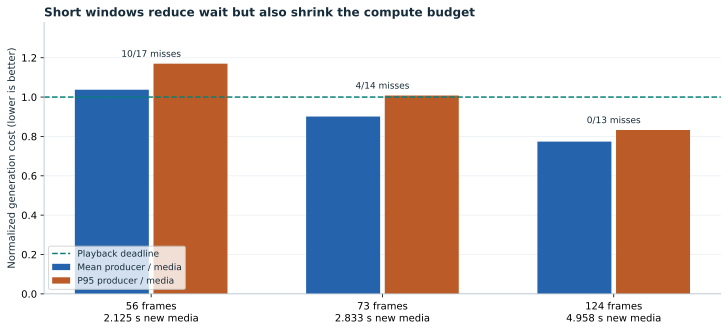

The shorter text budget also split one tea name across two clips; an energy-based boundary proxy measured a roughly 1.385 s gap. One inspected 56-frame speech frame contained unwanted subtitles despite passing coarse quality checks. These failures explain why a shorter generation window is not automatically a better conversational experience.

The geometry is quantized: the supported experimental windows follow `17n+5`, with latent temporal extent `5n+2`. An exact two-second crop is not equivalent to a valid shorter continuation unless the latent and audio clocks are advanced consistently. The current service keeps a fixed window length within a logical session.

### 7.4 Continuity ablation and longer extensions

#### 7.4.1 Protocol and measurement definitions

We reanalyze the retained prefix-ablation records on CPU. No new GPU generation was performed for this report. The three arms use the same saved instruction/seed schedule and the same loaded backend, with 60 segments per arm. These historical trials use 960×544, 24 fps, four steps, a 124-frame window, a five-frame overlap, τ = 0.8, first-step BF16 projections/attention, and subsequent MXFP8/Sage steps. Each request contains one clean image reference and an external audio reference. The sequences primarily contain silent reading and page turning. They therefore differ from the later two-copy, prompt-only-voice, all-fast live configuration.

For each of 59 adjacent boundaries, seam error is the mean absolute RGB difference between the preceding segment's last decoded frame and the incoming segment's first published frame, in 8-bit units. This is a discontinuity diagnostic: real motion, exposure changes and different generated poses also affect it. It is not a face-identity or perceptual-quality score.

For each clip, the historical scan inspects the first frame, frame 60, and the last frame. Top black-band height counts contiguous dark rows from the upper edge under the retained pixel thresholds. The top-border time-series figure reports the maximum of those three samples for each clip. No claim is made about unsampled frames.

Each arm is one temporally correlated trajectory, not 60 independent experimental replications. We report empirical distributions, medians and interquartile ranges. We do not attach independent-sample confidence intervals, significance tests, or population-level failure probabilities.

**TABLECAPTION: Descriptive boundary statistics from the prefix ablation.** IQR is the 25th–75th percentile interval over 59 boundaries. A dash denotes a prefix that was not constrained or equality-checked in that arm.

| Prefix policy | Clips / boundaries | Seam median | Seam IQR | Exact video prefix | Exact audio prefix |
|---|---:|---:|---:|---:|---:|
| Off | 60 / 59 | 7.824 | 5.781–9.864 | — | — |
| Video | 60 / 59 | 3.785 | 3.584–3.995 | 59/59 | — |
| Video + audio | 60 / 59 | 3.934 | 3.631–4.214 | 59/59 | 59/59 |


Video-prefix protection has a 51.6% lower observed median seam error than the unprotected arm. This is a descriptive contrast for these trajectories, not a claim of 51.6% higher perceptual quality. Their trajectories diverge after the conditioning policy changes, so the experiment does not isolate every subsequent pose difference.

**TABLECAPTION: Sampled top-border behavior.** “Affected clips” means at least one of the three inspected frames contains more than three qualifying top dark rows.

| Prefix policy | Affected clips | Maximum sampled band height | Scope |
|---|---:|---:|---|
| Off | 21/60 | 23 pixels | One retained trajectory |
| Video | 0/60 | 0 pixels | Same scan and clip count |
| Video + audio | 0/60 | 0 pixels | Same scan and clip count |

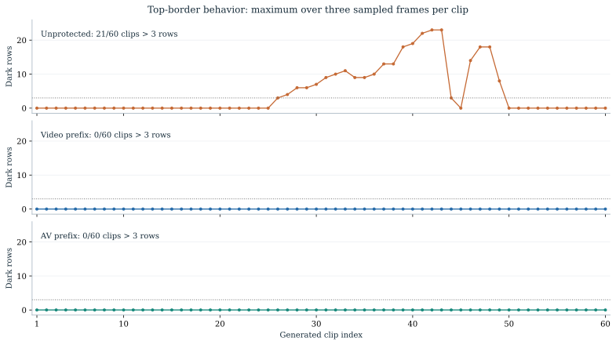

#### 7.4.2 Long-run behavior and the role of clean references

Extending the earlier video-prefix chain to 180 segments preserved all 179 checked video prefixes and retained zero sampled black bands, yet visual review found late color/texture drift and ghosted fingers. The result separates **boundary preservation** from **long-run appearance fidelity**. A metric can remain favorable while another aspect of the scene deteriorates.

A later lotus-scene trial using two identical clean image-reference blocks completed 180 segments without periodic resets or retries, whereas its preceding single-reference trial failed screening at continuation 49. This supported retaining the two-block conditioning policy for the selected scene. The trials were not a randomized, replicated study, and they are distinct from the earlier failed 180-segment prefix extension. Their different configurations must not be pooled into one success rate. The later production session's brightness-drift stop also prevents interpreting the two-reference trial as an indefinite-consistency guarantee. These trial identities and limits are documented in the [method-source manifest](evidence/continuity-design.json) and the production observations in Section 7.2.

**TABLECAPTION: Evidence supporting each consistency mechanism and its remaining limit.**

| Mechanism or diagnosis | Evidence | Supported inference | Remaining limit |
|---|---|---|---|
| Raw-tail propagation | Controlled clear/degraded-tail replays with other requested inputs fixed | Existing visual defects can propagate through the tail | Does not identify every source of the initial defect |
| Exact video prefix | 59/59 checked boundaries in the video arm | The inherited latent boundary is preserved under the tested contract | Decoded appearance and future content can still change |
| Clean reference repetition | Separate single-/two-block lotus-scene trials | Two blocks were useful in the observed scene | No universal optimal reference count or hours-long guarantee |
| Publication screen | Fixed-anchor drift checks, seam checks and a real rejected continuation | Some visibly degraded candidates are withheld | Three-frame sampling misses some errors; no semantic object verifier |
| Accepted-parent retry | Controller restores a hashed raw AV checkpoint before retry | Rejected candidate state is not reused as the accepted parent | An already marginal accepted tail may fail again |
| Application state | Reply/action continuity and explicit scene receipts | Prompts can remain consistent across segment boundaries | Intended state is not automatic visual confirmation |

## 8. Discussion and limitations

The system preserves several invariants exactly: segment ordering, selected latent-prefix values, accepted-tail provenance, and the progression of frame/sample clocks. It maintains face, clothing, lighting, props and voice through conditioning and screening, whose guarantees are weaker. These two classes of consistency should be reported separately.

Motion context is a bounded summary of recent generated content, including its appearance errors. Clean references do not overwrite those errors pixel by pixel. Window-relative positional encoding bounds temporal coordinates but does not repair the content carried by the recurrence. Likewise, passing a global color or black-band check does not establish that a hand, book title, window state or speaker identity is correct.

The supported conclusion is therefore limited: **reference-conditioned H3 Turbo, protected video overlap and accepted-state rollback improve the evaluated continuation behavior and provide an auditable streaming protocol. Indefinite character/scene fidelity remains unproven.** Further claims would require replicated long runs, varied actions and reference scenes, human inspection, and direct evaluation of identity, object state, speech continuity and lip synchronization.

The preceding live session stopped after 871 accepted clips when both attempts at the next continuation failed luminance screening. An operator-authorized fresh opening restarted production; this is not seamless autonomous recovery. A historical 7.352 s retried request also caused 2.458 s of relay waiting. Thus quality screening and a one-clip queue trade continuity risk against interruption risk.

The current screen checks decoded validity and sampled luminance, chroma, saturation, texture and top black bands against a fixed reviewed frame. It can miss incorrect text, repeated actions, impossible reflections or disappearing props. An intentional clothing or background change can also trigger its global appearance thresholds. Reliable semantic state verification and a continuous recovery policy remain open requirements.

## 9. Future work

| Priority | Work | Why this follows from evidence | Acceptance requirement |
|---|---|---|---|
| 1 | Long-run quality and explicit recovery policy | The last stream stopped on brightness drift despite sufficient throughput | Longer continuous reading/dialogue runs; retain failures; review face, lighting, props and raw AV; no hidden hard reset |
| 2 | Measure actual first-response onset | Ready time is not viewer experience; queueing and in-clip gaze/speech onset remain material | Correlate received messages with local and viewer-recorded first meaningful response |
| 3 | Current dense Ref2VA DiT profile | Historical VSA opportunities do not automatically apply; backend dominates | Fresh isolated capture and matching unprofiled requests; same prompt, tail, precision and geometry |
| 4 | Keep reducing exact conditioning and data handling work | New speech still misses text conditioning; unchanged image work can be reused | Exact cache keys/invalidation, distributed agreement, latent and full-output comparisons |
| 5 | Adaptive buffering with an explicit latency budget | One clip lowers delay but retries can exhaust it | Measure underruns and response distribution together; no hidden growing queue |
| 6 | Better speech continuity evaluation | ASR can miss unnatural prosody and clipped phonemes | Listening, boundary alignment, timbre, extra/missing speech and lip-sync review |
| 7 | Capability-specific visual qualification | State prediction does not guarantee action execution | Repeated requests, cancellation, interruption and persistent object state; retain negative examples |
| 8 | Revisit 73/56 frames only after backend headroom improves | 56-frame mixed workload currently loses throughput; 73-frame speech has little reserve | Sustained mixed speech/action run with comfortable P95 margin and no phrase fragmentation |
| 9 | Higher resolution after deadline/quality stability | 1088 residency alone failed; frame count and image area both cost compute | Unchanged-policy resolution comparison, paired quality review and full producer deadline statistics |

The credible demo claim is that an open H3-based audiovisual generator can sustain interactive, bounded-window live production on this eight-GPU system under the measured conditions, with a stateful application and explicit quality gates. The evidence does not yet support uninterrupted 24-hour coherence, unrestricted reliable object manipulation, or a universal low-latency viewer SLO.

## 10. Conclusion

The implemented system makes five-second H3 audiovisual continuation practical through a coordinated model, runtime and application design. Ref2VA Turbo establishes the reference-conditioned generation path; exact reuse and scheduling reduce recurring serving work; accepted raw-state continuation and prefix preservation constrain segment transitions. The measured production and ablation results support this operating point, while retained failures identify its limits. Future improvement should be judged jointly by complete-request timing, actual viewer response onset, speech fidelity and long-run visual state, under explicitly matched configurations.

## Appendix A. Historical record

### A.1 Early trajectory and rejected branches

These stages are imported from the September 11 historical audit. They change the step schedule, attention graph, arithmetic and decoder at different points. Values are historical complete-request seconds under the source campaign; they are not interchangeable with current five-second publication time. “Exact” applies to the optimization relative to its parent contract, not to the entire accumulated model. Do not sum adjacent changes or report a universal speedup to the present avatar.

| Stage | Change | Historical seconds | Fidelity of change | Later status |
|---|---|---:|---|---|
| S0 | Original H3 control | 653.838 | Original | Historical; not requalified as current live |
| S1 | AdaLN TP1 / SP8 | 605.348 | Exact | Historical; not requalified as current live |
| S2 | Explicit RDMA Ulysses exchange | 592.079 | Exact | Historical; not requalified as current live |
| S3 | Direct Q/K layout | 590.562 | Exact | Historical; not requalified as current live |
| F0 | Dense FastH3, four forwards | 66.785 | Lossy | Historical; not requalified as current live |
| P0 | FastH3 + VSA + FlashInfer | 43.420 | Lossy | Historical; not requalified as current live |
| P1 | GPU FP32-to-uint8 video pack | 36.568 | Exact | Historical; not requalified as current live |
| P2 | Chunked pinned D2H + background mux | 31.399 | Exact | Historical; not requalified as current live |
| P3 | Persistent RDMA communication | 30.534 | Exact | Historical; not requalified as current live |
| P4a | Fused VSA tile packing | 30.013 | Exact | Historical; not requalified as current live |
| P4c | Compact VSA untile | 29.880 | Exact | Historical; not requalified as current live |
| P4d | Direct attention O path | 29.873 | Exact / noise-sized | Historical; not requalified as current live |
| P5 | Exact VAE/direct Q-to-K cleanup | 28.236 | Exact | Historical; not requalified as current live |
| Q1 | Online FP8 MLP | 25.172 | Lossy | Historical; not requalified as current live |
| Q2 | MLP + output FP8 | 24.887 | Lossy | Historical; not requalified as current live |
| Q5 | QKV E4M3 wire + O bundle | 21.649 | Lossy | Rejected E4M3/TAEH3 descendant; excluded |
| D1 | TAEH3 decoder, FP32 | 16.738 | Lossy | Rejected E4M3/TAEH3 descendant; excluded |
| D2 | TAEH3 decoder, FP16 | 16.289 | Lossy | Rejected E4M3/TAEH3 descendant; excluded |
| D3 | All-main FP8 coverage | 15.634 | Lossy | Rejected E4M3/TAEH3 descendant; excluded |
| D4 | Persistent RDMA steady state | 15.165 | Exact | Rejected E4M3/TAEH3 descendant; excluded |
| D5 | OMP=28 CPU orchestration | 14.671 | Exact | Rejected E4M3/TAEH3 descendant; excluded |
| D6 | Cross-rank Audio VAE | 14.561 | Exact | Rejected E4M3/TAEH3 descendant; excluded |

The fastest rejected descendant is retained here to explain the rollback, not to advertise an accepted endpoint. The later native-VAE/BF16-wire work follows a different accepted branch. [Original numerical audit extract](evidence/early-history.json)

### A.2 Scheduling overlap and negative retests

| Round | Mechanism | Before mean | After mean | Evidence |
|---|---|---:|---:|---|
| v1 | QK/V overlap + four-chunk reverse O | 25.7613 s | 25.1353 s | Matched complete-request pairs; n=3 per arm |
| v2 | Gate GEMM during QKV exchanges | 25.1177 s | 24.3403 s | Matched complete-request pairs; n=3 per arm |
| v3 | Layout views + early Q + coarse overlap | 24.3647 s | 24.0117 s | Matched complete-request pairs; n=3 per arm |
| v4 | Early coarse softmax (exploratory) | 24.0528 s | 23.9402 s | Observed only; no stable gain established; n=5 per arm |

The later same-feature baseline retest was 25.1176 s, rather than the historical 24.0117 s. Its output-fusion and boundary candidates took 25.2708 and 25.2792 s. This variability is why a compounded percentage from different campaigns is not a freshly measured cumulative improvement. The v9 V-pack microbenchmark improved 0.5227 to 0.3484 ms, but its simulated single-GPU chain improved only about 0.30%; it was not an SP8 MP4 qualification.

### A.3 Consolidated decision ledger

The ledger groups related work so that repeated campaigns are not counted as independent additive improvements. Dates identify the retained experiment families. The retained history inventory includes the early 653.838-second dense-H3 baseline, every stage of that historical trajectory, and all indexed native experiment families and avatar documents. A separate machine-readable inventory records documentation hashes and evidence status. This is all locatable history in the stated workspace scope, not a claim to recover deleted runs. “Retained” means the relevant current mechanism is present; VSA-specific details may not transfer to Ref2VA.

| Period / family | Change and measured outcome | Final interpretation for the current demo |
|---|---|---|
| Early dense H3 serving | AdaLN reuse, sequence parallelism, explicit RDMA, direct layout, GPU byte packing and chunked output | Architectural foundation; the old 49-forward schedule is not the current four-step task |
| FastH3 model change | Four-step student and VSA replace the base trajectory/attention work | Historical long-clip route; model/attention changes are not lossless serving gains |
| Sep 10–11 communication overlap | QK/V overlap, O pipeline, gate overlap, view cleanup, early-Q/coarse work | Matched means 25.761→25.135; 25.118→24.340; 24.365→24.012 s in separate rounds; no single newly measured combined curve |
| Historical E4M3 wire + TAEH3 branch | Reached a historical 14.561 s endpoint | Excluded from the accepted baseline after quality rejection; BF16 wire and native video VAE retained later |
| Sep 14 MXFP8 projection path | Compare blockwise FP8 and MXFP8; preserve original non-target precision and BF16 wire | Approximate arithmetic choice; do not attribute changed surrounding schedules to quantization alone |
| Persistent RDMA | 17.9214→17.5780 s mean, five requests/arm | Exact relative to the selected MXFP8 baseline; retained registration trades memory for lower setup work |
| SwiGLU/FC2 packing fusion | About 130 ms complete-request reduction; payload/scale/output byte checks | Retained for current MXFP8 FC2; LUT variant gave no extra benefit |
| VAE gather overlap | 17.4510→17.4168 s historical means | Small observed change; later isolated early-gather comparisons did not establish a universal gain |
| VAE INT8 / MXFP8 experiments | INT8 ConvRot candidate 17.4168→16.0726 s; later MXFP8 VAE base 15.8322 s | Historical quality/performance candidates; current video decoder uses NVFP4 |
| CAKE descriptor specialization | 15.8322→15.6370 s in the audited long-clip progression | Grid-constant/TMA optimization; exactness relative to its parent checked |
| Combined QK/V split + VAE batching + AV overlap | Qualified complete-request mean 15.1336 s | Combined gain, not separately attributable; VSA split flags are off in current Ref2VA |
| O producer lookahead | 15.1336→14.9692 s, five formal requests all below 15 s | Qualified real-time long-clip milestone; retains output precision |
| NVFP4 video VAE | Single-request 14.973→14.444 s combined result; native audio PCM unchanged | Deliberate video approximation; early gather alone contributed only a small observed difference |
| Eager DiT scaling | 1/2/4/8 GPU means 89.629/58.249/28.321/16.072 s; matching final latents | DiT-only synthetic conditioning; communication routes also differ; not the fully optimized serving path |
| Tile-aware lowp QKV communication | Real-layer module improvement about 11%, full request 14.442→14.869 s | Rejected: slower complete request and changed video/audio; keep BF16 wire |
| V/QKV host-gap experiments | V-barrier-to-pack median 177.185→19.584 µs; full request 13.688→13.710 s | Local scheduling improvement did not establish E2E benefit; not credited as a speedup |
| Native O consumer Graph microbenchmark | Four O chunks 4.801→4.710 ms in a synthetic eight-rank test | Mechanism evidence; full-model qualification handled separately |
| First-step quality protection | Long clip 13.545 s fast vs 15.255 s BF16-first; O-only BF16 13.934 s | Quality frontier, not a free optimization; full first-step protection crossed the 15 s deadline |
| Exact VAE constant cache + early AAC | Config A 15.240→15.044 s; fast path 13.551→13.304 s | Byte-equivalent output in tested pairs; overlapping output costs became worth optimizing |
| GPU blend/RGB fusion | 13.334→13.261 s median; matched MP4/PCM | Retained; component speedup much larger than request speedup |
| Encoder GPU-output residency | 13.334→13.358 s median in the same campaign | Removed redundant transfers but no demonstrated request acceleration |
| Tiled O producer / full consumer Graph | 13.253→13.120→13.094 s long-clip medians | Producer gain supported; 26 ms extra Graph difference not independently stable; VSA-dependent integration |
| Chunked post-attention residual/norm | 13.117→13.103/13.102 s medians | Kept off: overlapping ranges, about 0.11% difference, no robust gain |
| Prepared norm submission | 13.115→13.079/13.090 s medians; CPU enqueue also reduced | Disabled: three-sample ranges overlap; no stable full-request gain established |
| Split Q/K with original first step | 15.255→15.303 s with copy, 15.253 s without copy; byte-equivalent | 57.04% K-GEMM overlap did not establish E2E acceleration; candidate only |
| Offline 2× reconstruction research | H3 latent-only 18.20–20.61 s; refine about 1850 s; SeedVR2 INT8 233.56–242.23 s | Two scenes and different GPU counts/boundaries; none qualifies as current live postprocessing |
| OpenVDN eight-step continuation | 5/22-frame context medians 23.219/25.208 s for roughly 15 s windows | Did not meet real time; not the selected demo model |
| VDN gather/scan/factor work | Exact window gather and scan Graph microbenchmarks; one faster solve failed numerical limits | Research evidence only; cannot be counted as current H3 speedup |
| Ref2VA five-second motion-context comparison | Five-frame context reduced work relative to 22-frame trials; warm finite measurements retained | Selected shorter context; stability must be checked separately from latency |
| First-step BF16 long-run test | 3.888→4.492 s medians; degradation appeared later but returned | Useful mitigation, not a long-run quality solution |
| 1088 weight residency and BF16 rollback | Transfers removed but 5.611→5.704 s; all-BF16 variants slower | Reverted to resident MXFP8; larger-resolution target not achieved by this change |
| Raw video prefix and accepted-tail rollback | Exact prefix/seam checks and same-parent retry | Retained; prevents bad candidate adoption and discontinuous retry resets |
| Original PCM relay | Avoid AAC-generation loss on the relay input | Retained; does not cure extra words already generated in PCM |
| Shared output validation decode | 5.044→4.774 s matched short-clip median | Exact application work reduction; retained |
| Exact reference/conditioning reuse | Four pairs and three-action OFF/ON/OFF equality; lower preparation scopes | Retained with bounded cache and distributed agreement |
| Local small text model / direct actions | Subsecond planning in small tests; supported commands bypass model | Retained; generation and queueing still dominate response onset |
| All-step Sage/MXFP8 live switch | Historical idle 4.575→3.857 s | Explicit temporary lossy choice to regain headroom |
| Prompt-only voice | Remove per-line reference synthesis and reference blocks | Selected after demo review; voice consistency still needs continued validation |
| One-clip lookahead | Historical ready-to-local-playback median 1.242 s | Retained; lower delay with less retry reserve |
| 56/73-frame trials | Mixed speech deadlines and quality issues | Implemented experimentally; 124-frame production default retained |
| Action-specific prompts and shared world harness | One-cycle gestures; book/food/cloth/water/mirror/window/wardrobe state research | Simple public gestures enabled; complex recipes remain selectively unqualified |
| Fresh-session recovery | New opening after terminal drift failure | Explicit operator restart; not evidence of seamless autonomous recovery |

These rows should not be summed. Some are overlapping implementations, some change arithmetic, some are different prompts/resolutions, and some deliberately record regressions. The historical 653.838 s dense-H3 baseline and rejected approximate branches are preserved in the source inventory rather than presented as a “current 160× speedup” claim.

### A.4 Indexed experiment families

The full descriptions, document hashes and evidence status are retained in the embedded [history inventory](evidence/history-inventory.json). The index below identifies the scope without repeating the methods discussed in the main text.

| Index | Retained experiment family |
|---:|---|
| 1 | `h3-ulysses-overlap-20260910` |
| 2 | `h3-vsa-preprocessing-investigation-20260910` |
| 3 | `h3-vsa-sage-pr4691-20260910` |
| 4 | `h3-vsa-sage-teahouse15s-20260910` |
| 5 | `h3-cumulative-optimization-20260911` |
| 6 | `h3-quality-comparison-20260913` |
| 7 | `fasth3-mxfp8-fusion-20260914` |
| 8 | `fasth3-mxfp8-next-20260914` |
| 9 | `fasth3-mxfp8-profile-20260914` |
| 10 | `fasth3-mxfp8-retention-20260914` |
| 11 | `fasth3-mxfp8-vs-blockwise-20260914` |
| 12 | `h3-best-paths-20260914` |
| 13 | `h3-dit-vsa-scaling-20260914` |
| 14 | `h3-e2e-cumulative-rerun-20260914` |
| 15 | `h3-dit-mxfp8-swiglu-nsys-20260915` |
| 16 | `h3-dit-vsa-usp-scaling-20260915` |
| 17 | `h3-fasth3-vs-best-video-20260915` |
| 18 | `h3-original-history-best-video-20260915` |
| 19 | `h3-postrollback-nsys-20260915` |
| 20 | `h3-best-latency-nsys-20260916` |
| 21 | `h3-infinite-cartoon-20260916` |
| 22 | `h3-ulysses-lowp-pr4924-review-20260916` |
| 23 | `h3-vae-nvfp4-pipeline-20260916` |
| 24 | `h3-o-consumer-full-20260917` |
| 25 | `h3-o-mxfp8-pre-a2a-lossless-20260917` |
| 26 | `h3-original-single-lossy-ablation-20260917` |
| 27 | `h3-qkv-transfer-gap-20260917` |
| 28 | `vdn-original-single-lossy-ablation-20260917` |
| 29 | `fasth3-combined-first-step-original-20260918` |
| 30 | `fasth3-cpu-pipeline-20260918` |
| 31 | `fasth3-dit-bubbles-20260918` |
| 32 | `fasth3-dit-bubbles-live-20260918` |
| 33 | `fasth3-dit-chunknorm-live-20260918` |
| 34 | `fasth3-dit-comm-review-20260918` |
| 35 | `fasth3-dit-norm-submit-20260918` |
| 36 | `fasth3-early-step-original-20260918` |
| 37 | `fasth3-encoder-resident-20260918` |
| 38 | `fasth3-fastest-plus-aac-20260918` |
| 39 | `fasth3-nvenc-vs-cpu-20260918` |
| 40 | `fasth3-oproj-bf16-20260918` |
| 41 | `fasth3-output-fusion-20260918` |
| 42 | `fasth3-output-fusion-live-20260918` |
| 43 | `fasth3-precision-schedule-realtime-20260918` |
| 44 | `fasth3-qk-split-overlap-20260918` |
| 45 | `fasth3-qkvo-bf16-20260918` |
| 46 | `fasth3-realtime-resume-20260918` |
| 47 | `fasth3-vae-lossless-overlap-20260918` |
| 48 | `h3-interactive-infinite-live-20260918` |
| 49 | `h3-upscaler-vs-seedvr2-20260918` |
| 50 | `vdn-combined-realtime-20260918` |
| 51 | `vdn-factor-fusion-20260920` |
| 52 | `vdn-ref2va-allopt-20260920` |
| 53 | `vdn-ref2va-allopt-v2-20260920` |
| 54 | `vdn-ref2va-allopt-v3-20260920` |
| 55 | `vdn-ref2va-gather-20260920` |

## Appendix B. Reproducibility

- [Current live production observation](evidence/current-live-observation.json): aggregate timing only; no viewer identities or message text.
- [Extended production observation](evidence/extended-live-observation.json): 456 accepted continuations, including later deadline misses and relay waits.
- [Measurements and selected runtime configuration](evidence/measurements.json): unprofiled samples, residency comparisons, cache profile ranges, short-window results.
- [Nsight SQLite reanalysis](evidence/nsys-reanalysis.json) and [CSV ranges](evidence/nsys-reanalysis.csv): eight retained captures; exact hashes and per-device detail.
- [Source manifest](evidence/source-manifest.json): local experiment documents and measurement files, with hashes and portable workspace placeholders.
- [Optimization history inventory](evidence/history-inventory.json): discovered experiment families and their retained records.
- [Backend execution counters](evidence/backend-dispatch-snapshot.json): accumulated eight-rank projection/fusion dispatch, explicitly not an isolated request benchmark.
- [Software versions](evidence/software-versions.json): environment metadata, with source-overlay caveats.
- [Selected implementation hashes](evidence/implementation-manifest.json): application control, model fusion and projection paths.
- [Trace analyzer](analyze_traces.py), [report builder](build_report.py), [history indexer](build_history.py), [continuity figure builder](build_continuity.py), [method diagram builder](build_diagrams.py), and [single-file paper builder](build_paper.py): CPU-only reproducibility tools.

```bash
# Read preserved SQLite exports; does not start a GPU request.
python analyze_traces.py --workspace /path/to/workspace \
  --temporary-root /path/to/retained-tmp --output evidence/nsys-reanalysis.json

# Rebuild charts and self-contained HTML from the bundled evidence.
python build_report.py

# When a new offline capture is explicitly scheduled, keep its timing separate.
# Export a recorded report (command shown for reproduction, not run on live):
nsys export --type sqlite --output request.sqlite request.nsys-rep
nsys stats --report nvtx_sum,cuda_gpu_kern_sum,cuda_gpu_mem_time_sum request.nsys-rep
```

The local analyzer uses the retained paths recorded in its trace catalog. To reproduce on another machine, supply the corresponding artifacts at updated paths and verify their hashes. Raw traces and model weights are not embedded in this lightweight report bundle. A directory named “prepared,” a configuration flag, or a successful HTTP response alone is never used as proof that a proposed optimization ran or that an action succeeded.

The [continuity protocol manifest](evidence/continuity-design.json) records the selected model, reference roles, temporal geometry and inspected-source hashes. The [continuity ablation records](evidence/continuity-ablation.json) contain all 180 sanitized segment records and 177 measured boundaries. Unchecked prefix-equality fields are null, rather than recorded as failed checks.

This HTML embeds its vector figures, presentation code and evidence downloads. It can be read offline without adjacent files. Raw Nsight traces, model weights, media and latent checkpoints are not embedded. Rebuilding the paper requires the source modules and data; rerunning a historical experiment additionally requires its original artifacts and configuration.

### B.1 Inspectable prompt examples

The gallery distinguishes source policy templates from exact H3 prompt strings saved in transmitted request records. Original Chinese policy text is retained verbatim; explanatory text is in English. Each renderer example identifies its reference, geometry, seed and intended state changes. The transmitted Picture 2 suffix is included. These are private research requests, not proof that the actions succeeded or were broadcast. [Download all prompt examples](evidence/prompt-examples.json)

PROMPT_EXPLORER

### B.2 ICML writing references

The following ten papers were verified against the official ICML proceedings. Their PDFs were collected locally, and the opening ten pages of each PDF were inspected for problem framing, method organization, figures and evaluation presentation. The recommendations below are our editorial interpretation. These papers are **writing references, not evaluated H3 baselines or evidence that their methods are implemented in this system**. Links lead to the official paper records and PDFs; the report does not reproduce their figures or prose.

**TABLECAPTION: Ten ICML papers and a concrete writing pattern to borrow.** Publication year is the proceedings year, not the first arXiv date.

| Paper | Venue | Inspect | Apply to this report |
|---|---|---|---|
| [Fast Inference from Transformers via Speculative Decoding](https://proceedings.mlr.press/v202/leviathan23a.html) · [PDF](https://proceedings.mlr.press/v202/leviathan23a/leviathan23a.pdf) | ICML 2023 | Algorithm 1, the analysis of arithmetic work versus latency, and the execution trace in Figure 5 | State exactly what an optimization preserves. Separate extra computation, parallelism and measured wall-clock benefit. Do not equate more FLOPs with greater latency. |
| [Medusa: Simple LLM Inference Acceleration Framework with Multiple Decoding Heads](https://proceedings.mlr.press/v235/cai24b.html) · [PDF](https://raw.githubusercontent.com/mlresearch/v235/main/assets/cai24b/cai24b.pdf) | ICML 2024 | Figure 2's mechanism view, Figure 3's speed/quality presentation, and variant ablations | Give variants distinct names and fidelity contracts. Put end-to-end speed beside quality evidence; do not pool materially different model variants. |
| [Break the Sequential Dependency of LLM Inference Using Lookahead Decoding](https://proceedings.mlr.press/v235/fu24a.html) · [PDF](https://raw.githubusercontent.com/mlresearch/v235/main/assets/fu24a/fu24a.pdf) | ICML 2024 | Table 1's experimental settings, Section 5.1 and Section 5.4 | Put hardware, parallelism, model and workload beside results. Separate the mechanism's potential from the speedup obtained by an actual implementation. |
| [FlexGen: High-Throughput Generative Inference of Large Language Models with a Single GPU](https://proceedings.mlr.press/v202/sheng23a.html) · [PDF](https://proceedings.mlr.press/v202/sheng23a/sheng23a.pdf) | ICML 2023 | The compute graph and schedule figures; Tables 4 and 5 | Define the operating objective first, then show scheduling and controlled ablations. A throughput-oriented workload is not an interactive response-time benchmark. |
| [DéjàVu: KV-cache Streaming for Fast, Fault-tolerant Generative LLM Serving](https://proceedings.mlr.press/v235/strati24a.html) · [PDF](https://raw.githubusercontent.com/mlresearch/v235/main/assets/strati24a/strati24a.pdf) | ICML 2024 | Figure 5's system view, Figure 6's implementation decomposition and Table 1's primitive interface | Explain the harness through interfaces, data ownership and recovery. Separate a persistent state mechanism from the applications that consume it. |
| [SmoothQuant: Accurate and Efficient Post-Training Quantization for Large Language Models](https://proceedings.mlr.press/v202/xiao23c.html) · [PDF](https://proceedings.mlr.press/v202/xiao23c/xiao23c.pdf) | ICML 2023 | The outlier motivation, Figure 6's operator precision map and accuracy tables | Show where each precision is used. Distinguish an equivalent algebraic transform from approximate low-bit arithmetic and separately evaluate accuracy, memory and latency. |
| [KIVI: A Tuning-Free Asymmetric 2bit Quantization for KV Cache](https://proceedings.mlr.press/v235/liu24bz.html) · [PDF](https://raw.githubusercontent.com/mlresearch/v235/main/assets/liu24bz/liu24bz.pdf) | ICML 2024 | Figure 2's distribution evidence, Figure 3's algorithm and Figure 4's memory/throughput comparison | Present the measured bottleneck before the optimization. Report the deployment consequence of memory savings rather than treating reduced bytes as automatic speedup. |
| [Improved Denoising Diffusion Probabilistic Models](https://proceedings.mlr.press/v139/nichol21a.html) · [PDF](https://proceedings.mlr.press/v139/nichol21a/nichol21a.pdf) | ICML 2021 | Schedule/objective ablation tables and the sampling-speed section | Give one controlled question to each experiment. Plot quality against sampling cost rather than selecting a fast point without its quality context. |
| [Consistency Models](https://proceedings.mlr.press/v202/song23a.html) · [PDF](https://proceedings.mlr.press/v202/song23a/song23a.pdf) | ICML 2023 | Figure 2's method explanation, Figure 3's factor ablations and Figure 4's sampling comparison | Introduce the mechanism before the result and label training routes and sampling budgets. Its use of “consistency” does not substantiate temporal identity preservation in our avatar. |
| [History-Guided Video Diffusion](https://proceedings.mlr.press/v267/song25b.html) · [PDF](https://raw.githubusercontent.com/mlresearch/v267/main/assets/song25b/song25b.pdf) | ICML 2025 | History-conditioning diagrams, the long-rollout example and quantitative comparisons | Visualize the history/reference contract and retain timed rollout evidence. Its learned model and guidance do not transfer into H3 merely through a prompt or citation. |

### B.3 What belongs in the report

This is a systems technical report adopting academic exposition, not a claim of ICML acceptance or a new trained foundation model. Its central argument is that a particular combination of model task, serving implementation, continuation protocol and interaction controller supports a bounded five-second streaming workload. Every claimed benefit needs a named configuration, a measurement scope and an explicit limit.

**TABLECAPTION: Editorial inclusion and claim boundaries.** “Include” means describe with the stated evidence, not promote an aspiration to an achieved result.

| Material | Placement and treatment | Required evidence | Do not claim |
|---|---|---|---|
| Problem and objective | Main introduction: playback deadline, interaction delay, quality and continuity | Explicit clocks and workload geometry | Backend real-time factor is a viewer-response guarantee |
| FastH3 → Ref2VA Turbo | Main model-selection section | Task path, adapter, resolution, frame count and conditioning | Shortening media from 15 s to 5 s is an isolated 3× infrastructure speedup |
| Exact optimizations | Main methods, grouped by the work they remove | Correctness scope plus matched timing where available | The entire stack is lossless because one cache is exact |
| Sage, MXFP8 and NVFP4 | Main precision/fidelity table and quality discussion | Operator coverage, selected policy and applicable comparisons | Approximate arithmetic is numerically identical to BF16 |
| Nsight traces | Main bottleneck and scheduling figures | Trace provenance, instrumented versus unprofiled runs, CPU versus GPU scopes | CPU NVTX ranges are GPU kernel time or additive critical-path costs |
| Latency and throughput | Main evaluation | Sample count, matched configuration, P50/P95, deadline misses and all clock definitions | Kernel speed, request-ready time and Twitch-viewer latency are interchangeable |
| Reference images and motion context | Main method with actual embedded images | Input roles, dimensions, hashes, raw-tail and prefix mechanisms | Two copies are independent views, or reference conditioning prevents all drift |
| Harness | Main interface/lifecycle diagram and compact tables | Deployed path versus research path, ledger and receipt contracts | A planned/generated action is an observed completed effect |
| Prompt design | Compact structure in main text; complete examples in B.1 | Captured request versus source template, reference and state provenance | The model reliably obeys every temporal or physical instruction |
| Action samples | Finite qualitative evidence and limitations | Full phase sequence, persistence checks and retained failures | Arbitrary actions, unrestricted object manipulation or universal success |
| Long-run quality | Evaluation and limitations | Duration, checkpoints, drift/seam measures and failure cases | Infinite duration, 24-hour stability or no degradation without such tests |
| Audio | Separate model, decoder and transport discussion | PCM/AAC distinction, intelligibility/speaker evidence when actually measured | No clipping implies natural, intelligible or faithful speech |
| Optimization history | Appendix A, with only decision-changing findings in the main text | Retained experiment records, rejected branches and baseline definitions | Every historical attempt is cumulative or still enabled |
| Reproduction material | Configuration, hashes, prompt/source excerpts and artifact index | Enough detail to inspect or rerun within access constraints | Credentials, stream keys, private viewer content or unsupported implementation details |

The main text should follow **problem → design → mechanism → controlled evidence → limitation**. An overview figure should explain the information flow, a precision table should expose approximation boundaries, and each performance figure should answer one measurable question. Full prompts, historical logs and parameter detail belong in expandable or downloadable appendices. Rejected experiments remain visible when they explain a design choice; repeated descriptions of the same optimization should be consolidated.

Numerical observations are retained at their original scope. Missing comparisons are stated as missing. A gallery frame illustrates an instance; a success-rate claim needs a defined sample population and review rubric. A deterministic state-machine test validates control behavior, not the video model's visual compliance. The literature reading list supplies presentation examples and conceptual context, not experimental evidence for our implementation.
