# MiniMax H3 Interactive Avatar: Infrastructure, Optimizations, and Latency

Measurement date: **2026-09-21**. Deployment: **eight SM120 GPUs, 960 x 544, 24 FPS, four diffusion steps**. Session: `twitch-zhiwei-20260921-09`. Local relay started at **2026-09-21T06:43:42.429Z**.

This is a running, scoped interactive demo: a viewer asks a question, a local text model writes the answer, and H3 generates synchronized speech and video in a continuous scene. It produces fresh footage; it does not select a prerecorded response video. In the first 59 continuation clips, median generation-to-publication time was **4.558 seconds** for **4.958 seconds** of new media. Three synthetic requests reached local playback in **11.527, 13.152, and 11.681 seconds**. These are different measurements: generation throughput is not viewer response latency.

- [Watch the Twitch demo](https://www.twitch.tv/sylar_nv).
- [Open the live English Grafana dashboard](https://zoloft-requirement-auction-valid.trycloudflare.com/d/h3-live/e9145c2?orgId=1&refresh=5s&kiosk=true&from=1789973022429&to=now). The public tunnel is temporary.
- This document reports a local integration with private/custom runtime patches. A stock upstream install is not sufficient to reproduce every optimization below.

## 1. System architecture

```mermaid
flowchart LR
    A[Viewer / Twitch chat] --> B[Chat listener]
    B --> C[SQLite WAL inbox]
    C --> D[Local action / fact router]
    D --> E[Qwen dialogue model]
    D --> F[Validated reply queue]
    E --> F
    F --> G[Timed prompt and continuation producer]
    G --> H[Eight-GPU H3 Ref2VA]
    H --> I[Prefix and image continuity checks]
    I --> J[Published video and FP32 PCM]
    J --> K[Paced PyAV relay / music mixing]
    K --> L[H.264 + AAC / RTMP]
    L --> M[Twitch HLS / viewer player]
    C -. metrics .-> N[Prometheus / Grafana]
    G -. metrics .-> N
    K -. metrics .-> N
```



The action router handles explicit supported movements and a few canonical facts. Open dialogue uses Qwen. It receives configured scene facts and the same viewer's recent completed conversation; it has no live visual perception. A requested action, a generated action, and an action actually visible in the video are different states.

A single producer advances the rolling H3 session. Reply segments stay consecutive. The durable queue tracks selection, generation, publication, and playback. The relay sends fresh clips in order with two clips of configured lookahead. Only this producer may advance the backend's rolling state; offline generation clients must not run against it concurrently.

## 2. Complete deployed stack

| Layer | Actual implementation / configuration |
| --- | --- |
| Compute | One host, eight NVIDIA SM120 / GB202-class GPUs. The installed driver reports the generic name `NVIDIA Graphics Device` and 73,415 MiB total memory per GPU; a retail board name is not inferred. |
| Model runtime | Custom native MiniMax H3 integration on vLLM-Omni; CUDA, PyTorch, Triton, cuDNN attention, CUTLASS block-scaled GEMM, and FlashInfer communication kernels. |
| Video and speech model | MiniMax H3 Ref2VA with a four-step Turbo/FastH3 adapter; reference image plus voice reference; joint audio/video generation. |
| Parallelism | Diffusion TP=1, sequence/Ulysses parallelism=8, ring degree=1; text encoder TP=8; video VAE tile parallelism=8. |
| Inter-GPU exchange | Custom FlashInfer PCIe/RDMA Ulysses route, permutation-aware exchange and direct Q/K/O producer paths; E4M3 QKV transport is disabled. |
| Text authoring | Local Qwen3-4B-Instruct-2507 through a vLLM OpenAI-compatible chat endpoint; BF16, 2,048-token serving context, thinking disabled. The larger experimental text models are not the demo's authoring model. |
| Harness | Python; HTTPX; SQLite WAL; conservative action routing; per-viewer conversation context; validated reply queue; timed scene prompts; producer and relay receipts. |
| Answer segmentation | Punctuation/word-aware segmentation with Jieba; complete answers may span arbitrary numbers of video clips. Per-clip speaking budgets remain, but total answer length and segment count are not capped. |
| Visual inputs | One clean AI-generated reference scene supplied twice as two reference blocks; one fixed interior side camera; a seated reader, paper book, lotus pond, incense, bamboo slips, and candy. These are duplicate anchors, not two independently observed camera views. |
| Voice reference | A synthetic Serena reference prepared offline with Qwen3-TTS. TTS is not called for each answer; H3 generates the final speech and mouth motion. |
| Media | PyAV and FFmpeg/ffprobe; raw FP32 PCM sidecars; stereo resampling from 32 kHz to 48 kHz; continuous background music with speech ducking; H.264 at 5,000 kbps and AAC at 192 kbps for RTMP. |
| Observability | Custom Prometheus exporter, Prometheus 3.13.3, Grafana 13.2.2, a Cloudflare viewer tunnel, JSON receipts, SQLite lifecycle timestamps, NVTX, and offline NVIDIA Nsight Systems captures. |
| Storage | Model/checkpoint/source storage is on shared storage. Current live clips, PCM, rolling checkpoints, and the recovered Prometheus TSDB use local temporary storage to avoid the shared filesystem's user-quota failure. |

Installed package versions, read from the running environment:

| Component | Version |
| --- | --- |
| vllm | `0.28.0` |
| vllm-omni | `0.28.0rc2.dev62+gad1bb0f97` |
| torch | `2.13.0+cu132` |
| triton | `3.7.1` |
| flashinfer-python | `0.6.16.post3` |
| transformers | `5.14.1` |
| tokenizers | `0.22.2` |
| av | `18.1.0` |
| numpy | `2.3.5` |
| prometheus-client | `0.26.0` |
| httpx | `0.28.1` |
| python | `3.12.13` |
| torch_cuda | `13.2` |

FFmpeg build: `N-125972-ge13b2e00e8-20260805`. The source lock checks **1,408 files**. Source-manifest SHA-256: `944d97228c608f2fe11a67fb5a07077946bf8270415470bd10a0832e3a32bd86`. Package versions alone do not identify the local patched implementation. Inactive 14B and 30B text candidates remained resident during this measurement; the GPU memory dashboard includes them, although this demo sent no authoring requests to them.

## 3. Locked inference and continuity configuration

| Parameter | Value |
| --- | --- |
| Output | 960 x 544 at 24 FPS |
| Diffusion | Four steps; video flow shift 12; audio flow shift 3.0 |
| Window | 124 frames; first window is 5.167 seconds |
| Continuation overlap | Five frames; each continuation emits 119 fresh frames = 4.958333 seconds |
| Step 1 weights / attention | Original BF16 weights / BF16 attention |
| Steps 2-4 weights / attention | GPU-resident MXFP8 weights / dense Sage attention |
| Original BF16 storage | Pinned CPU storage with two GPU block buffers for prefetch |
| Per-forward weight requantization | Disabled; MXFP8 weights are prepared at loading and remain resident. Activation quantization still occurs in the low-precision GEMM path. |
| Video VAE / audio VAE | NVFP4 / FP32 |
| Reference conditioning | Two image-reference blocks; exact reference/condition encoding cache enabled |
| Motion context | Rolling retained tail, video target-prefix constraint, visual guide timestep 0.8 |
| Time position | Window-relative coordinates; continuation temporal offset is zero rather than an unbounded global time offset |
| Camera / reset policy | Fixed camera, no scheduled hard cuts or periodic scene reset |
| Playback | Two-clip lookahead; no speedup of the video or shortened media duration to manufacture real-time throughput |

Window-relative position coordinates avoid ever-increasing global time indices. They do not prove that drift is solved. Motion context carries the accepted preceding tail into the next generated window. Five overlap frames do not mean access to a future clip. Reference conditioning reinforces appearance; it cannot guarantee correct hands, factual dialogue, or indefinite image stability.

## 4. Measured end-to-end latency

The three probes were injected into the live durable inbox as explicitly synthetic test messages. They bypassed Twitch chat delivery, then used the actual text worker, producer, continuity checks, and paced broadcast relay. They were allowed to finish before the next probe. No real viewer messages or account identifiers are included here.

| Probe | Question, translated from Mandarin | Decision path | First response clip |
| --- | --- | --- | ---: |
| A | What is the dessert on the table? | Qwen-generated answer | 32 |
| B | What is outside the window? | Qwen-generated answer | 36 |
| C | Where is your book? | Deterministic scene-fact router | 40 |

All durations below are seconds. Each column is an additive decomposition from one host's timestamps.

| Stage | A | B | C |
| --- | ---: | ---: | ---: |
| Inbox dispatch wait | 0.016 | 0.033 | 0.049 |
| Text decision and enqueue | 0.315 | 0.097 | 0.001 |
| Wait for a generation slot | 1.338 | 3.124 | 1.755 |
| Request preparation | 0.003 | 0.002 | 0.002 |
| H3 HTTP request | 4.369 | 4.508 | 4.515 |
| Post-request validation and publication | 0.165 | 0.161 | 0.161 |
| Wait for local playback | 5.322 | 5.227 | 5.198 |
| **Total: inbox to local clip playback** | **11.527** | **13.152** | **11.681** |

Definitions:

- **Inbox dispatch:** durable message arrival to the text worker starting that message.
- **Text decision:** text-worker start to the reply being enqueued, including local validation and commit. This is full short-answer authoring, not time to the first LLM token. Probe C does not exercise the LLM.
- **Generation-slot wait:** reply enqueue to producer selection. An already running or committed earlier clip cannot be replaced freely without breaking continuity.
- **Request preparation:** producer selection to the H3 HTTP request starting.
- **H3 request:** the client's observed HTTP duration, including backend conditioning, denoising, decoding, output creation, and service overhead.
- **Validation/publication:** return from that request to the accepted clip being published, including continuity/image checks and local bookkeeping.
- **Playback wait:** published media waiting until the paced local relay starts its response clip. The two-clip buffer is the main reason a roughly 4.6-second generator does not answer the viewer in 4.6 seconds.

The median of the three measured totals is **11.681 seconds**. Three probes are a small demonstration, not a latency SLA or a reliable tail-latency distribution. They had no pre-existing audience backlog. Longer answers and concurrent viewers can add queueing.

The viewer's audible response additionally depends on:

```text
viewer audible response = chat delivery to the local inbox
                        + measured inbox-to-local-clip-playback latency
                        + speech onset within that clip
                        + Twitch ingest, distribution, and player buffering
```

The current measurement does **not** time Twitch delivery, browser rendering, or acoustic speech onset. A response clip may begin with a gaze transition. Neither the prompt's speech time nor a zero trim/lead field in a media receipt is a measured first audible word. HLS fetch/decode verification proves availability, not a measured viewer response time.

## 5. Unprofiled live generation throughput

The fixed sample is live clips 2-60: **59 continuations**, excluding only opening clip 1. No slow continuation was removed. This is a mostly-reading workload with three short spoken answers, not a sustained long-speech workload. The backend was already warm from the completed preflight, and Nsight capture was not enabled during this live sample. Each continuation supplies **4.958333 seconds** of new media. Percentiles use linear interpolation.

| Workload | Samples | P50, s | P95, s | Mean, s | Maximum, s | Above media budget |
| --- | ---: | ---: | ---: | ---: | ---: | ---: |
| All continuation clips | 59 | 4.558 | 4.632 | 4.563 | 4.678 | 0 |
| Reading / silent actions | 56 | 4.557 | 4.580 | 4.560 | 4.655 | 0 |
| Spoken answers | 3 | 4.672 | 4.678 | 4.629 | 4.678 | 0 |

Here the measured quantity is producer request-to-ready time, including publication checks, but excluding the time waiting for a future production/playback slot. The all-continuation mean corresponds to approximately **0.920 generation seconds per media second**. This leaves modest headroom, not enough to assume a higher resolution will remain real time.

At the relay snapshot **2026-09-21T06:57:11.010Z**, `163` clips had completed playback, with `0` waiting events and `0.000` seconds on the waiting screen. This is a bounded observation, not an hours-long stability claim.

## 6. Nsight stage breakdown: separate diagnostic captures

These are **earlier offline** captures from the locked 960 x 544, four-step implementation, not the three live probes above. Four arms each have one captured continuation after three preceding requests. Values are **rank-0 CPU NVTX range durations**, including CPU submission and any waits inside the range. They are not exclusive GPU execution times or production medians.

| Range, seconds | One reference, cache off | Two references, cache off | Two references, cache hit | Two references, new speech text |
| --- | ---: | ---: | ---: | ---: |
| Request preparation | 0.562 | 0.876 | 0.117 | 0.476 |
| Included: condition encoder | 0.258 | 0.368 | 0.003 | 0.373 |
| Four-step DiT | 3.639 | 3.803 | 3.658 | 3.946 |
| Included: step 1 | 1.589 | 1.593 | 1.455 | 1.726 |
| Included: step 2 | 0.675 | 0.726 | 0.726 | 0.729 |
| Included: step 3 | 0.675 | 0.725 | 0.724 | 0.729 |
| Included: step 4 | 0.673 | 0.722 | 0.724 | 0.727 |
| Decode range | 0.506 | 0.507 | 0.509 | 0.509 |
| Included: video VAE | 0.461 | 0.466 | 0.468 | 0.469 |
| Included: audio VAE | 0.026 | 0.024 | 0.024 | 0.024 |

Rows marked “Included” are children and must not be added to their parents. Audio decoding, video decoding, host copies, and encoding can overlap on streams or threads. The table is a decomposition aid, not a set of independent costs to sum into the live HTTP time.

The two-reference full cache hit reduced the observed preparation range from **0.876 to 0.117 seconds** in those captures. New speech still required text encoding: preparation was **0.476 seconds**, while the image reference could be reused. The DiT remained the dominant range at roughly **3.66-3.95 seconds** in the cached arms.

The same traces contain around **11.3 GPU-seconds of H2D copies summed across eight GPUs**. This is not 11.3 seconds of serial request latency. BF16 first-step prefetch overlaps computation. Across the four captures, CPU D2H-wait ranges summed to roughly 0.200-0.202 seconds and video encode/mux ranges to roughly 0.090-0.093 seconds; these also overlap other work.

The generic backend field `denoise_step_latency_ms` is not used here as a measured per-step kernel breakdown. Explicit nested step NVTX ranges are the evidence for step timings. A block-sparse-looking CAKE kernel name does not imply sparse attention in this deployment: the selected route retains all KV blocks and runs dense Sage.

## 7. Optimization methods actually in the deployment

### Exact reuse and implementation changes

| Method | Mechanism and infrastructure benefit | Evidence / scope |
| --- | --- | --- |
| Exact reference and condition cache | Bounded content-addressed cache for matching reference/image and prompt conditioning; configuration-aware keys, cross-rank agreement, independent returned tensors. Repeated reading prompts can reuse more work than new dialogue. | Four matched reading continuations and nine rest/speech/page-turn OFF/ON/OFF requests had identical video latents, audio latents, and MP4 hashes. This establishes equivalence for those tests, not every possible input. |
| Load-time adapter fusion and AdaLN sidecar | Fold adapter contributions into the checkpoint loading path; reuse modulation outputs tied to the configured schedule rather than repeat their projection work for every request. | Runtime configuration and loader implementation; no separate speedup is claimed for this session. This is exact reuse under its binding, distinct from the four-step adapter's model-quality tradeoff. |
| MXFP8 weight residency | Prepare fused low-precision weights at load and keep them on GPU; avoid quantizing the entire weight set on every forward. | Locked storage policy. The choice of MXFP8 itself is approximate; residency is a storage/scheduling method. |
| Pinned BF16 prefetch | Keep original projections in pinned host memory and prefetch into two block buffers for the quality-preserving first step. | Observed H2D activity and source configuration. Copy duration cannot be subtracted directly from request latency because of overlap. |
| Ulysses communication paths | Eight-way sequence parallel exchange over the configured FlashInfer PCIe/RDMA route, direct Q/K/O producer paths and permutation-aware layouts. | Locked flags and implementation. No E4M3 communication reduction is enabled, and this document does not assign an isolated speedup to each flag. |
| Exact VAE operator paths | Specialized QK normalization/RoPE, SwiGLU, residual and cached normalization paths; eliminate redundant intermediate work in the configured VAE. | Runtime operator counters report the specialized paths without fallback. This does not make the NVFP4 decoder numerically lossless relative to BF16. |
| Temporal/spatial VAE scheduling | Pair temporal work, distribute spatial tiles, use mixed tile batches, and overlap gather with decoder work while preserving the configured overlap/blend geometry. | Pair-completion and gather counters. Early-gather support is enabled but a logged request had zero early batches; enabled flags alone are not counted as realized savings. |
| Video/audio decoder overlap | Run resident audio/video decoder work with explicit event synchronization; join only where consumers require it. | NVTX and runtime join events. The short FP32 audio decode is retained rather than reduced in precision for a small possible gain. |
| Output fusion and pipelined export | Fused blend/RGB conversion, bounded pinned uint8 D2H slots, and asynchronous CPU video encoding/mux. | Output receipts and NVTX ranges. Preserves the intended output conversion path; independent end-to-end ablations are not supplied for every kernel. |
| Reuse CPU decode for checks | Avoid decoding the same candidate MP4 separately for continuity and image checks. | Earlier matched 12-clip test preserved request and MP4 hashes; median fell from 5.044 to 4.774 seconds in that experiment. Different workload from this live sample. |
| Raw PCM relay path | Read the captured FP32 audio directly, resample/mix once, and perform the final AAC encode at the broadcast relay. | Live receipts show `original_fp32_pcm` and `aac_before_relay=false`. Backend MP4 AAC may still be generated as an artifact but is not decoded as the relay's audio source. |

These changes are not a claim that every optimization is independently benchmarked or that all are bitwise exact across devices and software revisions. “Exact” means preserving a defined computation/reuse contract; the explicitly cited A/B results establish the tested equality boundaries.

### Precision, sampling, and content-policy tradeoffs

- **Four-step Turbo/FastH3 sampling** is the selected distilled sampling configuration. It is not a lossless infrastructure acceleration over a many-step reference.
- **Step 1 uses BF16 weights and attention.** Restoring this step was selected for quality. Moving it back to MXFP8/Sage would change the quality policy and is not included in the reported optimization gain.
- **Steps 2-4 use MXFP8 and dense Sage**, and the **video VAE uses NVFP4**. These are precision/algorithm tradeoffs. The audio VAE stays FP32.
- **Two identical image references** increase conditioning cost and were retained to support appearance consistency; this is not a free cache-only change.
- **960 x 544 output** is the real generated resolution. Neither a prompt mentioning HD nor display scaling makes it native HD.
- **Silent actions are explicitly muted** before music mixing. This suppresses stray generated speech and also removes their generated room tone; it is a content policy, not lossless audio repair.
- **H.264/AAC delivery is lossy.** Avoiding an intermediate AAC decode/re-encode preserves more of the source, but does not make Twitch audio lossless.
- A runtime option named `quality=lossless` disables an approximate cache path; it does not describe the entire model and broadcast pipeline as lossless.

### Optimizations investigated and not selected

A previous controlled 1088 x 608 experiment compared resident MXFP8 plus first-step BF16 prefetch against resident BF16 with on-demand MXFP8 weight quantization in later steps. Nine unprofiled samples per arm, after three warmup requests, measured **5.611 versus 5.704 seconds median HTTP-to-MP4**. Removing large H2D copies did not help the complete request: later quantization work offset the first-step improvement. The 13 matched output MP4s were identical in that particular comparison. This is why the live configuration retains MXFP8 weights rather than re-quantizing them each forward.

Separate all-BF16 projection experiments also exceeded the 4.958-second media budget. Higher-resolution and precision experiments used different reference/workload conditions; they are not substituted for this report's live numbers. VSA pruning, reduced-precision QKV transport, a shorter generated clip, and a lower-precision first step are not silently counted as exact optimizations.

## 8. Demo quality scope and operational controls

Before the live restart, 14 freshly generated clips passed the raw video-prefix and decoded seam checks without retries. Seven frames per clip were visually reviewed. The selected factual answers, book/page handling and nod supported this small demo. The three recommended factual-answer samples contained no extra words in the ASR review; the candy name produced homophone spelling differences. A separate name sample had an ambiguous tone recognition and was not used to qualify those three answers.

Fifty relevant harness tests passed. Full-length answers are retained and segmented instead of being truncated to a fixed number of sentences. However, the broader dialogue suite and long-answer video runs still found invented facts, premature gaze changes, and extra speech. They are **not globally qualified** by this short demo. Long-run drift, every facial detail, every requested action, human listening quality, and exact lip sync remain outside the acceptance claim.

Continuity controls include a fixed clean reference, accepted-tail prefix inheritance, checkpoint/rollback on rejected candidates, decoded seam checks, and image checks for black-bar growth, brightness, color, and texture changes. These checks can stop a bad run; they do not prove semantic correctness or eliminate all drift. No scheduled hard cut is used to hide discontinuities.

## 9. Grafana and measurement boundaries

The English dashboard refreshes every five seconds and is anchored to the current local stream start. Panels cover request-to-ready timing, media budget/headroom, GPU use, queue/buffer state, output progress, chat availability, reply milestones, waiting events, and metric-source health. Reply milestones are cumulative arrival-to-text, arrival-to-ready, and arrival-to-local-playback values; they must not be stacked as independent stage durations.

During this restart, the earlier Prometheus instance was found stopped after a shared-storage user-quota failure. The old TSDB was preserved. A fresh local TSDB began at **2026-09-21T06:49:43.650Z**; the dashboard's earlier interval therefore has a scrape gap. JSON receipts preserve the live timing sample reported above. Historical dashboard samples were not fabricated or backfilled. Grafana health, current Prometheus samples and the public dashboard URL were subsequently checked successfully.

Twitch viewer verification fetched and decoded an actual HLS segment: **H.264, 960 x 544, 24 FPS; AAC, 48 kHz stereo**. An RTMP progress counter alone would not establish viewer playback availability.

## 10. Next infrastructure priorities

1. **Evaluate one-clip/adaptive lookahead in an isolated paced run.** The measured published-to-playback wait is approximately 5.2 seconds. Reducing pre-generated footage could improve responsiveness substantially, but it spends protection against generation jitter and must be measured for underruns before replacing this stream's policy.
2. **Measure viewer first-response presentation and audible onset.** Correlate the local message ID/clip receipt with a controlled viewer capture, then separate chat ingress, relay, Twitch delivery, player buffering and first phoneme. Do not estimate them from HTTP generation time.
3. **Preserve cache hits without assuming every prompt hits.** Maintain exact keys, reference invariance, bounded memory and distributed hit agreement. Evaluate new-dialogue misses separately from repeated reading prompts.
4. **Optimize the DiT critical path while preserving the first-step policy.** It dominates the diagnostic ranges. Use unprofiled, matched workloads after each change; profile only the stage requiring attribution.
5. **Keep full-quality output and audio work visible in the budget.** Count validation, copies, CPU encoding and relay waits. Investigate scheduling before reducing video/audio precision or resolution.

The two-clip buffer, short factual queries and current hardware are part of the measured setup. This report does not promise the same latency for arbitrary conversation, dense chat traffic, a different GPU topology, or higher resolution.

## 11. Evidence and reproducibility

This document is a measurement report, not a portable one-command deployment package. Reproduction requires the same licensed model assets, custom backend snapshot, runtime lock, references, driver environment and producer/relay implementation.

Local evidence identifiers (raw video/model/profile files are not uploaded by this document):

| Evidence | Identifier / SHA-256 |
| --- | --- |
| Live run | `twitch-zhiwei-20260921-09` |
| Sanitized measurement snapshot | `report-evidence.json` / `e8e34335b4ef684673d28f7fc1e549879a8179612bd8351d2e4b85b3c100c776` |
| Live synthetic probe receipts | `latency-probes.json` / `3dafbe0df1700758d6125d3d1afa53cf965b8902cdbfb68a19532f81cdcd02ea` |
| Preflight | `try-demo/preflight`: 14 clips, zero retries, exact prefixes, passing seam checks |
| Offline Nsight summary | `profile-stage-summary.json` / `e007578247bc24c531a743a44577a3c24580ae586fd3694119d91b6fc2423f46` |
| Nsight capture arms | `p-one-off`, `p-two-off`, `p-two-hit`, `p-two-speech`; four captures, one per arm |
| Clean exact-cache comparison | `clean-cache-equivalence/summary.json` / `11a45bb5dd5212dcb51ebab495d0bc5291f7aa39ebb1a02a8907cfc21019a3dd` |

The additive latency formula is:

```python
inbox_to_playback = (
    text_started - received
    + text_queued - text_started
    + selected - text_queued
    + http_started - selected
    + http_seconds
    + published - http_started - http_seconds
    + playback - published
)
assert abs(inbox_to_playback - (playback - received)) < 1e-5
```

Only synthetic probes are summarized publicly. Stream keys, authentication material, signed playback URLs, private viewer messages and raw account identifiers are excluded.
